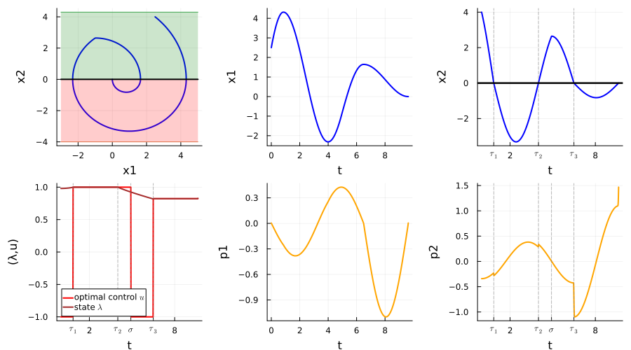
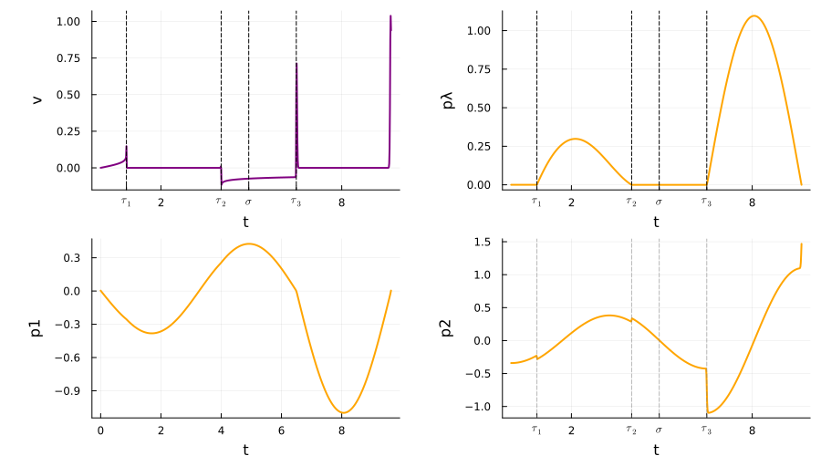
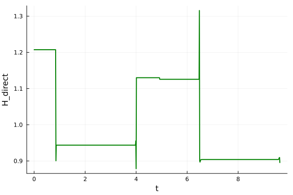
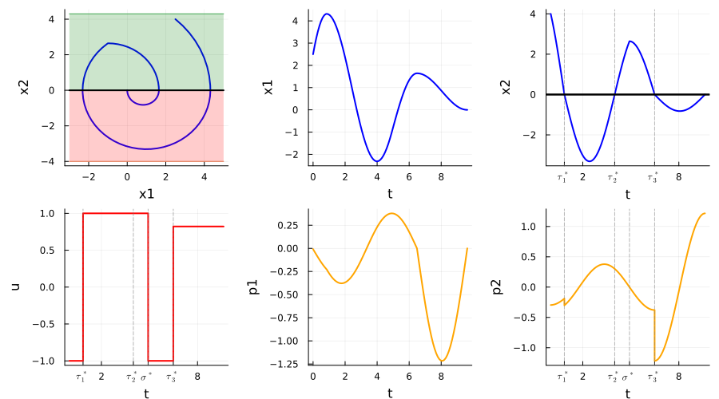
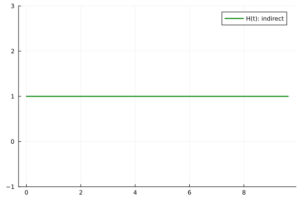

## Harmonic oscillator (min T) including a control loss region (initial problem)

```math
    \begin{equation}
        \left\{
        \begin{array}{l}
            \displaystyle \min  T, \\[0.5em]
            \dot{x}_1(t) = x_2(t), \; t \in [0,T], \\[0.5em]
            \dot{x}_2(t) = u(t) - x_1(t), \; t \in [0,T], \\[0.5em]
            u(t) \in [-1, 1], \; t \in [0,T], \\[0.5em]
            x(0) = (4.2,0), \quad x(T) = 0_{\mathbb{R}^2}, \\[0.5em]
            \{x \mid x_2 < 0\} \text{ is a control loss region.}
        \end{array}
        \right.
    \end{equation}
```
## Harmonic oscillator (min T) including a control loss region (regularized problem)

```math
    \left\{
    \begin{array}{l}
        \displaystyle \min  T + \varepsilon \int_0^T v^2(t)dt + \int_0^T f_{NC}(x_2(t))u^2(t)dt, \\[0.5em]
        \dot{x}_1(t) = x_2(t), \; t\in [0,T]\\[0.5em]
        \dot{x}_2(t) =f_{C}(x_2(t))(u(t) - x_1(t)) + f_{NC}(x_2(t))(\lambda(t) - x_1(t))
        , t\in [0,T]  \\[0.5em]
        \dot{\lambda}(t) = f_C(x_2(t))v(t),\; t\in [0,T]\\[0.5em]
        u(t) \in [-1, 1] \; t\in [0,T]\\[0.5em]
        x(0) = (4.2,0) , \quad x(T) = 0_{\mathrm{R}^2}.
    \end{array}
    \right.
```


```julia
    using JuMP  
    using Ipopt
    using Plots
    using LaTeXStrings
    using Plots.PlotMeasures
```


```julia
    mutable struct Direct
        t; x1; x2 ; λ ; u ; xu ; xv ; p1 ; p2
    end

    mutable struct DirecttSol
        t; x1; x2 ; λ ; u ; v ; xu ; xv ; p1 ; p2 ; p3
    end

```


```julia
    distance_squared(x, a) = x < a ? (a - x)^2 : 0 ;

    #Moreau Yosida regularization

    function MY_reg(x, a, k)
        return 1 - exp(-k*distance_squared(x, a))
    end

    fNC(x) = MY_reg(x, 0.03, 1200)
    fC(x) = 1. - fNC(x)

    plot(fNC, -0.5, 0.5)
```


    

    


```julia
    #function F(x, alpha, a)
    #    return 1 / (1 + exp(alpha * (x - a)))
    #end
    #fNC1(x)  = F(x, 100, 0.0)
    #fC1(x)   = 1. - F(x, 100, 0.0)
    #g(x)     = fNC(x) - fNC1(x) 
    #plot(g, -0.5, 0.5)
```


```julia
    function HO(ε=1e-3; x0=[2.5, 4], nsteps=800, tol=1e-8, display=true)
        """
            Solve the HO problem with the given parameters.

            Parameters
            ----------

            x0 : array of floats
                Initial condition
            nsteps : int
                Number of steps in the discretization
            ε : float
                Regularization parameter
            tol : float
                Tolerance for the solver
            display : bool
                If true, display the results

            Returns
            -------
            
            sol : DirecttSol
                The (direct) solution of the problem
                """


        # Create JuMP model, using Ipopt as the solver
        sys = Model(optimizer_with_attributes(Ipopt.Optimizer, "print_level" => display ? 5 : 1))
        set_optimizer_attribute(sys,"tol", tol)
        set_optimizer_attribute(sys,"constr_viol_tol", tol)
        set_optimizer_attribute(sys,"max_iter",1000)
        
        # Constants
        N  = nsteps     # Grid size
        
        @variables(sys, begin
                    x1[1:N+1]    
                    x2[1:N+1]   
            -1.0  ≤  λ[1:N+1]  ≤ 1.0
            -1.0  ≤  u[1:N+1]  ≤ 1.0
            0.0  ≤ Δt         ≤ 1.0 
                    v[1:N+1] 
            -1e1  ≤ xv[1:N+1]
            -1e1  ≤ xu[1:N+1]
        end)
        
        set_start_value(Δt, 20/N);
        for i in 1:N+1
            set_start_value(λ[i] , 1.0);
            set_start_value(v[i] , 0.0);
            set_start_value(xv[i], 0.0);
            set_start_value(xu[i], 0.0);
        end
        
        T = Δt*(N+1) ;
        
        # Objective
        @objective(sys, Min, T + ε*xv[N+1] + xu[N+1])

        # Boundary constraints
        @constraints(sys, begin
            con_xu0, xu[1]   == 0.0
            con_xv0, xv[1]   == 0.0
            con_x10, x1[1]   == x0[1] 
            con_x20, x2[1]   == x0[2] 
            con_x1f, x1[N+1] == 0.0 
            con_x2f, x2[N+1] == -1e-5
        end)

        # Dynamics
        @NLexpression(sys, dx1[j = 1:N+1], x2[j])
        @NLexpression(sys, dx2[j = 1:N+1], fC(x2[j])*u[j] +fNC(x2[j])*λ[j] - x1[j])
        @NLexpression(sys,  dλ[j = 1:N+1], fC(x2[j])*v[j])
        @NLexpression(sys, dxv[j = 1:N+1], v[j]^2)
        @NLexpression(sys, dxu[j = 1:N+1], fNC(x2[j])*u[j]^2)
        
        # Dynamics with Crank-Nicolson scheme
        @NLconstraints(sys, begin
            con_dx1[j=1:N], x1[j+1] == x1[j] + 0.5 * Δt * (dx1[j+1] + dx1[j])
            con_dx2[j=1:N], x2[j+1] == x2[j] + 0.5 * Δt * (dx2[j+1] + dx2[j])
            con_dx3[j=1:N],  λ[j+1] ==  λ[j] + 0.5 * Δt * (dλ[j+1]  + dλ[j])
            con_dxv[j=1:N], xv[j+1] == xv[j] + 0.5 * Δt * (dxv[j+1] + dxv[j])
            con_dxu[j=1:N], xu[j+1] == xu[j] + 0.5 * Δt * (dxu[j+1] + dxu[j])
        end)
        
        
        # Solve for the control and state
        if display
            println("Solving...")
        end
        status = optimize!(sys)
        if display
            println()
        end

        # Display results
        if display
            if termination_status(sys) == MOI.OPTIMAL
                println("  Solution is optimal")
            elseif  termination_status(sys) == MOI.LOCALLY_SOLVED
                println("  (Local) solution found")
            elseif termination_status(sys) == MOI.TIME_LIMIT && has_values(sys)
                println("  Solution is suboptimal due to a time limit, but a primal solution is available")
            else
                error("  The model was not solved correctly.")
            end
            println("  objective value = ", objective_value(sys))
            println()
        end

        # Retrieves values (including duals)
        x1 = value.(x1)[:]
        x2 = value.(x2)[:]
        λ  = value.(λ)[:]
        u  = value.(u)[:]
        v  = value.(v)[:]
        xu  = value.(xu)[:]
        xv  = value.(xv)[:]
        t  = (0:N) * value.(Δt)
        
        
        px10 = - dual(con_x10)
        px20 = - dual(con_x20)
        px1f =   dual(con_x1f)                                 
        px2f =   dual(con_x2f) 
        
        px30 = 0 # λ(0) is free
        px3f = 0 # λ(T) is free

    
        # duals of the dynamics
        px1 = -[ dual(con_dx1[i]) for i in 1:N ]
        px2 = -[ dual(con_dx2[i]) for i in 1:N ]
        px3 = -[ dual(con_dx3[i]) for i in 1:N ]

        # adjoint vectors
        p1 = [px10; (px1[1:N-1]+px1[2:N])/2; px1f]
        p2 = [px20; (px2[1:N-1]+px2[2:N])/2; px2f]
        p3 = [px30; (px3[1:N-1]+px3[2:N])/2; px3f]
        
        
        
        return DirecttSol(t, x1, x2, λ, u, v, xu, xv, p1, p2, p3)
        
        
    end;
        

```


```julia
    # Resolution
    ε   = 1e-3
    sol = HO(ε);
```

    Solving...
    This is Ipopt version 3.14.4, running with linear solver MUMPS 5.4.1.
    
    Number of nonzeros in equality constraint Jacobian...:    26406
    Number of nonzeros in inequality constraint Jacobian.:        0
    Number of nonzeros in Lagrangian Hessian.............:    69600
    
    Total number of variables............................:     5608
                         variables with only lower bounds:     1602
                    variables with lower and upper bounds:     1603
                         variables with only upper bounds:        0
    Total number of equality constraints.................:     4006
    Total number of inequality constraints...............:        0
            inequality constraints with only lower bounds:        0
       inequality constraints with lower and upper bounds:        0
            inequality constraints with only upper bounds:        0
    
    iter    objective    inf_pr   inf_du lg(mu)  ||d||  lg(rg) alpha_du alpha_pr  ls
       0  2.0025000e+01 4.00e+00 4.01e-03  -1.0 0.00e+00    -  0.00e+00 0.00e+00   0
       1  1.7144881e+01 3.86e+00 2.31e+03  -1.0 8.45e+00   2.0 7.79e-02 3.46e-02f  1
       2  1.2474532e+01 3.60e+00 1.25e+04  -1.0 1.03e+01   1.5 5.50e-02 6.78e-02f  1
       3  1.2376394e+01 3.58e+00 1.26e+04  -1.0 6.78e+00   1.9 7.28e-02 4.40e-03f  1
       4  1.0268357e+01 3.05e+00 7.22e+04  -1.0 5.28e+00   1.5 4.02e-02 1.49e-01f  1
       5  1.0364001e+01 2.66e+00 1.45e+05  -1.0 8.34e+00   1.9 3.06e-03 1.28e-01f  1
       6  1.0401733e+01 2.65e+00 1.45e+05  -1.0 3.77e+01   2.3 4.01e-03 3.14e-03h  1
       7  1.0408099e+01 2.65e+00 1.45e+05  -1.0 7.05e+00   2.7 6.05e-03 1.34e-03h  1
       8  1.0436992e+01 2.63e+00 1.44e+05  -1.0 6.12e+00   3.2 4.34e-04 5.37e-03h  1
       9  1.0470632e+01 2.62e+00 1.42e+05  -1.0 6.94e+00   2.7 1.03e-01 6.32e-03h  1
    iter    objective    inf_pr   inf_du lg(mu)  ||d||  lg(rg) alpha_du alpha_pr  ls
      10  1.0520464e+01 2.59e+00 1.40e+05  -1.0 6.31e+00   3.1 1.32e-02 8.95e-03h  1
      11  1.0631976e+01 2.55e+00 1.32e+05  -1.0 7.30e+00   2.6 1.69e-01 1.75e-02h  1
      12  1.0757609e+01 2.49e+00 1.22e+05  -1.0 5.95e+00   3.1 4.96e-02 2.07e-02h  1
      13  1.0824585e+01 2.47e+00 1.22e+05  -1.0 5.61e+00   3.5 2.93e-01 9.59e-03h  1
      14  1.1838933e+01 2.17e+00 4.71e+04  -1.0 6.30e+00   3.0 8.14e-02 1.21e-01h  1
      15  1.1852651e+01 2.17e+00 4.70e+04  -1.0 4.68e+00   3.4 4.16e-01 2.71e-03h  1
      16  1.2033157e+01 2.16e+00 4.71e+04  -1.0 9.06e+02   3.0 2.40e-03 4.61e-04f  4
      17  1.2201243e+01 2.09e+00 4.66e+04  -1.0 4.43e+00   3.4 6.81e-01 3.46e-02h  1
      18  1.2352920e+01 2.03e+00 4.79e+04  -1.0 2.90e+00   3.8 8.83e-01 3.04e-02h  1
      19  1.2782125e+01 1.98e+00 4.86e+04  -1.0 3.10e+01   3.3 1.10e-01 2.33e-02h  3
    iter    objective    inf_pr   inf_du lg(mu)  ||d||  lg(rg) alpha_du alpha_pr  ls
      20  1.2994896e+01 1.89e+00 6.44e+04  -1.0 2.73e+00   3.8 7.96e-01 4.32e-02h  1
      21  1.3492727e+01 1.68e+00 9.00e+05  -1.0 2.32e+00   4.2 1.00e+00 1.11e-01h  1
      22  1.3611638e+01 1.63e+00 8.21e+05  -1.0 2.08e+00   4.6 1.00e+00 3.35e-02h  1
      23  1.3761293e+01 1.62e+00 8.70e+05  -1.0 8.42e+01   4.1 2.64e-02 2.90e-03h  4
      24  1.3875665e+01 1.57e+00 1.58e+06  -1.0 2.54e+00   4.6 9.29e-01 3.22e-02h  1
      25  1.4195703e+01 1.41e+00 2.00e+06  -1.0 1.98e+00   5.0 3.12e-01 1.01e-01h  1
      26  1.4211416e+01 1.40e+00 3.65e+06  -1.0 1.91e+00   5.4 9.80e-01 6.89e-03h  1
      27  1.4567277e+01 1.21e+00 3.07e+06  -1.0 2.45e+00   4.9 1.53e-01 1.34e-01h  1
      28  1.4587829e+01 1.20e+00 8.93e+06  -1.0 1.76e+00   5.4 3.48e-01 1.13e-02h  1
      29  1.4887637e+01 1.09e+00 8.80e+06  -1.0 7.68e+00   4.9 9.14e-03 8.84e-02h  1
    iter    objective    inf_pr   inf_du lg(mu)  ||d||  lg(rg) alpha_du alpha_pr  ls
      30  1.4902043e+01 1.08e+00 8.50e+06  -1.0 1.44e+00   5.3 1.45e-03 8.41e-03h  1
      31  1.4907157e+01 1.08e+00 1.20e+07  -1.0 1.43e+00   5.7 6.78e-02 3.50e-03h  1
      32  1.5083364e+01 9.70e-01 8.77e+06  -1.0 1.72e+00   5.3 1.06e-02 1.02e-01h  1
      33  1.5085030e+01 9.69e-01 8.54e+06  -1.0 1.28e+00   5.7 1.33e-01 1.40e-03h  1
      34  1.5179930e+01 9.24e-01 9.21e+06  -1.0 2.17e+00   5.2 1.09e-01 4.64e-02h  1
      35  1.5186724e+01 9.19e-01 9.17e+06  -1.0 1.22e+00   5.6 1.88e-01 5.84e-03h  1
      36  1.5255676e+01 8.29e-01 6.56e+06  -1.0 1.22e+00   5.2 4.38e-01 9.73e-02h  1
      37  1.5293965e+01 7.99e-01 6.47e+06  -1.0 1.10e+00   5.6 1.51e-01 3.62e-02h  1
      38  1.5327336e+01 7.85e-01 6.19e+06  -1.0 3.56e+00   5.1 2.90e-01 1.71e-02h  1
      39  1.5357285e+01 7.60e-01 6.01e+06  -1.0 1.05e+00   5.5 1.79e-01 3.28e-02h  1
    iter    objective    inf_pr   inf_du lg(mu)  ||d||  lg(rg) alpha_du alpha_pr  ls
      40  1.5436815e+01 7.55e-01 5.15e+06  -1.0 2.45e+01   5.1 1.08e-02 5.67e-03h  2
      41  1.5458067e+01 7.44e-01 5.29e+06  -1.0 1.04e+00   5.5 7.76e-02 1.51e-02h  1
      42  1.5459065e+01 7.42e-01 5.28e+06  -1.0 1.26e+00   5.0 2.72e-01 2.00e-03h  1
      43  1.5478523e+01 6.77e-01 8.91e+06  -1.0 1.81e+00   4.5 5.74e-02 8.88e-02h  1
      44  1.5479777e+01 6.75e-01 8.89e+06  -1.0 1.08e+00   5.0 1.18e-01 2.60e-03h  1
      45  1.5502734e+01 6.45e-01 8.67e+06  -1.0 2.51e+00   4.5 6.86e-02 4.44e-02h  1
      46  1.5541397e+01 6.35e-01 8.35e+06  -1.0 7.51e+00   4.9 3.73e-02 1.59e-02h  1
      47  1.5550943e+01 6.26e-01 8.25e+06  -1.0 1.06e+00   5.3 7.94e-02 1.42e-02h  1
      48  1.5555699e+01 6.18e-01 8.18e+06  -1.0 1.23e+00   4.9 7.31e-02 1.30e-02h  1
      49  1.5560222e+01 5.97e-01 8.42e+06  -1.0 1.63e+00   4.4 3.49e-02 3.27e-02h  1
    iter    objective    inf_pr   inf_du lg(mu)  ||d||  lg(rg) alpha_du alpha_pr  ls
      50  1.5562710e+01 5.93e-01 8.37e+06  -1.0 1.40e+00   4.8 2.27e-02 7.50e-03h  1
      51  1.5564577e+01 5.82e-01 8.40e+06  -1.0 1.60e+00   4.3 7.18e-02 1.88e-02h  1
      52  1.5569410e+01 5.72e-01 8.32e+06  -1.0 1.60e+00   4.8 1.23e-01 1.59e-02h  1
      53  1.5569759e+01 5.61e-01 8.41e+06  -1.0 1.55e+00   4.3 2.92e-02 2.02e-02h  1
      54  1.5571174e+01 5.58e-01 8.38e+06  -1.0 1.41e+00   4.7 1.17e-01 5.47e-03h  1
      55  1.5570682e+01 5.41e-01 8.84e+06  -1.0 2.03e+00   4.2 2.93e-02 2.95e-02h  1
      56  1.5572110e+01 5.38e-01 8.79e+06  -1.0 1.59e+00   4.7 1.01e-01 6.26e-03h  1
      57  1.5574463e+01 5.25e-01 9.16e+06  -1.0 3.96e+00   4.2 2.86e-02 2.35e-02h  1
      58  1.5575873e+01 5.22e-01 9.11e+06  -1.0 1.75e+00   4.6 1.92e-01 6.08e-03h  1
      59  1.5577325e+01 5.07e-01 9.36e+06  -1.0 1.94e+00   4.1 1.42e-01 2.86e-02h  1
    iter    objective    inf_pr   inf_du lg(mu)  ||d||  lg(rg) alpha_du alpha_pr  ls
      60  1.5606016e+01 5.01e-01 8.99e+06  -1.0 4.78e+00   4.6 1.99e-01 1.27e-02h  1
      61  1.5613289e+01 4.92e-01 8.76e+06  -1.0 1.89e+00   5.0 4.47e-01 1.69e-02h  1
      62  1.5623353e+01 4.83e-01 8.48e+06  -1.0 1.91e+00   5.4 7.95e-01 1.82e-02h  1
      63  1.5649324e+01 4.65e-01 7.87e+06  -1.0 2.76e+00   4.9 3.72e-01 3.73e-02h  1
      64  1.5665124e+01 4.57e-01 8.09e+06  -1.0 2.75e+00   5.4 3.21e-01 1.80e-02h  1
      65  1.5676660e+01 4.49e-01 1.53e+07  -1.0 2.62e+00   5.8 1.00e+00 1.70e-02h  1
      66  1.5706694e+01 4.31e-01 8.39e+06  -1.0 3.44e+00   5.3 6.91e-01 4.03e-02h  1
      67  1.5715461e+01 4.17e-01 4.93e+06  -1.0 3.54e+00   4.8 4.46e-01 3.21e-02h  1
      68  1.5724531e+01 4.10e-01 7.98e+06  -1.0 4.08e+00   5.3 1.00e+00 1.77e-02h  1
      69  1.5732475e+01 3.97e-01 4.48e+06  -1.0 5.12e+00   4.8 5.88e-01 3.24e-02h  1
    iter    objective    inf_pr   inf_du lg(mu)  ||d||  lg(rg) alpha_du alpha_pr  ls
      70  1.5743834e+01 3.90e-01 6.29e+06  -1.0 5.20e+00   5.2 2.59e-01 1.78e-02h  1
      71  1.5757030e+01 3.83e-01 1.32e+07  -1.0 5.03e+00   5.6 7.85e-02 1.69e-02h  1
      72  1.5770977e+01 3.76e-01 1.73e+07  -1.0 5.89e+00   5.2 2.48e-02 1.82e-02h  1
      73  1.5773720e+01 3.75e-01 1.75e+07  -1.0 5.76e+00   5.6 8.52e-02 2.83e-03h  1
      74  1.5783863e+01 3.70e-01 2.02e+07  -1.0 7.24e+00   5.1 3.37e-02 1.31e-02h  1
      75  1.5793636e+01 3.67e-01 2.22e+07  -1.0 6.51e+00   5.5 1.43e-01 8.83e-03h  1
      76  1.5798410e+01 3.65e-01 6.61e+07  -1.0 6.32e+00   6.0 3.05e-01 5.00e-03h  1
      77  1.5815432e+01 3.59e-01 6.54e+07  -1.0 7.52e+00   5.5 5.16e-02 1.64e-02f  1
      78  1.5828084e+01 3.56e-01 8.21e+07  -1.0 7.47e+00   5.9 1.10e-01 9.39e-03h  1
      79  1.5833545e+01 3.53e-01 8.14e+07  -1.0 9.21e+00   5.4 2.16e-03 8.21e-03f  1
    iter    objective    inf_pr   inf_du lg(mu)  ||d||  lg(rg) alpha_du alpha_pr  ls
      80  1.5838817e+01 3.51e-01 8.04e+07  -1.0 8.11e+00   5.8 1.42e-04 3.84e-03h  1
      81  1.5839481e+01 3.50e-01 8.04e+07  -1.0 1.20e+01   5.4 5.23e-02 4.27e-03h  1
      82  1.5841046e+01 3.49e-01 8.13e+07  -1.0 8.16e+00   5.8 6.45e-03 9.77e-04h  1
      83  1.5838326e+01 3.46e-01 8.24e+07  -1.0 1.56e+01   5.3 1.57e-01 9.37e-03f  1
      84  1.5838782e+01 3.46e-01 8.37e+07  -1.0 8.66e+00   5.7 1.32e-02 5.72e-04h  1
      85  1.5844897e+01 3.44e-01 1.77e+08  -1.0 7.79e+00   6.2 1.65e-01 4.90e-03h  1
      86  1.5852730e+01 3.41e-01 1.76e+08  -1.0 1.12e+01   5.7 1.35e-02 1.05e-02f  1
      87  1.5853379e+01 3.40e-01 2.93e+08  -1.0 8.78e+00   6.1 1.89e-01 3.52e-04h  1
      88  1.5872632e+01 3.36e-01 2.89e+08  -1.0 1.31e+01   5.6 1.59e-02 1.25e-02f  1
      89  1.5873119e+01 3.36e-01 3.55e+08  -1.0 8.66e+00   6.1 1.21e-01 3.58e-04h  1
    iter    objective    inf_pr   inf_du lg(mu)  ||d||  lg(rg) alpha_du alpha_pr  ls
      90  1.5852333e+01 3.35e-01 3.52e+08  -1.0 6.01e+01   5.6 1.01e-02 1.95e-03f  2
      91  1.5857212e+01 3.33e-01 3.49e+08  -1.0 1.47e+01   5.1 1.04e-02 6.23e-03f  1
      92  1.5858561e+01 3.33e-01 3.34e+08  -1.0 1.16e+01   5.5 1.43e-01 1.21e-03h  1
      93  1.5901162e+01 3.26e-01 5.66e+08  -1.0 9.21e+00   6.0 4.58e-02 2.20e-02f  1
      94  1.5901762e+01 3.26e-01 5.66e+08  -1.0 9.18e+00   6.4 9.65e-02 2.64e-04h  1
      95  1.5916780e+01 3.23e-01 6.62e+08  -1.0 1.13e+01   5.9 1.60e-02 9.40e-03f  1
      96  1.5918291e+01 3.22e-01 6.63e+08  -1.0 1.06e+01   6.3 2.43e-02 6.53e-04h  1
      97  1.5903884e+01 3.21e-01 6.86e+08  -1.0 3.88e+01   5.9 9.72e-03 2.70e-03h  1
      98  1.5904231e+01 3.21e-01 8.07e+08  -1.0 1.07e+01   6.3 1.79e-01 3.16e-04h  1
      99  1.5958984e+01 3.13e-01 5.52e+09  -1.0 8.25e+00   6.7 4.78e-02 2.65e-02h  1
    iter    objective    inf_pr   inf_du lg(mu)  ||d||  lg(rg) alpha_du alpha_pr  ls
     100  1.5959517e+01 3.13e-01 5.52e+09  -1.0 8.85e+00   6.2 4.69e-02 2.78e-04h  1
     101  1.5973247e+01 3.11e-01 5.57e+09  -1.0 9.89e+00   6.7 3.75e-02 4.97e-03h  1
     102  1.5983613e+01 3.09e-01 5.55e+09  -1.0 9.77e+00   6.2 6.18e-02 5.83e-03f  1
     103  1.5991421e+01 3.08e-01 5.56e+09  -1.0 9.66e+00   6.6 7.36e-04 3.13e-03h  1
     104  1.5994132e+01 3.06e-01 5.57e+09  -1.0 1.53e+01   6.1 8.92e-05 8.56e-03f  1
     105  1.5994314e+01 3.06e-01 5.57e+09  -1.0 9.56e+00   6.6 2.64e-02 1.09e-04h  1
     106  1.6002413e+01 3.05e-01 5.61e+09  -1.0 8.08e+00   7.0 1.67e-01 3.12e-03h  1
     107  1.6039530e+01 2.98e-01 6.31e+09  -1.0 1.06e+01   6.5 1.46e-02 2.06e-02f  1
     108  1.6039275e+01 2.98e-01 6.30e+09  -1.0 1.59e+01   6.9 5.74e-02 1.84e-04h  1
     109  1.6041150e+01 2.98e-01 6.33e+09  -1.0 6.98e+00   7.4 6.05e-02 1.10e-03h  1
    iter    objective    inf_pr   inf_du lg(mu)  ||d||  lg(rg) alpha_du alpha_pr  ls
     110  1.6028961e+01 2.96e-01 7.22e+09  -1.0 2.25e+01   6.9 3.58e-02 6.28e-03f  2
     111  1.6098392e+01 2.74e-01 4.63e+09  -1.0 1.06e+01   6.4 1.38e-02 7.55e-02f  1
     112  1.6099255e+01 2.74e-01 4.62e+09  -1.0 5.57e+00   6.8 1.05e-01 1.36e-03h  1
     113  1.6038437e+01 2.61e-01 4.56e+09  -1.0 7.35e+00   6.4 4.22e-03 4.46e-02f  1
    MUMPS returned INFO(1) = -9 and requires more memory, reallocating.  Attempt 1
      Increasing icntl[13] from 1000 to 2000.
     114  1.6038556e+01 2.61e-01 4.56e+09  -1.0 3.09e+00   6.8 1.48e-01 5.22e-04h  1
     115  1.6037459e+01 2.61e-01 4.56e+09  -1.0 4.35e+00   6.3 1.49e-02 8.06e-04h  1
     116  1.6037494e+01 2.61e-01 4.55e+09  -1.0 3.76e+00   6.7 1.13e-01 7.73e-04h  1
     117  1.5756464e+01 2.17e-01 9.18e+09  -1.0 4.69e+00   6.3 2.02e-02 1.69e-01f  1
     118  1.5756495e+01 2.17e-01 9.18e+09  -1.0 1.98e+00   7.6 3.38e-01 1.13e-04h  1
     119  1.5756166e+01 2.16e-01 9.14e+09  -1.0 3.55e+01   7.1 4.24e-04 6.81e-04h  1
    iter    objective    inf_pr   inf_du lg(mu)  ||d||  lg(rg) alpha_du alpha_pr  ls
     120  1.5756453e+01 2.16e-01 9.13e+09  -1.0 1.79e+00   7.5 8.11e-01 1.34e-03h  1
     121  1.5725106e+01 2.00e-01 6.83e+09  -1.0 3.76e+00   7.1 8.96e-04 7.29e-02f  3
     122  1.5874697e+01 6.33e-02 1.38e+10  -1.0 3.01e-01   7.5 1.92e-03 6.84e-01h  1
    MUMPS returned INFO(1) = -9 and requires more memory, reallocating.  Attempt 1
      Increasing icntl[13] from 2000 to 4000.
     123  1.5905339e+01 3.39e-03 7.60e+09  -1.0 2.92e-01   7.0 2.22e-02 1.00e+00h  1
     124  1.5923161e+01 1.87e-03 6.83e+08  -1.0 1.51e-01   7.4 8.70e-01 1.00e+00h  1
     125  1.5931965e+01 1.15e-04 3.70e+07  -1.0 4.68e-02   7.0 9.36e-01 1.00e+00h  1
     126  1.5932499e+01 2.41e-07 2.07e+06  -1.0 3.13e-03   6.5 9.61e-01 1.00e+00f  1
     127  1.5932499e+01 7.51e-10 4.07e+04  -1.0 2.45e-04   6.0 9.44e-01 1.00e+00f  1
     128  1.5932515e+01 2.67e-08 1.48e+04  -1.0 5.21e-04   5.5 3.69e-01 1.00e+00f  1
     129  1.5932541e+01 4.35e-08 1.03e+03  -1.0 6.16e-04   5.0 7.50e-01 1.00e+00f  1
    iter    objective    inf_pr   inf_du lg(mu)  ||d||  lg(rg) alpha_du alpha_pr  ls
     130  1.5932631e+01 3.70e-07 2.28e+03  -1.0 1.10e-03   4.6 4.44e-01 1.00e+00f  1
     131  1.5932795e+01 7.11e-07 3.50e+01  -1.0 1.80e-03   4.1 9.22e-01 1.00e+00f  1
     132  1.5933295e+01 7.46e-06 3.75e+02  -1.0 4.54e-03   3.6 4.72e-01 1.00e+00f  1
     133  1.5933976e+01 6.13e-06 4.70e+01  -1.0 6.48e-03   3.1 1.00e+00 1.00e+00f  1
     134  1.5935357e+01 3.09e-05 4.18e+01  -1.0 1.45e-02   2.7 7.79e-01 1.00e+00f  1
     135  1.5937311e+01 4.01e-05 9.40e+01  -1.0 2.09e-02   2.2 1.00e+00 1.00e+00f  1
     136  1.5941425e+01 1.29e-04 1.01e+02  -1.0 4.32e-02   1.7 7.92e-01 1.00e+00f  1
     137  1.5945133e+01 6.94e-04 6.22e+02  -1.0 6.55e-02   1.2 1.00e+00 1.00e+00f  1
     138  1.5940170e+01 2.76e-03 2.92e+02  -1.0 7.52e-02   1.7 1.00e+00 1.00e+00f  1
     139  1.5924322e+01 3.82e-03 3.25e+03  -1.0 1.14e-01   1.2 1.00e+00 1.00e+00f  1
    iter    objective    inf_pr   inf_du lg(mu)  ||d||  lg(rg) alpha_du alpha_pr  ls
     140  1.5929081e+01 1.70e-04 7.81e+01  -1.0 1.66e-02   1.6 1.00e+00 1.00e+00f  1
     141  1.5925245e+01 1.66e-04 2.02e+01  -1.0 3.92e-02   1.1 1.00e+00 1.00e+00f  1
     142  1.5914514e+01 5.88e-04 6.56e+01  -1.0 7.74e-02   0.7 1.00e+00 1.00e+00f  1
     143  1.5890025e+01 2.54e-03 1.23e+01  -1.0 2.45e-01   0.2 1.00e+00 1.00e+00f  1
     144  1.5898238e+01 8.30e-03 2.81e+02  -1.0 3.18e-01  -0.3 1.00e+00 1.00e+00f  1
     145  1.5868111e+01 4.80e-03 7.62e+01  -1.0 9.80e-02   0.1 1.00e+00 1.00e+00f  1
     146  1.5856119e+01 7.98e-03 1.34e+02  -1.0 3.60e-01  -0.4 1.00e+00 1.00e+00f  1
     147  1.5859536e+01 6.62e-03 1.53e+03  -1.0 2.07e-01   1.0 1.00e+00 1.00e+00f  1
     148  1.5862556e+01 2.98e-03 2.37e+01  -1.0 8.54e-02   1.4 1.00e+00 1.00e+00h  1
     149  1.5861884e+01 5.49e-04 9.74e+00  -1.0 9.98e-03   1.8 1.00e+00 1.00e+00h  1
    iter    objective    inf_pr   inf_du lg(mu)  ||d||  lg(rg) alpha_du alpha_pr  ls
     150  1.5861961e+01 6.11e-05 4.53e+00  -1.0 4.27e-03   1.3 1.00e+00 1.00e+00f  1
     151  1.5862300e+01 1.87e-04 1.07e-01  -1.0 1.26e-02   0.9 1.00e+00 1.00e+00f  1
     152  1.5861578e+01 5.48e-06 4.19e-01  -2.5 1.11e-03   0.4 1.00e+00 1.00e+00h  1
     153  1.5858765e+01 2.18e-05 7.70e-03  -2.5 3.08e-03  -0.1 1.00e+00 1.00e+00h  1
     154  1.5850355e+01 7.93e-05 3.41e-01  -3.8 6.67e-03  -0.6 1.00e+00 1.00e+00h  1
     155  1.5820904e+01 6.31e-04 1.22e-02  -3.8 2.01e-02  -1.0 1.00e+00 1.00e+00h  1
     156  1.5740564e+01 3.80e-03 6.12e-02  -3.8 5.25e-02  -1.5 1.00e+00 1.00e+00h  1
     157  1.5592771e+01 8.83e-03 2.36e-02  -3.8 1.28e-01  -2.0 1.00e+00 1.00e+00h  1
     158  1.5513062e+01 4.18e-03 6.87e-02  -3.8 6.32e-02  -1.6 1.00e+00 1.00e+00h  1
     159  1.5359366e+01 8.26e-03 3.17e-02  -3.8 2.01e-01  -2.0 1.00e+00 1.00e+00h  1
    iter    objective    inf_pr   inf_du lg(mu)  ||d||  lg(rg) alpha_du alpha_pr  ls
     160  1.5102349e+01 2.33e-02 1.44e-01  -3.8 9.67e-01  -2.5 1.00e+00 8.22e-01h  1
     161  1.5043713e+01 1.20e-02 2.75e-01  -3.8 3.78e-01  -2.1 1.00e+00 1.00e+00h  1
     162  1.4865689e+01 1.43e-02 1.19e-01  -3.8 9.75e-01  -2.6 1.00e+00 9.47e-01h  1
     163  1.4780119e+01 1.20e-02 2.71e-01  -3.8 6.65e-01  -2.1 1.00e+00 1.00e+00h  1
     164  1.4752440e+01 2.13e-03 5.18e-02  -3.8 1.32e-01  -1.7 1.00e+00 1.00e+00h  1
     165  1.4627256e+01 1.47e-02 2.66e-01  -3.8 1.65e+00  -2.2 3.19e-01 8.98e-01h  1
     166  1.4576083e+01 1.01e-02 1.74e-01  -3.8 1.05e+00  -1.8 1.00e+00 1.00e+00f  1
     167  1.4500687e+01 8.31e-03 7.12e-02  -3.8 5.05e-01  -2.2 6.38e-01 1.00e+00h  1
     168  1.4474527e+01 1.91e-03 6.27e-02  -3.8 3.16e-01  -1.8 1.00e+00 1.00e+00h  1
     169  1.4471604e+01 1.05e-04 4.84e-03  -3.8 4.81e-02  -1.4 1.00e+00 1.00e+00h  1
    iter    objective    inf_pr   inf_du lg(mu)  ||d||  lg(rg) alpha_du alpha_pr  ls
     170  1.4426522e+01 6.49e-03 9.44e-02  -3.8 5.45e-01  -1.9 6.02e-01 1.00e+00h  1
     171  1.4408141e+01 2.15e-04 5.02e-02  -3.8 3.49e-02  -1.4 1.00e+00 1.00e+00h  1
     172  1.4389219e+01 1.65e-03 3.00e-02  -3.8 1.74e-01  -1.9 1.00e+00 1.00e+00h  1
     173  1.4141553e+01 1.75e-02 2.21e-01  -3.8 1.37e+00  -2.4 4.26e-01 6.89e-01h  1
     174  1.4160818e+01 5.42e-03 1.28e-01  -3.8 3.51e-01  -2.0 1.09e-01 1.00e+00f  1
     175  1.4127270e+01 3.66e-03 2.02e-01  -3.8 3.00e-01  -1.5 4.93e-01 1.00e+00h  1
     176  1.4109789e+01 1.86e-03 4.47e-02  -3.8 1.39e-01  -2.0 8.17e-01 1.00e+00h  1
     177  1.4099302e+01 3.07e-04 9.32e-03  -3.8 7.18e-02  -1.6 1.00e+00 1.00e+00h  1
     178  1.4022465e+01 7.02e-03 1.24e-01  -3.8 5.12e-01  -2.1 4.75e-01 1.00e+00h  1
     179  1.4013262e+01 4.81e-04 1.60e-02  -3.8 1.26e-01  -1.6 9.44e-01 1.00e+00h  1
    iter    objective    inf_pr   inf_du lg(mu)  ||d||  lg(rg) alpha_du alpha_pr  ls
     180  1.3936988e+01 6.95e-03 9.24e-02  -3.8 4.18e-01  -2.1 1.00e+00 1.00e+00h  1
     181  1.3722564e+01 1.70e-02 6.34e-01  -3.8 9.72e-01  -2.6 2.57e-01 7.14e-01h  1
     182  1.3704096e+01 6.97e-03 3.71e-01  -3.8 4.46e-01  -2.2 2.56e-01 1.00e+00f  1
     183  1.3673266e+01 2.06e-03 1.06e-01  -3.8 2.20e-01  -1.8 4.38e-01 1.00e+00h  1
     184  1.3642845e+01 2.01e-03 4.70e-02  -3.8 1.97e-01  -2.2 6.29e-01 1.00e+00h  1
     185  1.3623203e+01 9.80e-04 2.39e-02  -3.8 1.59e-01  -1.8 1.00e+00 1.00e+00h  1
     186  1.3518649e+01 7.41e-03 5.54e-02  -3.8 4.55e-01  -2.3 6.32e-01 1.00e+00h  1
     187  1.3518504e+01 9.54e-04 1.19e-02  -3.8 2.00e-01  -1.9 5.73e-01 1.00e+00h  1
     188  1.3498643e+01 3.01e-03 2.15e-02  -3.8 2.93e-01  -2.3 1.00e+00 1.00e+00h  1
     189  1.3490514e+01 7.69e-04 9.50e-03  -3.8 1.50e-01  -1.9 1.00e+00 1.00e+00h  1
    iter    objective    inf_pr   inf_du lg(mu)  ||d||  lg(rg) alpha_du alpha_pr  ls
     190  1.3483423e+01 1.34e-04 6.61e-03  -3.8 5.23e-02  -1.5 1.00e+00 1.00e+00h  1
     191  1.3455349e+01 2.09e-03 2.01e-02  -3.8 2.24e-01  -2.0 1.00e+00 1.00e+00h  1
     192  1.3442874e+01 1.04e-03 4.47e-02  -3.8 1.81e-01  -2.4 1.00e+00 1.00e+00h  1
     193  1.3437162e+01 7.35e-04 1.62e-02  -3.8 1.74e-01  -2.0 1.00e+00 1.00e+00h  1
     194  1.3427456e+01 3.24e-04 9.96e-03  -3.8 7.67e-02  -1.6 1.00e+00 1.00e+00h  1
     195  1.3388956e+01 2.96e-03 4.63e-02  -3.8 2.74e-01  -2.1 1.00e+00 1.00e+00h  1
     196  1.3391521e+01 9.48e-05 5.32e-03  -3.8 8.48e-02  -1.6 1.00e+00 1.00e+00h  1
     197  1.3389785e+01 3.01e-05 1.77e-03  -3.8 2.95e-02  -1.2 1.00e+00 1.00e+00h  1
     198  1.3381790e+01 5.18e-04 1.31e-02  -3.8 1.19e-01  -1.7 1.00e+00 1.00e+00h  1
     199  1.3291938e+01 8.83e-03 1.09e-01  -3.8 6.38e-01  -2.2 7.39e-01 1.00e+00h  1
    iter    objective    inf_pr   inf_du lg(mu)  ||d||  lg(rg) alpha_du alpha_pr  ls
     200  1.3260829e+01 7.27e-03 6.00e-02  -3.8 5.87e-01  -2.6 2.10e-01 1.00e+00h  1
     201  1.3209954e+01 4.96e-03 3.87e-02  -3.8 1.46e-01  -2.2 1.00e+00 1.00e+00h  1
     202  1.3209738e+01 2.32e-04 3.02e-02  -3.8 1.80e-01  -1.8 8.68e-01 1.00e+00h  1
     203  1.3081437e+01 1.63e-02 4.25e-01  -3.8 3.89e+01  -2.3 7.05e-02 1.98e-02f  1
     204  1.3079901e+01 7.29e-03 8.78e-02  -3.8 1.55e+00  -2.7 4.42e-01 5.82e-01h  1
     205  1.3067802e+01 3.69e-03 1.00e-01  -3.8 4.35e-01  -2.3 2.26e-01 1.00e+00f  1
     206  1.3042671e+01 4.01e-04 3.22e-02  -3.8 1.49e-01  -1.9 1.00e+00 1.00e+00h  1
     207  1.3014152e+01 1.74e-03 7.45e-03  -3.8 2.56e-01  -2.4 9.81e-01 1.00e+00h  1
     208  1.3011809e+01 2.95e-04 3.93e-03  -3.8 1.08e-01  -1.9 1.00e+00 1.00e+00h  1
     209  1.3009100e+01 5.53e-05 2.16e-03  -3.8 4.26e-02  -1.5 1.00e+00 1.00e+00h  1
    iter    objective    inf_pr   inf_du lg(mu)  ||d||  lg(rg) alpha_du alpha_pr  ls
     210  1.2993146e+01 1.55e-03 4.19e-02  -3.8 2.56e-01  -2.0 1.00e+00 1.00e+00h  1
     211  1.2875059e+01 1.39e-02 3.56e-01  -3.8 6.77e-01  -2.5 1.00e+00 1.00e+00h  1
     212  1.2868584e+01 3.96e-03 6.79e-02  -3.8 3.09e-01  -2.0 4.13e-01 1.00e+00h  1
     213  1.2871476e+01 1.89e-04 1.35e-02  -3.8 1.11e-01  -1.6 1.00e+00 1.00e+00h  1
     214  1.2869568e+01 1.77e-05 2.29e-03  -3.8 3.00e-02  -1.2 1.00e+00 1.00e+00h  1
     215  1.2860810e+01 2.46e-04 5.28e-03  -3.8 9.02e-02  -1.7 1.00e+00 1.00e+00h  1
     216  1.2814276e+01 3.19e-03 4.40e-02  -3.8 3.46e-01  -2.1 1.00e+00 1.00e+00h  1
     217  1.2814679e+01 8.85e-05 1.82e-03  -3.8 7.98e-02  -1.7 1.00e+00 1.00e+00h  1
     218  1.2712675e+01 2.23e-02 2.19e-01  -3.8 1.72e+00  -2.2 1.35e-01 1.00e+00h  1
     219  1.2723702e+01 9.82e-04 1.32e-01  -3.8 2.73e-01  -1.8 7.12e-01 1.00e+00h  1
    iter    objective    inf_pr   inf_du lg(mu)  ||d||  lg(rg) alpha_du alpha_pr  ls
     220  1.2722970e+01 3.11e-05 1.66e-02  -3.8 5.17e-02  -1.3 1.00e+00 1.00e+00h  1
     221  1.2716553e+01 2.40e-04 5.05e-03  -3.8 1.12e-01  -1.8 1.00e+00 1.00e+00h  1
     222  1.2636144e+01 1.23e-02 1.09e-01  -3.8 8.69e-01  -2.3 3.79e-01 1.00e+00h  1
     223  1.2638781e+01 4.83e-04 3.48e-02  -3.8 1.79e-01  -1.9 6.25e-01 1.00e+00h  1
     224  1.2620986e+01 1.81e-03 3.69e-02  -3.8 3.25e-01  -2.3 1.00e+00 1.00e+00h  1
     225  1.2615766e+01 5.85e-04 7.09e-03  -3.8 1.10e-01  -1.9 1.00e+00 1.00e+00h  1
     226  1.2612615e+01 5.13e-05 3.36e-03  -3.8 3.84e-02  -1.5 1.00e+00 1.00e+00h  1
     227  1.2597581e+01 7.68e-04 2.05e-02  -3.8 1.75e-01  -2.0 1.00e+00 1.00e+00h  1
     228  1.2539453e+01 5.18e-03 2.66e-02  -3.8 3.68e-01  -2.5 1.00e+00 1.00e+00h  1
     229  1.2535972e+01 1.23e-03 2.66e-02  -3.8 2.95e-01  -2.0 5.66e-01 1.00e+00h  1
    iter    objective    inf_pr   inf_du lg(mu)  ||d||  lg(rg) alpha_du alpha_pr  ls
     230  1.2458036e+01 2.18e-02 4.69e-01  -3.8 2.10e+00  -2.5 3.10e-01 6.44e-01h  1
     231  1.2417551e+01 9.83e-03 1.33e-01  -3.8 9.02e-01  -2.1 2.26e-01 1.00e+00f  1
     232  1.2418482e+01 8.75e-05 1.72e-02  -3.8 1.03e-01  -1.7 1.00e+00 1.00e+00h  1
     233  1.2394962e+01 6.64e-04 2.61e-02  -3.8 2.28e-01  -2.1 1.00e+00 1.00e+00h  1
     234  1.2393025e+01 7.03e-05 2.24e-03  -3.8 9.39e-02  -1.7 1.00e+00 1.00e+00h  1
     235  1.2383641e+01 1.02e-03 1.30e-02  -3.8 1.67e-01  -2.2 1.00e+00 1.00e+00h  1
     236  1.2355006e+01 6.64e-03 3.33e-02  -3.8 8.44e-01  -2.7 4.04e-01 1.00e+00h  1
     237  1.2329838e+01 9.52e-04 2.75e-02  -3.8 2.05e-01  -2.2 1.00e+00 1.00e+00h  1
     238  1.2315193e+01 5.84e-03 3.44e-02  -3.8 8.06e-01  -2.7 6.37e-01 1.00e+00h  1
     239  1.2264077e+01 8.62e-03 1.40e-01  -3.8 6.54e-01  -2.3 1.00e+00 1.00e+00h  1
    iter    objective    inf_pr   inf_du lg(mu)  ||d||  lg(rg) alpha_du alpha_pr  ls
     240  1.2263142e+01 2.93e-04 4.40e-02  -3.8 2.09e-01  -1.9 9.12e-01 1.00e+00h  1
     241  1.2234230e+01 5.30e-03 8.63e-02  -3.8 2.95e-01  -2.3 1.00e+00 1.00e+00h  1
     242  1.2235152e+01 1.11e-04 1.29e-02  -3.8 1.89e-01  -1.9 9.23e-01 1.00e+00h  1
     243  1.2166578e+01 7.09e-03 1.07e-01  -3.8 5.54e+00  -2.4 1.27e-01 1.00e-01h  2
     244  1.2156337e+01 5.78e-03 1.52e-01  -3.8 8.08e-01  -2.9 4.26e-01 1.00e+00h  1
     245  1.2137988e+01 2.70e-03 4.22e-02  -3.8 8.16e-01  -3.3 4.70e-01 8.48e-01h  1
     246  1.2144811e+01 1.09e-04 2.66e-03  -3.8 2.72e-01  -2.0 1.00e+00 1.00e+00f  1
     247  1.2143992e+01 1.68e-05 1.21e-03  -3.8 2.80e-02  -1.6 1.00e+00 1.00e+00h  1
     248  1.2102787e+01 2.36e-03 1.31e-01  -5.7 2.71e-01  -2.1 6.08e-01 1.00e+00h  1
     249  1.1991968e+01 1.23e-02 3.55e-01  -5.7 5.27e-01  -2.5 4.83e-01 1.00e+00h  1
    iter    objective    inf_pr   inf_du lg(mu)  ||d||  lg(rg) alpha_du alpha_pr  ls
     250  1.1979934e+01 5.24e-03 1.26e-01  -5.7 6.13e-01  -2.1 4.56e-02 3.46e-01h  1
     251  1.1980761e+01 3.75e-04 6.49e-02  -5.7 1.69e-01  -1.7 4.57e-01 1.00e+00h  1
     252  1.1965594e+01 5.08e-04 4.09e-02  -5.7 1.98e-01  -2.2 3.01e-01 1.00e+00h  1
     253  1.1959573e+01 3.57e-04 1.15e-02  -5.7 1.04e-01  -1.7 1.00e+00 1.00e+00h  1
     254  1.1954802e+01 9.47e-05 5.17e-03  -5.7 3.84e-02  -1.3 8.95e-01 1.00e+00h  1
     255  1.1944483e+01 5.28e-04 1.46e-02  -5.7 1.72e-01  -1.8 1.00e+00 6.24e-01h  1
     256  1.1930559e+01 7.92e-04 1.78e-02  -5.7 4.43e-01  -2.3 4.97e-01 2.51e-01f  1
     257  1.1915179e+01 6.39e-04 7.38e-03  -5.7 4.35e-01  -2.7 7.58e-01 5.08e-01f  1
     258  1.1908511e+01 5.81e-04 1.09e-02  -5.7 1.84e-01  -2.3 6.91e-01 1.00e+00f  1
     259  1.1907325e+01 1.86e-04 4.30e-03  -5.7 1.20e-01  -1.9 1.00e+00 1.00e+00h  1
    iter    objective    inf_pr   inf_du lg(mu)  ||d||  lg(rg) alpha_du alpha_pr  ls
     260  1.1905441e+01 4.43e-05 1.35e-03  -5.7 3.80e-02  -1.5 7.96e-01 1.00e+00h  1
     261  1.1898152e+01 8.11e-04 1.89e-02  -5.7 2.26e-01  -1.9 1.00e+00 8.39e-01h  1
     262  1.1889105e+01 9.72e-04 2.22e-02  -5.7 9.54e-01  -2.4 3.09e-01 1.28e-01f  1
     263  1.1879508e+01 4.72e-04 1.71e-02  -5.7 1.31e-01  -2.0 1.00e+00 6.55e-01f  1
     264  1.1865602e+01 1.82e-03 3.56e-02  -5.7 4.77e-01  -2.5 8.07e-01 1.00e+00f  1
     265  1.1868811e+01 9.46e-05 4.55e-03  -5.7 6.63e-02  -2.0 2.74e-01 1.00e+00h  1
     266  1.1868150e+01 2.22e-05 9.99e-04  -5.7 4.17e-02  -1.6 1.00e+00 1.00e+00h  1
     267  1.1862692e+01 9.89e-04 2.54e-02  -5.7 2.37e-01  -2.1 2.35e-01 1.00e+00h  1
     268  1.1855400e+01 1.65e-04 4.02e-03  -5.7 7.59e-02  -1.7 1.00e+00 1.00e+00h  1
     269  1.1848266e+01 3.21e-04 4.87e-03  -5.7 2.56e-01  -2.1 1.00e+00 4.01e-01h  1
    iter    objective    inf_pr   inf_du lg(mu)  ||d||  lg(rg) alpha_du alpha_pr  ls
     270  1.1832900e+01 7.69e-04 3.96e-02  -5.7 4.96e-01  -2.6 9.87e-01 3.22e-01f  1
     271  1.1829767e+01 2.45e-04 9.02e-03  -5.7 1.40e-01  -2.2 8.56e-01 1.00e+00f  1
     272  1.1829253e+01 1.82e-05 7.88e-04  -5.7 4.53e-02  -1.8 1.00e+00 1.00e+00h  1
     273  1.1824410e+01 4.47e-04 1.49e-02  -5.7 1.81e-01  -2.2 2.81e-01 1.00e+00h  1
     274  1.1817394e+01 3.99e-04 9.22e-03  -5.7 1.34e-01  -1.8 1.00e+00 1.00e+00h  1
     275  1.1808446e+01 5.73e-04 1.21e-02  -5.7 4.84e-01  -2.3 5.19e-01 3.07e-01h  1
     276  1.1801569e+01 2.24e-04 3.51e-03  -5.7 1.03e-01  -1.9 1.00e+00 7.81e-01f  1
     277  1.1787671e+01 1.56e-03 5.23e-02  -5.7 5.74e-01  -2.3 4.20e-01 4.72e-01f  1
     278  1.1779430e+01 6.23e-04 6.54e-02  -5.7 2.60e-01  -2.8 3.68e-01 1.00e+00f  1
     279  1.1780934e+01 1.03e-05 1.85e-03  -5.7 5.86e-02  -1.5 1.00e+00 1.00e+00h  1
    iter    objective    inf_pr   inf_du lg(mu)  ||d||  lg(rg) alpha_du alpha_pr  ls
     280  1.1775598e+01 5.94e-04 1.59e-02  -5.7 1.74e-01  -2.0 2.91e-01 1.00e+00h  1
     281  1.1769466e+01 7.96e-04 1.93e-02  -5.7 1.95e+00  -2.5 9.14e-02 5.75e-02h  1
     282  1.1764865e+01 5.66e-04 1.39e-02  -5.7 1.79e-01  -2.0 1.00e+00 3.29e-01f  1
     283  1.1759191e+01 4.74e-05 1.47e-03  -5.7 5.88e-02  -1.6 1.00e+00 1.00e+00f  1
     284  1.1741303e+01 2.22e-03 5.51e-02  -5.7 2.54e-01  -2.1 1.00e+00 1.00e+00h  1
     285  1.1745536e+01 7.48e-05 3.93e-03  -5.7 6.24e-02  -1.7 6.58e-01 1.00e+00h  1
     286  1.1741206e+01 1.67e-04 4.31e-03  -5.7 1.40e-01  -2.1 1.00e+00 1.00e+00h  1
     287  1.1738750e+01 3.45e-05 8.79e-04  -5.7 4.14e-02  -1.7 8.07e-01 1.00e+00h  1
     288  1.1730884e+01 7.67e-04 2.29e-02  -5.7 4.33e-01  -2.2 8.26e-01 5.01e-01h  1
     289  1.1718695e+01 9.02e-04 2.17e-02  -5.7 1.21e+00  -2.7 2.91e-01 1.65e-01f  1
    iter    objective    inf_pr   inf_du lg(mu)  ||d||  lg(rg) alpha_du alpha_pr  ls
     290  1.1711945e+01 5.42e-04 1.41e-02  -5.7 1.75e-01  -2.2 1.00e+00 4.11e-01f  1
     291  1.1705554e+01 1.15e-04 1.47e-02  -5.7 6.50e-02  -1.8 1.00e+00 1.00e+00f  1
     292  1.1697117e+01 6.59e-04 2.59e-02  -5.7 2.91e-01  -2.3 8.07e-01 9.11e-01h  1
     293  1.1692115e+01 4.64e-04 1.48e-02  -5.7 2.59e-01  -2.8 4.19e-01 1.00e+00f  1
     294  1.1688476e+01 8.16e-04 1.07e-02  -5.7 6.11e-01  -2.3 1.00e+00 4.85e-01h  1
     295  1.1682538e+01 1.80e-04 3.18e-03  -5.7 1.16e-01  -1.9 7.53e-01 1.00e+00f  1
     296  1.1671375e+01 8.79e-04 1.88e-02  -5.7 5.39e-01  -2.4 1.40e-01 4.35e-01h  1
     297  1.1661233e+01 8.68e-04 3.64e-02  -5.7 6.91e-01  -2.9 1.00e+00 2.02e-01f  1
     298  1.1650688e+01 8.44e-04 1.85e-02  -5.7 4.31e-01  -3.3 5.26e-01 8.19e-01f  1
     299  1.1652122e+01 1.03e-04 1.45e-03  -5.7 1.33e-01  -2.0 1.00e+00 1.00e+00h  1
    iter    objective    inf_pr   inf_du lg(mu)  ||d||  lg(rg) alpha_du alpha_pr  ls
     300  1.1646196e+01 9.33e-04 1.80e-02  -5.7 1.17e+00  -2.5 1.07e-01 2.05e-01h  1
     301  1.1640679e+01 4.21e-04 6.77e-03  -5.7 1.61e-01  -2.1 1.00e+00 6.22e-01f  1
     302  1.1637143e+01 3.06e-05 1.22e-03  -5.7 5.33e-02  -1.6 1.00e+00 1.00e+00f  1
     303  1.1629261e+01 4.10e-04 1.56e-02  -5.7 2.06e-01  -2.1 7.66e-01 7.79e-01h  1
     304  1.1625632e+01 3.63e-04 1.38e-02  -5.7 4.10e-01  -2.6 1.00e+00 1.53e-01f  1
     305  1.1609520e+01 1.53e-03 3.32e-02  -5.7 4.40e-01  -3.1 6.99e-01 1.00e+00f  1
     306  1.1608804e+01 1.48e-03 2.84e-02  -5.7 2.00e+00    -  6.38e-02 3.40e-02h  1
     307  1.1613215e+01 4.55e-06 1.16e-03  -5.7 5.69e-02  -1.7 1.00e+00 1.00e+00h  1
     308  1.1610400e+01 2.55e-04 6.57e-03  -5.7 1.27e-01  -2.2 3.45e-01 1.00e+00h  1
     309  1.1607609e+01 8.50e-05 1.26e-03  -5.7 8.04e-02  -1.8 1.00e+00 1.00e+00h  1
    iter    objective    inf_pr   inf_du lg(mu)  ||d||  lg(rg) alpha_du alpha_pr  ls
     310  1.1600275e+01 4.80e-04 7.26e-03  -5.7 3.64e-01  -2.3 3.02e-01 6.25e-01h  1
     311  1.1594810e+01 8.97e-05 3.32e-03  -5.7 8.40e-02  -1.8 1.00e+00 1.00e+00f  1
     312  1.1586065e+01 1.88e-03 5.73e-02  -5.7 1.97e+00  -2.3 8.16e-02 1.43e-01h  1
     313  1.1572494e+01 1.02e-03 3.42e-02  -5.7 2.88e-01  -2.8 3.35e-01 1.00e+00f  1
     314  1.1574226e+01 1.19e-04 3.30e-03  -5.7 1.54e-01  -2.4 5.98e-01 1.00e+00h  1
     315  1.1572422e+01 9.10e-05 2.14e-03  -5.7 8.87e-02  -1.9 8.24e-01 1.00e+00h  1
     316  1.1562020e+01 1.98e-03 5.39e-02  -5.7 9.73e+00  -2.4 1.00e-02 3.52e-02h  1
     317  1.1551399e+01 1.89e-03 4.05e-02  -5.7 1.47e+00  -2.9 1.63e-02 1.10e-01f  1
     318  1.1545807e+01 1.97e-05 1.80e-03  -5.7 6.64e-02  -1.6 1.00e+00 1.00e+00f  1
     319  1.1538255e+01 4.54e-04 2.76e-02  -5.7 1.48e-01  -2.0 2.95e-01 1.00e+00h  1
    iter    objective    inf_pr   inf_du lg(mu)  ||d||  lg(rg) alpha_du alpha_pr  ls
     320  1.1528790e+01 4.61e-04 1.20e-02  -5.7 3.19e-01  -2.5 1.00e+00 1.00e+00h  1
     321  1.1527910e+01 4.00e-05 1.66e-03  -5.7 9.41e-02  -2.1 1.00e+00 1.00e+00h  1
     322  1.1524316e+01 2.93e-04 5.92e-03  -5.7 5.69e-01  -2.6 1.19e-01 2.63e-01h  1
     323  1.1517038e+01 5.44e-04 9.70e-03  -5.7 2.58e-01  -2.1 4.78e-01 7.37e-01f  1
     324  1.1507992e+01 5.50e-04 7.71e-03  -5.7 7.04e-01  -2.6 6.41e-01 2.35e-01f  1
     325  1.1490079e+01 1.04e-03 3.60e-02  -5.7 9.18e-01  -3.1 5.11e-01 3.37e-01f  1
     326  1.1489621e+01 1.02e-03 3.53e-02  -5.7 1.00e+01    -  1.88e-01 1.96e-02h  1
     327  1.1483703e+01 5.45e-04 4.65e-01  -5.7 1.26e+00    -  2.62e-01 5.64e-01h  1
     328  1.1485857e+01 2.09e-05 6.64e-03  -5.7 5.57e-01  -1.8 7.09e-01 1.00e+00h  1
     329  1.1484192e+01 1.02e-04 4.35e-03  -5.7 1.01e-01  -2.2 3.51e-01 1.00e+00h  1
    iter    objective    inf_pr   inf_du lg(mu)  ||d||  lg(rg) alpha_du alpha_pr  ls
     330  1.1482454e+01 4.84e-05 9.36e-04  -5.7 6.36e-02  -1.8 9.86e-01 1.00e+00h  1
     331  1.1475884e+01 6.23e-04 1.43e-02  -5.7 3.88e-01  -2.3 4.58e-01 6.39e-01h  1
     332  1.1468872e+01 3.72e-04 2.86e-02  -5.7 9.55e-02  -1.9 1.00e+00 1.00e+00f  1
     333  1.1461705e+01 3.02e-04 1.61e-02  -5.7 2.23e-01  -2.4 7.25e-01 6.45e-01h  1
     334  1.1458188e+01 1.17e-04 1.48e-02  -5.7 7.89e-02  -1.9 1.00e+00 1.00e+00f  1
     335  1.1452101e+01 7.12e-04 5.41e-02  -5.7 2.90e-01  -2.4 2.10e-01 1.00e+00h  1
     336  1.1445281e+01 5.00e-04 8.85e-03  -5.7 3.87e-01  -2.9 4.85e-01 1.00e+00h  1
     337  1.1439551e+01 1.54e-03 9.14e-03  -5.7 1.45e+00  -2.5 1.31e-01 3.10e-01h  1
     338  1.1431240e+01 2.94e-04 9.47e-03  -5.7 1.33e-01  -2.0 9.25e-01 1.00e+00f  1
     339  1.1411875e+01 1.39e-03 7.25e-02  -5.7 3.90e-01  -2.5 4.07e-01 1.00e+00h  1
    iter    objective    inf_pr   inf_du lg(mu)  ||d||  lg(rg) alpha_du alpha_pr  ls
     340  1.1410007e+01 7.44e-04 2.37e-02  -5.7 3.31e-01  -3.0 6.48e-01 4.78e-01h  1
     341  1.1406655e+01 1.86e-03 4.05e-02  -5.7 2.14e+00  -2.6 4.38e-03 2.69e-01f  1
     342  1.1403018e+01 1.82e-03 3.90e-02  -5.7 2.25e+00  -3.0 1.77e-02 3.06e-02f  1
     343  1.1395063e+01 1.46e-03 4.28e-02  -5.7 2.46e+00  -2.6 1.00e+00 1.63e-01f  1
     344  1.1371459e+01 1.67e-03 5.14e-02  -5.7 8.80e-01  -3.1 5.89e-01 4.33e-01f  1
     345  1.1366481e+01 3.09e-04 3.23e-02  -5.7 2.13e-01  -2.7 5.18e-01 9.50e-01f  1
     346  1.1363790e+01 5.25e-04 1.75e-02  -5.7 2.82e-01  -2.2 1.93e-01 1.00e+00f  1
     347  1.1358401e+01 1.14e-04 8.45e-03  -5.7 8.17e-02  -1.8 8.52e-01 1.00e+00h  1
     348  1.1346471e+01 6.12e-04 2.98e-02  -5.7 2.81e-01  -2.3 4.91e-01 8.40e-01h  1
     349  1.1328118e+01 1.06e-03 4.50e-02  -5.7 5.04e-01  -2.8 1.87e-01 6.84e-01f  1
    iter    objective    inf_pr   inf_du lg(mu)  ||d||  lg(rg) alpha_du alpha_pr  ls
     350  1.1325749e+01 1.49e-03 5.23e-02  -5.7 1.75e+00  -2.3 1.86e-01 1.73e-01f  1
     351  1.1325774e+01 4.32e-04 1.42e-02  -5.7 9.56e-02  -1.9 6.79e-01 7.21e-01f  1
     352  1.1323700e+01 2.02e-04 5.89e-03  -5.7 2.44e-01  -2.4 3.43e-01 4.16e-01f  1
     353  1.1322075e+01 6.12e-05 1.47e-03  -5.7 9.10e-02  -2.0 7.81e-01 1.00e+00f  1
     354  1.1320688e+01 1.19e-05 9.36e-04  -5.7 3.21e-02  -1.5 1.00e+00 1.00e+00h  1
     355  1.1315537e+01 2.27e-04 2.16e-02  -5.7 1.44e-01  -2.0 1.00e+00 9.14e-01h  1
     356  1.1312133e+01 2.21e-04 1.69e-02  -5.7 4.39e-01  -2.5 1.00e+00 2.05e-01h  1
     357  1.1290017e+01 1.87e-03 1.97e-01  -5.7 1.18e+00  -3.0 8.00e-02 4.92e-01f  1
     358  1.1287878e+01 1.84e-03 1.92e-01  -5.7 1.16e+01  -3.4 1.30e-03 1.85e-02h  1
     359  1.1283237e+01 2.18e-03 3.93e-02  -5.7 7.24e-01  -3.0 4.36e-01 1.00e+00f  1
    iter    objective    inf_pr   inf_du lg(mu)  ||d||  lg(rg) alpha_du alpha_pr  ls
     360  1.1279964e+01 1.55e-03 3.36e-02  -5.7 1.10e+00  -2.6 7.34e-03 1.63e-01h  1
     361  1.1277240e+01 7.22e-04 1.48e-02  -5.7 2.41e-01  -2.2 1.00e+00 5.32e-01f  1
     362  1.1275505e+01 1.90e-05 2.44e-03  -5.7 7.56e-02  -1.7 1.00e+00 1.00e+00f  1
     363  1.1272935e+01 4.36e-05 3.25e-03  -5.7 2.23e-01  -2.2 3.75e-01 3.10e-01h  1
     364  1.1269955e+01 4.16e-05 1.91e-03  -5.7 7.85e-02  -1.8 1.00e+00 1.00e+00f  1
     365  1.1259988e+01 1.38e-03 5.18e-02  -5.7 4.47e-01  -2.3 1.73e-01 6.25e-01h  1
     366  1.1252236e+01 7.47e-04 5.73e-03  -5.7 3.55e-01  -2.7 2.42e-01 1.00e+00f  1
     367  1.1251664e+01 5.76e-04 2.82e-02  -5.7 3.15e-01  -2.3 6.38e-01 1.00e+00h  1
     368  1.1250048e+01 1.69e-05 1.24e-03  -5.7 6.76e-02  -1.9 8.87e-01 1.00e+00h  1
     369  1.1246210e+01 3.06e-04 5.51e-03  -5.7 1.79e-01  -2.4 2.89e-01 1.00e+00h  1
    iter    objective    inf_pr   inf_du lg(mu)  ||d||  lg(rg) alpha_du alpha_pr  ls
     370  1.1242504e+01 1.26e-04 2.17e-03  -5.7 1.07e-01  -1.9 7.14e-01 1.00e+00h  1
     371  1.1237680e+01 2.49e-04 6.47e-03  -5.7 8.57e-01  -2.4 4.94e-01 1.75e-01h  1
     372  1.1223781e+01 1.32e-03 7.17e-02  -5.7 1.12e+00  -2.9 1.72e-01 3.06e-01f  1
     373  1.1220338e+01 1.63e-03 3.91e-02  -5.7 3.46e+00  -3.4 5.57e-02 2.09e-01f  1
     374  1.1216915e+01 2.38e-03 3.98e-02  -5.7 7.07e+00  -2.9 1.43e-03 8.81e-02f  1
     375  1.1215628e+01 2.19e-03 3.67e-02  -5.7 1.13e+00  -3.4 1.64e-01 7.96e-02f  1
     376  1.1204890e+01 1.76e-03 2.29e-02  -5.7 1.48e+00  -3.0 1.54e-02 3.01e-01f  1
     377  1.1197079e+01 1.33e-03 2.00e-02  -5.7 8.33e-01  -2.6 1.00e-01 1.84e-01f  1
     378  1.1193473e+01 9.12e-04 1.59e-02  -5.7 2.74e-01  -2.1 1.00e+00 3.10e-01f  1
     379  1.1173159e+01 1.69e-03 3.59e-02  -5.7 5.21e-01  -2.6 1.14e-01 1.00e+00f  1
    iter    objective    inf_pr   inf_du lg(mu)  ||d||  lg(rg) alpha_du alpha_pr  ls
     380  1.1159098e+01 2.51e-03 4.37e-02  -5.7 1.11e+00  -3.1 3.34e-01 8.26e-01h  1
     381  1.1163201e+01 3.39e-04 5.54e-03  -5.7 2.95e-01  -1.8 3.21e-01 8.73e-01h  1
     382  1.1156483e+01 4.69e-04 2.06e-02  -5.7 3.67e-01  -2.2 2.35e-01 6.03e-01f  1
     383  1.1146599e+01 6.89e-04 4.10e-02  -5.7 1.11e+00  -2.7 1.05e-01 1.82e-01f  1
     384  1.1137842e+01 8.79e-04 3.86e-02  -5.7 7.24e-01  -2.3 1.00e+00 4.72e-01f  1
     385  1.1129211e+01 5.78e-04 3.55e-03  -5.7 2.77e-01  -2.8 6.23e-01 1.00e+00f  1
     386  1.1129063e+01 2.02e-04 7.37e-03  -5.7 1.85e-01  -2.4 5.52e-01 1.00e+00h  1
     387  1.1127516e+01 4.51e-05 8.20e-03  -5.7 6.47e-02  -1.9 8.10e-01 1.00e+00h  1
     388  1.1123641e+01 3.51e-04 3.95e-03  -5.7 2.64e-01  -2.4 2.22e-01 6.75e-01h  1
     389  1.1120514e+01 1.65e-04 3.35e-03  -5.7 1.16e-01  -2.0 1.00e+00 7.53e-01f  1
    iter    objective    inf_pr   inf_du lg(mu)  ||d||  lg(rg) alpha_du alpha_pr  ls
     390  1.1107309e+01 9.26e-04 6.42e-02  -5.7 4.23e-01  -2.5 2.29e-01 1.00e+00f  1
     391  1.1102380e+01 8.85e-04 6.51e-02  -5.7 1.92e+00  -2.9 9.79e-01 1.23e-01h  1
     392  1.1097281e+01 1.19e-03 3.05e-02  -5.7 2.50e+00  -3.4 1.66e-01 2.76e-01h  1
     393  1.1095095e+01 9.77e-04 2.17e-02  -5.7 3.08e+00  -3.9 2.22e-01 1.70e-01f  1
     394  1.1095493e+01 5.36e-04 1.22e-02  -5.7 6.52e-01  -2.6 4.27e-01 4.49e-01h  1
     395  1.1094137e+01 2.17e-04 2.08e-02  -5.7 2.43e-01  -2.1 6.27e-01 1.00e+00f  1
     396  1.1088364e+01 1.63e-03 2.38e-02  -5.7 1.01e+00  -2.6 4.63e-01 5.47e-01h  1
     397  1.1076815e+01 5.26e-04 3.28e-02  -5.7 1.86e-01  -2.2 1.63e-01 1.00e+00f  1
     398  1.1064337e+01 8.35e-04 2.68e-02  -5.7 5.32e-01  -2.7 2.73e-01 7.10e-01h  1
     399  1.1061275e+01 9.53e-04 4.37e-02  -5.7 2.89e-01  -2.2 1.00e+00 1.00e+00h  1
    iter    objective    inf_pr   inf_du lg(mu)  ||d||  lg(rg) alpha_du alpha_pr  ls
     400  1.1056855e+01 3.45e-04 4.49e-03  -5.7 3.12e-01  -2.7 1.33e-01 1.00e+00h  1
     401  1.1052111e+01 7.80e-04 1.74e-02  -5.7 2.87e-01  -2.3 2.26e-01 1.00e+00h  1
     402  1.1049940e+01 7.96e-04 1.69e-02  -5.7 3.16e+00  -2.8 1.08e-01 1.92e-02h  1
     403  1.1037539e+01 7.22e-04 7.42e-02  -5.7 2.76e-01  -2.3 8.42e-01 1.00e+00f  1
     404  1.1031219e+01 3.34e-04 2.77e-02  -5.7 1.06e-01  -1.9 1.00e+00 1.00e+00h  1
     405  1.1025889e+01 1.64e-04 1.93e-03  -5.7 2.11e-01  -2.4 4.12e-01 1.00e+00h  1
     406  1.1019968e+01 5.46e-04 1.45e-02  -5.7 4.14e-01  -2.9 2.44e-01 1.00e+00h  1
     407  1.1016201e+01 2.55e-03 5.62e-02  -5.7 5.47e-01  -2.4 2.70e-01 1.00e+00h  1
     408  1.1013784e+01 1.01e-03 2.20e-02  -5.7 1.88e-01  -2.0 2.38e-01 6.08e-01h  1
     409  1.1007406e+01 8.54e-04 1.56e-02  -5.7 9.10e-01  -2.5 1.51e-01 2.04e-01f  1
    iter    objective    inf_pr   inf_du lg(mu)  ||d||  lg(rg) alpha_du alpha_pr  ls
     410  1.0991590e+01 2.32e-03 1.36e-01  -5.7 2.05e+01  -3.0 5.89e-03 2.32e-02f  1
     411  1.0982519e+01 1.34e-03 9.15e-02  -5.7 1.34e+00  -3.4 1.42e-01 4.36e-01f  1
     412  1.0981525e+01 1.33e-03 9.11e-02  -5.7 7.76e+00    -  5.91e-03 6.35e-03h  1
     413  1.0978073e+01 1.27e-03 8.51e-02  -5.7 2.32e+00  -3.9 8.28e-02 1.03e-01f  1
     414  1.0976851e+01 8.74e-04 5.61e-02  -5.7 2.88e-01  -2.6 1.76e-01 3.13e-01f  1
     415  1.0974557e+01 1.97e-04 1.33e-02  -5.7 1.96e-01  -2.2 1.00e+00 7.22e-01f  1
     416  1.0964508e+01 1.06e-03 7.22e-02  -5.7 1.85e+00  -2.6 8.23e-02 2.01e-01f  1
     417  1.0951435e+01 2.13e-03 1.03e-01  -5.7 3.15e+01  -3.1 2.92e-03 1.44e-02f  1
     418  1.0947587e+01 1.92e-03 7.12e-02  -5.7 1.13e+01  -2.7 1.13e-02 3.89e-02f  1
     419  1.0927155e+01 4.55e-03 9.33e-02  -5.7 1.30e+00  -3.2 1.70e-01 1.00e+00f  1
    iter    objective    inf_pr   inf_du lg(mu)  ||d||  lg(rg) alpha_du alpha_pr  ls
     420  1.0932633e+01 5.73e-04 1.84e-02  -5.7 1.56e-01  -1.8 2.42e-01 8.98e-01h  1
     421  1.0925114e+01 3.59e-04 7.77e-03  -5.7 4.84e-01  -2.3 1.81e-01 3.79e-01f  1
     422  1.0911119e+01 6.98e-04 1.67e-02  -5.7 5.45e-01  -2.8 6.49e-01 6.77e-01f  1
     423  1.0901467e+01 2.15e-03 5.27e-02  -5.7 7.04e-01  -3.3 2.02e-01 1.00e+00f  1
     424  1.0905502e+01 3.73e-04 3.62e-03  -5.7 1.30e-01  -1.9 2.92e-01 1.00e+00h  1
     425  1.0905329e+01 7.20e-06 1.05e-03  -5.7 3.47e-02  -1.5 9.09e-01 1.00e+00h  1
     426  1.0902121e+01 1.47e-04 1.24e-03  -5.7 1.22e-01  -2.0 4.59e-01 1.00e+00h  1
     427  1.0900350e+01 2.17e-05 1.25e-03  -5.7 4.67e-02  -1.6 1.00e+00 1.00e+00h  1
     428  1.0894328e+01 3.26e-04 6.72e-03  -5.7 1.83e-01  -2.0 1.00e+00 1.00e+00h  1
     429  1.0890729e+01 3.06e-04 8.85e-03  -5.7 4.69e-01  -2.5 1.00e+00 1.41e-01h  1
    iter    objective    inf_pr   inf_du lg(mu)  ||d||  lg(rg) alpha_du alpha_pr  ls
     430  1.0864222e+01 5.40e-03 3.11e-01  -5.7 3.87e+00  -3.0 4.63e-02 2.09e-01f  1
     431  1.0875008e+01 1.71e-04 1.01e-02  -5.7 4.82e-01  -1.7 2.42e-01 1.00e+00h  1
     432  1.0872516e+01 8.09e-05 5.61e-03  -5.7 2.03e-01  -2.1 1.24e-01 5.58e-01h  1
     433  1.0870410e+01 1.60e-05 2.69e-03  -5.7 7.32e-02  -1.7 1.00e+00 1.00e+00f  1
     434  1.0858954e+01 1.71e-03 5.30e-02  -5.7 3.96e-01  -2.2 2.76e-01 8.25e-01h  1
     435  1.0852714e+01 2.78e-03 5.76e-02  -5.7 9.49e+00  -2.7 2.10e-03 1.75e-02h  1
     436  1.0847378e+01 3.17e-03 6.80e-02  -5.7 1.90e+01  -3.2 3.46e-03 3.41e-02f  1
     437  1.0843649e+01 2.38e-03 5.87e-02  -5.7 1.86e+00  -2.7 2.04e-02 1.48e-01f  1
     438  1.0832307e+01 7.26e-04 2.40e-02  -5.7 2.03e-01  -2.3 2.35e-01 1.00e+00f  1
     439  1.0830614e+01 5.53e-05 1.74e-03  -5.7 1.12e-01  -1.9 8.83e-01 1.00e+00h  1
    iter    objective    inf_pr   inf_du lg(mu)  ||d||  lg(rg) alpha_du alpha_pr  ls
     440  1.0811456e+01 2.02e-03 1.52e-01  -5.7 7.39e-01  -2.4 1.54e-01 6.91e-01h  1
     441  1.0790474e+01 9.40e-04 6.85e-02  -5.7 6.04e-01  -2.8 1.35e-01 9.16e-01f  1
     442  1.0790147e+01 6.70e-04 4.77e-02  -5.7 2.35e-01  -2.4 2.86e-01 2.93e-01f  1
     443  1.0790814e+01 7.93e-05 1.18e-03  -5.7 1.21e-01  -2.0 7.10e-01 1.00e+00h  1
     444  1.0779789e+01 1.75e-03 3.03e-02  -5.7 8.25e-01  -2.5 1.37e-01 4.94e-01h  1
     445  1.0777016e+01 1.67e-03 2.97e-02  -5.7 1.02e+00  -2.9 5.85e-02 4.88e-02f  1
     446  1.0746455e+01 1.07e-02 1.59e-01  -5.7 2.70e+00  -3.4 1.83e-01 6.99e-01f  1
     447  1.0754222e+01 5.72e-03 8.40e-02  -5.7 5.37e-01  -2.1 3.05e-01 4.76e-01h  1
     448  1.0754226e+01 3.56e-03 4.72e-02  -5.7 4.24e-01  -2.6 2.50e-01 4.48e-01f  1
     449  1.0758058e+01 4.18e-04 6.26e-03  -5.7 1.97e-01  -2.1 1.00e+00 1.00e+00h  1
    iter    objective    inf_pr   inf_du lg(mu)  ||d||  lg(rg) alpha_du alpha_pr  ls
     450  1.0755968e+01 4.21e-05 1.25e-03  -5.7 6.32e-02  -1.7 8.21e-01 1.00e+00h  1
     451  1.0752362e+01 1.51e-04 2.31e-03  -5.7 2.83e-01  -2.2 1.00e+00 3.44e-01h  1
     452  1.0741826e+01 9.29e-04 4.37e-02  -5.7 6.66e+00  -2.7 2.40e-02 4.06e-02f  1
     453  1.0733795e+01 8.97e-04 2.91e-02  -5.7 1.53e+00  -3.1 9.09e-01 2.63e-01f  1
     454  1.0727439e+01 4.99e-04 1.04e-02  -5.7 2.84e-01  -2.7 3.33e-01 7.39e-01f  1
     455  1.0723588e+01 1.37e-03 1.38e-02  -5.7 5.91e+00  -3.2 1.08e-02 9.44e-02f  1
     456  1.0720152e+01 2.03e-04 6.57e-03  -5.7 1.06e-01  -1.9 2.57e-01 1.00e+00f  1
     457  1.0711668e+01 7.54e-04 1.07e-02  -5.7 6.67e-01  -2.3 4.72e-01 3.48e-01h  1
     458  1.0689370e+01 3.63e-03 2.24e-01  -5.7 2.02e+00  -2.8 4.91e-02 2.52e-01f  1
     459  1.0690097e+01 1.08e-03 1.17e-01  -5.7 1.17e-01  -2.4 2.13e-01 7.68e-01f  1
    iter    objective    inf_pr   inf_du lg(mu)  ||d||  lg(rg) alpha_du alpha_pr  ls
     460  1.0688727e+01 8.84e-04 9.41e-02  -5.7 6.01e-01  -2.9 1.76e-01 1.90e-01f  1
     461  1.0683971e+01 6.44e-04 6.45e-02  -5.7 9.61e-01  -2.4 4.11e-01 2.93e-01f  1
     462  1.0679884e+01 2.21e-04 2.57e-02  -5.7 1.51e-01  -2.0 6.93e-01 7.37e-01f  1
     463  1.0672771e+01 4.38e-04 3.28e-02  -5.7 4.42e-01  -2.5 2.91e-01 3.41e-01f  1
     464  1.0650179e+01 4.78e-03 1.99e-01  -5.7 1.78e+01  -3.0 1.14e-02 4.64e-02f  1
     465  1.0651346e+01 1.17e-03 6.04e-02  -5.7 5.55e-01  -2.5 2.13e-01 9.99e-01h  1
     466  1.0646400e+01 8.88e-04 5.08e-02  -5.7 1.53e+00  -3.0 5.16e-02 2.04e-01f  1
     467  1.0645469e+01 4.21e-05 3.25e-03  -5.7 9.25e-02  -1.7 9.44e-01 1.00e+00f  1
     468  1.0631513e+01 1.92e-03 6.02e-02  -5.7 3.74e-01  -2.2 2.95e-01 7.69e-01h  1
     469  1.0618125e+01 5.69e-04 3.32e-02  -5.7 3.33e-01  -2.6 2.31e-01 9.01e-01f  1
    iter    objective    inf_pr   inf_du lg(mu)  ||d||  lg(rg) alpha_du alpha_pr  ls
     470  1.0613706e+01 6.35e-03 1.17e-01  -5.7 5.71e+00  -3.1 6.03e-02 2.17e-01f  1
     471  1.0611629e+01 4.50e-03 8.31e-02  -5.7 2.25e-01  -2.7 8.67e-02 2.91e-01f  1
     472  1.0601638e+01 2.36e-03 4.89e-02  -5.7 5.83e-01  -2.3 1.84e-01 9.09e-01h  1
     473  1.0596633e+01 6.13e-04 1.04e-02  -5.7 8.69e-02  -1.8 9.11e-01 7.37e-01f  1
     474  1.0588144e+01 2.39e-04 1.01e-02  -5.7 2.11e-01  -2.3 5.67e-01 1.00e+00f  1
     475  1.0585962e+01 1.98e-04 7.31e-03  -5.7 3.36e-01  -2.8 3.39e-01 2.71e-01h  1
     476  1.0584612e+01 1.22e-04 4.61e-03  -5.7 2.19e-01  -2.4 1.00e+00 3.50e-01f  1
     477  1.0583237e+01 2.29e-05 7.00e-04  -5.7 6.04e-02  -1.9 7.19e-01 1.00e+00f  1
     478  1.0578675e+01 6.92e-04 5.25e-03  -5.7 1.18e+00  -2.4 1.61e-01 2.17e-01h  1
     479  1.0571001e+01 1.92e-04 9.03e-03  -5.7 1.23e-01  -2.0 1.00e+00 1.00e+00f  1
    iter    objective    inf_pr   inf_du lg(mu)  ||d||  lg(rg) alpha_du alpha_pr  ls
     480  1.0553138e+01 1.33e-03 6.09e-02  -5.7 3.22e-01  -2.5 3.34e-01 1.00e+00h  1
     481  1.0552327e+01 1.09e-03 5.05e-02  -5.7 3.80e-01  -2.9 1.46e-01 1.92e-01h  1
     482  1.0551941e+01 7.77e-04 3.58e-02  -5.7 2.55e-01  -2.5 3.78e-01 2.90e-01f  1
     483  1.0551796e+01 5.97e-05 3.10e-03  -5.7 1.11e-01  -2.1 1.00e+00 1.00e+00f  1
     484  1.0535109e+01 4.20e-03 1.06e-01  -5.7 1.07e+00  -2.6 7.49e-02 6.50e-01h  1
     485  1.0532050e+01 3.55e-03 9.02e-02  -5.7 5.05e-01  -3.1 1.10e-01 1.54e-01f  1
     486  1.0509555e+01 1.11e-02 1.89e-01  -5.7 8.00e+00  -3.5 1.38e-02 2.49e-01f  1
     487  1.0496636e+01 9.81e-03 1.25e-01  -5.7 1.82e+00  -2.2 6.71e-02 3.49e-01f  1
     488  1.0494803e+01 8.89e-03 1.14e-01  -5.7 5.84e-01  -2.7 1.38e-01 9.43e-02f  1
     489  1.0472459e+01 4.65e-03 7.26e-02  -5.7 8.72e-01  -3.2 1.06e-01 5.24e-01f  1
    iter    objective    inf_pr   inf_du lg(mu)  ||d||  lg(rg) alpha_du alpha_pr  ls
     490  1.0473121e+01 2.01e-03 4.03e-02  -5.7 3.17e-01  -2.7 3.02e-01 6.15e-01f  1
     491  1.0468129e+01 1.63e-03 2.62e-02  -5.7 7.33e-01  -2.3 1.20e-01 5.68e-01f  1
     492  1.0454493e+01 2.54e-03 7.96e-02  -5.7 5.37e+00  -2.8 1.41e-02 7.29e-02f  1
     493  1.0453609e+01 2.27e-03 7.13e-02  -5.7 1.64e-01  -2.4 3.73e-01 1.08e-01f  1
     494  1.0450988e+01 9.30e-05 7.60e-03  -5.7 6.58e-02  -1.9 9.83e-01 1.00e+00f  1
     495  1.0448139e+01 5.07e-05 5.22e-03  -5.7 1.95e-01  -2.4 2.83e-01 5.17e-01h  1
     496  1.0446271e+01 4.68e-05 8.28e-03  -5.7 7.31e-02  -2.0 7.54e-01 1.00e+00f  1
     497  1.0436124e+01 2.34e-03 1.34e-02  -5.7 5.42e-01  -2.5 1.36e-01 1.00e+00h  1
     498  1.0431423e+01 2.17e-03 1.29e-02  -5.7 1.69e+00  -2.9 2.33e-02 6.16e-02h  1
     499  1.0417975e+01 7.43e-04 1.05e-02  -5.7 3.59e-01  -2.5 1.00e+00 1.00e+00f  1
    iter    objective    inf_pr   inf_du lg(mu)  ||d||  lg(rg) alpha_du alpha_pr  ls
     500  1.0414500e+01 4.12e-04 1.14e-02  -5.7 2.71e-01  -3.0 2.30e-01 5.23e-01h  1
     501  1.0413387e+01 2.82e-04 7.02e-03  -5.7 2.02e-01  -2.6 2.05e-01 4.19e-01f  1
     502  1.0411371e+01 1.86e-04 2.69e-03  -5.7 1.38e-01  -2.1 9.12e-01 1.00e+00f  1
     503  1.0409316e+01 4.25e-05 1.18e-03  -5.7 5.34e-02  -1.7 8.96e-01 1.00e+00h  1
     504  1.0401896e+01 7.71e-04 1.62e-02  -5.7 3.19e-01  -2.2 4.92e-01 7.78e-01h  1
     505  1.0386388e+01 1.72e-03 8.19e-02  -5.7 6.75e-01  -2.7 6.16e-01 3.79e-01f  1
     506  1.0384813e+01 1.14e-04 1.40e-02  -5.7 1.14e-01  -2.2 4.60e-01 1.00e+00f  1
     507  1.0378820e+01 1.26e-03 2.29e-02  -5.7 4.11e-01  -2.7 1.20e-01 1.00e+00h  1
     508  1.0371026e+01 1.14e-03 1.56e-02  -5.7 7.33e-01  -2.3 3.32e-01 3.77e-01h  1
     509  1.0362909e+01 1.88e-04 1.53e-02  -5.7 1.03e-01  -1.9 1.00e+00 1.00e+00f  1
    iter    objective    inf_pr   inf_du lg(mu)  ||d||  lg(rg) alpha_du alpha_pr  ls
     510  1.0354856e+01 5.01e-04 8.03e-03  -5.7 2.34e-01  -2.3 8.70e-01 9.96e-01h  1
     511  1.0337883e+01 1.16e-02 9.97e-02  -5.7 1.18e+00  -2.8 5.67e-02 1.00e+00f  1
     512  1.0343570e+01 1.64e-03 1.73e-01  -5.7 7.62e-02  -1.5 3.09e-01 1.00e+00h  1
     513  1.0331513e+01 5.15e-04 2.78e-02  -5.7 2.09e-01  -2.0 7.31e-01 1.00e+00h  1
     514  1.0326786e+01 3.73e-04 1.84e-02  -5.7 3.18e-01  -2.4 6.35e-01 3.23e-01h  1
     515  1.0308453e+01 1.23e-02 1.41e-01  -5.7 2.16e+00  -2.9 5.94e-02 5.37e-01f  1
     516  1.0312075e+01 2.84e-03 2.05e-01  -5.7 3.88e-01  -1.6 1.00e+00 1.00e+00h  1
     517  1.0298959e+01 4.73e-04 2.47e-02  -5.7 2.34e-01  -2.1 3.64e-01 1.00e+00h  1
     518  1.0282466e+01 1.08e-03 1.08e-02  -5.7 3.50e-01  -2.5 7.19e-01 1.00e+00h  1
     519  1.0280004e+01 3.80e-04 7.09e-03  -5.7 1.93e-01  -2.1 1.00e+00 1.00e+00h  1
    iter    objective    inf_pr   inf_du lg(mu)  ||d||  lg(rg) alpha_du alpha_pr  ls
     520  1.0276039e+01 9.10e-05 1.25e-03  -5.7 6.11e-02  -1.7 7.86e-01 1.00e+00h  1
     521  1.0263846e+01 8.12e-04 1.48e-02  -5.7 3.22e-01  -2.2 1.00e+00 7.86e-01h  1
     522  1.0254183e+01 5.50e-04 7.56e-03  -5.7 3.03e-01  -2.6 9.29e-01 5.48e-01f  1
     523  1.0243972e+01 1.66e-02 2.78e-01  -5.7 1.34e+01  -3.1 1.47e-02 1.17e-01h  1
     524  1.0232555e+01 1.12e-02 2.15e-01  -5.7 1.32e+00  -1.8 1.00e+00 1.00e+00f  1
     525  1.0222861e+01 7.77e-03 2.25e-01  -5.7 5.10e-01  -2.3 3.16e-01 3.04e-01h  1
     526  1.0208369e+01 4.03e-03 4.70e-02  -5.7 4.06e-01  -2.7 1.55e-01 1.00e+00f  1
     527  1.0191726e+01 1.60e-03 3.54e-02  -5.7 3.99e-01  -2.3 1.00e+00 1.00e+00h  1
     528  1.0175641e+01 1.29e-03 4.41e-02  -5.7 4.39e-01  -2.8 1.49e-01 8.76e-01h  1
     529  1.0153947e+01 3.83e-03 9.51e-02  -5.7 2.40e+00  -2.4 5.61e-01 1.03e-01f  1
    iter    objective    inf_pr   inf_du lg(mu)  ||d||  lg(rg) alpha_du alpha_pr  ls
     530  1.0153528e+01 2.07e-04 3.95e-03  -5.7 1.76e-01  -1.9 4.81e-01 1.00e+00h  1
     531  1.0149636e+01 8.30e-05 7.70e-03  -5.7 1.26e-01  -1.5 1.00e+00 1.00e+00h  1
     532  1.0139275e+01 4.45e-04 2.41e-02  -5.7 1.22e-01  -2.0 5.85e-01 1.00e+00h  1
     533  1.0131595e+01 3.60e-04 9.61e-03  -5.7 3.75e-01  -2.5 7.01e-01 4.54e-01h  1
     534  1.0126950e+01 1.58e-04 6.73e-03  -5.7 1.57e-01  -2.0 1.00e+00 1.00e+00f  1
     535  1.0111650e+01 3.65e-03 3.96e-02  -5.7 1.73e+00  -2.5 5.89e-02 2.70e-01h  1
     536  1.0087655e+01 1.01e-03 3.99e-02  -5.7 3.41e-01  -3.0 2.01e-01 1.00e+00f  1
     537  1.0087254e+01 2.30e-04 4.94e-03  -5.7 1.26e-01  -1.7 1.00e+00 1.00e+00h  1
     538  1.0071425e+01 1.83e-03 5.43e-02  -5.7 6.06e-01  -2.1 1.89e-01 3.72e-01h  1
     539  1.0060115e+01 5.60e-04 3.05e-02  -5.7 3.54e-01  -2.6 1.72e-01 9.55e-01f  1
    iter    objective    inf_pr   inf_du lg(mu)  ||d||  lg(rg) alpha_du alpha_pr  ls
     540  1.0049033e+01 1.01e-03 3.63e-02  -5.7 1.42e+00  -2.2 1.00e+00 1.38e-01f  1
     541  1.0031739e+01 1.17e-03 3.21e-02  -5.7 3.79e-01  -2.7 3.52e-01 1.00e+00f  1
     542  1.0026371e+01 5.94e-04 1.41e-02  -5.7 1.74e-01  -2.3 2.67e-01 8.76e-01h  1
     543  1.0015591e+01 8.58e-04 3.08e-02  -5.7 1.64e-01  -1.8 1.00e+00 1.00e+00f  1
     544  1.0006079e+01 5.91e-04 6.41e-03  -5.7 2.89e-01  -2.3 3.89e-01 1.00e+00h  1
     545  1.0001123e+01 3.80e-04 1.46e-02  -5.7 4.73e-01  -2.8 4.02e-02 2.43e-01h  1
     546  9.9996839e+00 7.16e-05 2.44e-03  -5.7 5.35e-02  -1.5 1.00e+00 8.25e-01f  1
     547  9.9905926e+00 6.90e-04 1.73e-02  -5.7 1.95e-01  -1.9 4.13e-01 1.00e+00f  1
     548  9.9808551e+00 4.72e-04 7.35e-03  -5.7 3.09e-01  -2.4 1.00e+00 7.74e-01h  1
     549  9.9731976e+00 3.86e-04 2.28e-02  -5.7 3.79e-01  -2.9 3.57e-02 6.35e-01f  1
    iter    objective    inf_pr   inf_du lg(mu)  ||d||  lg(rg) alpha_du alpha_pr  ls
     550  9.9712047e+00 7.86e-05 1.71e-03  -5.7 6.22e-02  -1.6 1.00e+00 1.00e+00f  1
     551  9.9635979e+00 5.60e-04 9.68e-03  -5.7 2.80e-01  -2.0 5.18e-01 5.57e-01h  1
     552  9.9513511e+00 1.00e-03 1.31e-02  -5.7 3.43e-01  -2.5 1.00e+00 8.74e-01f  1
     553  9.9472793e+00 7.11e-04 1.51e-02  -5.7 3.11e-01  -3.0 1.47e-01 4.70e-01f  1
     554  9.9470812e+00 6.00e-05 1.53e-03  -5.7 6.96e-02  -1.7 1.00e+00 1.00e+00f  1
     555  9.9407338e+00 7.28e-04 4.36e-03  -5.7 4.06e-01  -2.1 1.86e-01 4.37e-01h  1
     556  9.9341604e+00 1.22e-04 1.22e-02  -5.7 8.17e-02  -1.7 1.00e+00 1.00e+00f  1
     557  9.9258678e+00 6.27e-04 5.37e-03  -5.7 2.10e-01  -2.2 1.00e+00 1.00e+00h  1
     558  9.9204676e+00 5.23e-04 9.36e-03  -5.7 2.81e-01  -2.7 2.62e-01 7.32e-01h  1
     559  9.9150229e+00 8.85e-04 1.00e-02  -5.7 6.53e-01  -2.2 1.00e+00 4.05e-01f  1
    iter    objective    inf_pr   inf_du lg(mu)  ||d||  lg(rg) alpha_du alpha_pr  ls
     560  9.9071395e+00 1.82e-04 3.03e-02  -5.7 9.98e-02  -1.8 7.74e-01 1.00e+00f  1
     561  9.8966221e+00 8.20e-04 1.66e-02  -5.7 2.35e-01  -2.3 1.00e+00 1.00e+00h  1
     562  9.8892138e+00 6.37e-04 1.74e-02  -5.7 3.42e-01  -2.8 2.95e-01 8.88e-01h  1
     563  9.8814950e+00 1.08e-03 2.62e-02  -5.7 2.16e+01  -2.3 1.43e-01 1.30e-02f  1
     564  9.8690251e+00 1.31e-03 6.65e-02  -5.7 1.43e-01  -1.9 8.86e-01 1.00e+00h  1
     565  9.8690192e+00 7.05e-05 7.99e-02  -5.7 5.82e-02  -1.5 4.67e-01 1.00e+00h  1
     566  9.8642511e+00 3.96e-04 1.58e-01  -5.7 1.09e-01  -2.0 2.45e-01 1.00e+00h  1
     567  9.8607660e+00 8.85e-05 7.63e-02  -5.7 5.34e-02  -1.5 4.98e-01 1.00e+00h  1
     568  9.8530609e+00 5.08e-04 5.06e-02  -5.7 3.29e-01  -2.0 2.31e-01 3.90e-01h  1
     569  9.8351435e+00 1.32e-03 1.08e-01  -5.7 1.13e+01  -2.5 8.85e-03 1.87e-02f  1
    iter    objective    inf_pr   inf_du lg(mu)  ||d||  lg(rg) alpha_du alpha_pr  ls
     570  9.7864111e+00 6.46e-03 7.53e-02  -5.7 6.90e-01  -3.0 1.42e-01 1.00e+00f  1
     571  9.7737293e+00 4.58e-03 4.09e-02  -5.7 1.24e+00  -3.4 1.17e-01 2.92e-01h  1
     572  9.7633557e+00 2.91e-03 2.82e-02  -5.7 8.62e-01  -3.9 8.78e-02 3.64e-01h  1
     573  9.7682228e+00 2.73e-04 7.31e-03  -5.7 1.21e-01  -1.7 1.00e+00 9.33e-01h  1
     574  9.7610020e+00 3.79e-04 4.25e-03  -5.7 3.11e-01  -2.2 2.85e-01 5.64e-01f  1
     575  9.7504056e+00 7.72e-04 3.43e-02  -5.7 8.35e-01  -2.6 1.00e+00 2.01e-01f  1
     576  9.7427147e+00 6.24e-04 6.97e-02  -5.7 4.80e-01  -3.1 4.36e-01 4.48e-01f  1
     577  9.7423387e+00 2.75e-05 3.33e-03  -5.7 7.12e-02  -1.8 1.00e+00 1.00e+00f  1
     578  9.7370645e+00 3.15e-04 1.12e-02  -5.7 1.43e-01  -2.3 3.55e-01 9.05e-01h  1
     579  9.7334806e+00 1.06e-04 4.60e-03  -5.7 9.30e-02  -1.8 1.00e+00 8.71e-01f  1
    iter    objective    inf_pr   inf_du lg(mu)  ||d||  lg(rg) alpha_du alpha_pr  ls
     580  9.7305919e+00 1.17e-04 5.00e-03  -5.7 3.14e-01  -2.3 7.24e-01 2.21e-01f  1
     581  9.7247173e+00 1.65e-04 7.85e-03  -5.7 9.36e-01  -2.8 1.00e+00 1.33e-01f  1
     582  9.7111092e+00 4.00e-01 1.06e-01  -5.7 2.88e+01    -  5.00e-01 2.00e-01f  1
     583  9.6997799e+00 5.91e-01 3.42e-01  -5.7 2.02e+01    -  4.05e-01 3.02e-01h  1
     584  9.7042091e+00 3.19e-01 6.57e+00  -5.7 7.79e+00  -2.4 2.57e-01 4.88e-01h  1
     585  9.6922896e+00 2.94e-01 5.75e+00  -5.7 8.37e+00    -  3.61e-03 8.00e-02h  1
     586  9.6839691e+00 2.55e-01 4.94e+00  -5.7 5.01e+00    -  3.24e-01 1.34e-01h  1
     587  9.6828366e+00 1.67e-01 3.34e+00  -5.7 4.35e+00    -  3.10e-01 3.46e-01h  1
     588  9.6827987e+00 3.38e-02 2.43e+00  -5.7 2.44e+00  -2.8 1.00e+00 8.01e-01h  1
     589  9.6792890e+00 2.74e-02 1.96e+00  -5.7 1.93e+00  -3.3 8.61e-02 1.88e-01h  1
    iter    objective    inf_pr   inf_du lg(mu)  ||d||  lg(rg) alpha_du alpha_pr  ls
     590  9.6742799e+00 2.49e-02 1.75e+00  -5.7 3.26e+00  -3.8 1.98e-01 9.05e-02h  1
     591  9.6701005e+00 2.28e-02 1.59e+00  -5.7 9.85e+00    -  8.70e-02 8.58e-02h  1
     592  9.6672382e+00 2.07e-02 1.47e+00  -5.7 7.89e+00    -  1.17e-01 9.36e-02f  1
     593  9.6659089e+00 1.97e-02 1.40e+00  -5.7 5.79e+00  -3.4 3.76e-01 4.60e-02h  1
     594  9.6639104e+00 1.95e-02 1.48e+00  -5.7 6.26e+01    -  8.73e-03 1.30e-02h  1
     595  9.6627568e+00 1.80e-02 1.41e+00  -5.7 8.81e+00    -  8.17e-02 7.32e-02h  1
     596  9.6612086e+00 1.60e-02 1.32e+00  -5.7 1.24e+01    -  4.75e-01 1.12e-01h  1
     597  9.6602171e+00 1.31e-02 1.11e+00  -5.7 5.46e+00    -  1.54e-01 1.83e-01h  1
     598  9.6595362e+00 1.06e-02 9.18e-01  -5.7 7.45e+00    -  9.45e-02 1.89e-01h  1
     599  9.6590837e+00 6.09e-03 5.40e-01  -5.7 3.69e+00    -  1.22e-01 4.27e-01h  1
    iter    objective    inf_pr   inf_du lg(mu)  ||d||  lg(rg) alpha_du alpha_pr  ls
     600  9.6589094e+00 4.82e-03 4.30e-01  -5.7 2.36e+00    -  2.10e-01 2.09e-01f  1
     601  9.6586702e+00 4.21e-03 3.81e-01  -5.7 7.86e+00    -  5.32e-01 1.27e-01h  1
     602  9.6584121e+00 3.51e-03 3.27e-01  -5.7 9.47e+00    -  1.00e+00 1.66e-01h  1
     603  9.6584469e+00 1.21e-03 1.44e-02  -5.7 1.51e+00    -  2.98e-01 9.64e-01h  1
     604  9.6585464e+00 2.79e-03 1.26e-02  -5.7 1.21e+00    -  7.93e-01 3.71e-01h  1
     605  9.6587983e+00 1.51e-02 1.63e-02  -5.7 3.63e+00    -  1.00e+00 4.07e-01f  1
     606  9.6600464e+00 5.38e-02 8.81e-03  -5.7 2.37e+00    -  1.00e+00 1.00e+00h  1
     607  9.6605402e+00 2.49e-03 1.25e-03  -5.7 5.77e-01    -  1.00e+00 1.00e+00h  1
     608  9.6606340e+00 6.57e-06 5.35e-07  -5.7 9.38e-02    -  1.00e+00 1.00e+00h  1
     609  9.6559380e+00 1.29e-01 8.36e-03  -8.6 8.68e+00    -  3.67e-01 4.15e-01h  1
    iter    objective    inf_pr   inf_du lg(mu)  ||d||  lg(rg) alpha_du alpha_pr  ls
     610  9.6550506e+00 1.07e-01 1.34e-02  -8.6 7.00e+00    -  5.51e-01 1.77e-01h  1
     611  9.6531874e+00 8.50e-03 7.49e-01  -8.6 8.15e-01  -3.0 8.41e-01 9.92e-01h  1
     612  9.6531300e+00 8.05e-04 3.31e-01  -8.6 2.65e-01  -2.5 7.95e-01 9.29e-01h  1
     613  9.6525439e+00 7.47e-04 3.05e-01  -8.6 1.02e+00  -3.0 1.62e-01 7.31e-02h  1
     614  9.6521039e+00 5.75e-04 2.33e-01  -8.6 1.38e-01  -2.6 3.51e-01 2.32e-01h  1
     615  9.6513381e+00 5.35e-04 2.14e-01  -8.6 1.14e+00  -3.1 8.82e-02 7.07e-02h  1
     616  9.6510380e+00 5.24e-04 2.08e-01  -8.6 1.80e+00  -3.5 2.07e-01 2.10e-02h  1
     617  9.6510207e+00 5.21e-04 2.07e-01  -8.6 6.69e-01  -4.0 6.86e-01 5.15e-03h  1
     618  9.6509408e+00 5.05e-04 2.00e-01  -8.6 8.94e-01  -4.5 7.60e-01 2.99e-02h  1
     619  9.6508446e+00 4.76e-04 1.88e-01  -8.6 1.21e+00  -5.0 4.23e-01 5.76e-02h  1
    iter    objective    inf_pr   inf_du lg(mu)  ||d||  lg(rg) alpha_du alpha_pr  ls
     620  9.6508303e+00 4.76e-04 1.88e-01  -8.6 8.31e+02    -  2.59e-03 2.36e-04h  1
     621  9.6507850e+00 4.68e-04 1.85e-01  -8.6 2.08e+01    -  7.49e-01 1.79e-02h  1
     622  9.6506483e+00 4.34e-04 1.77e-01  -8.6 1.53e+01    -  5.93e-02 7.11e-02h  1
     623  9.6498047e+00 1.18e-03 2.35e-02  -8.6 3.15e-01    -  1.00e+00 1.00e+00h  1
     624  9.6494449e+00 7.73e-03 6.43e-03  -8.6 1.01e+00    -  6.30e-01 8.50e-01h  1
     625  9.6497304e+00 9.83e-04 5.65e-05  -8.6 3.86e-01    -  1.00e+00 1.00e+00h  1
     626  9.6497362e+00 2.88e-04 6.42e-06  -8.6 2.18e-01    -  1.00e+00 1.00e+00h  1
     627  9.6497359e+00 6.47e-05 1.44e-06  -8.6 1.03e-01    -  1.00e+00 1.00e+00h  1
     628  9.6497358e+00 1.07e-05 2.38e-07  -8.6 4.20e-02    -  1.00e+00 1.00e+00h  1
     629  9.6497358e+00 7.42e-07 1.62e-08  -8.6 1.10e-02    -  1.00e+00 1.00e+00h  1
    iter    objective    inf_pr   inf_du lg(mu)  ||d||  lg(rg) alpha_du alpha_pr  ls
     630  9.6497358e+00 5.66e-09 1.21e-10  -8.6 9.46e-04    -  1.00e+00 1.00e+00h  1
    
    Number of Iterations....: 630
    
                                       (scaled)                 (unscaled)
    Objective...............:   1.2047110887071684e+00    9.6497358205444179e+00
    Dual infeasibility......:   1.2062629194120600e-10    9.6621659844906008e-10
    Constraint violation....:   5.6649735100371829e-09    5.6649735100371829e-09
    Variable bound violation:   0.0000000000000000e+00    0.0000000000000000e+00
    Complementarity.........:   2.5093414195119966e-09    2.0099824770291092e-08
    Overall NLP error.......:   5.6649735100371829e-09    2.0099824770291092e-08
    
    
    Number of objective function evaluations             = 656
    Number of objective gradient evaluations             = 631
    Number of equality constraint evaluations            = 656
    Number of inequality constraint evaluations          = 0
    Number of equality constraint Jacobian evaluations   = 631
    Number of inequality constraint Jacobian evaluations = 0
    Number of Lagrangian Hessian evaluations             = 630
    Total seconds in IPOPT                               = 46.184
    
    EXIT: Optimal Solution Found.
    
      (Local) solution found
      objective value = 9.649735820544418
    
    


```julia
    # Plots
    t  = sol.t
    x1 = sol.x1
    x2 = sol.x2
    λ  = sol.λ
    u  = sol.u
    v  = sol.v
    xu = sol.xu
    xv = sol.xv
    p1 = sol.p1
    p2 = sol.p2
    p3 = sol.p3

    println("xu = ", xu[end])
    println("xv = ", xv[end])

    # Compute the differences between adjacent elements
    d = diff(u)

    switchings = findall(abs.(x2) .< 0.012)
    tc1   = t[switchings[1]]
    tc2   = t[switchings[2]]
    tc3   = t[switchings[3]]
    tstar = t[findall(abs.(d) .> 1.5)[]]

    T  = t[end];


    x1_plot   = plot(t,  x1, xlabel = "t", ylabel = "x1",   legend=false,  linecolor=:blue , linewidth=2)
    x2_plot   = plot(t,  x2, xlabel = "t", ylabel = "x2",    legend=false,  linecolor=:blue , linewidth=2)
    xticks!(x2_plot, [tc1,2.,tc2,tc3,8.], [L"$\tau_1$","2",L"$\tau_2$",L"$\tau_3$", "8"])
    vline!(x2_plot, [tc1], linestyle=:dash, linecolor=RGBA(0.5, 0.5, 0.5, 0.5), label=nothing)
    vline!(x2_plot, [tc2], linestyle=:dash, linecolor=RGBA(0.5, 0.5, 0.5, 0.5), label=nothing)
    vline!(x2_plot, [tc3], linestyle=:dash, linecolor=RGBA(0.5, 0.5, 0.5, 0.5), label=nothing)
    hline!([(0., 0), (31., 0)], linecolor=:black, linewidth=2, label=false)


    u1 = copy(u) ;

    u1[tc1  .<= t .<= tc2] .= λ[(switchings[1] + switchings[2]) ÷ 2]
    u1[tc3 .<= t .<=   T] .= λ[(switchings[4] + length(t)) ÷ 2]

    control_plot = plot(t, u1,  xlabel = "t", label=L"optimal control $u$",linecolor=:red ,linewidth=2,legend=:bottomleft) 
    plot!(t, λ, xlabel = "t", ylabel = "(λ,u)",  label =L"state $\lambda$", linecolor=:brown,linewidth=2)
    xticks!(control_plot, [tc1,2.,tc2,tstar,tc3,8.], [L"$\tau_1$","2",L"$\tau_2$",L"$\sigma$",L"$\tau_3$", "8"])
    vline!(control_plot, [tc1], linestyle=:dash, linecolor=RGBA(0.5, 0.5, 0.5, 0.5), label=nothing)
    vline!(control_plot, [tc2], linestyle=:dash, linecolor=RGBA(0.5, 0.5, 0.5, 0.5), label=nothing)
    vline!(control_plot, [tc3], linestyle=:dash, linecolor=RGBA(0.5, 0.5, 0.5, 0.5), label=nothing)
    vline!(control_plot, [tstar], linestyle=:dash, linecolor=RGBA(0.5, 0.5, 0.5, 0.5), label=nothing)


    x1x2_plot = plot(x1, x2, xlabel = "x1", ylabel = "x2",  legend=false,  linecolor=:blue , linewidth=2)
    plot!(x1x2_plot, [-3, 5], [-4.0, -4.0], fillrange = 0.0, fillalpha = 0.2, fillcolor = :red, label=false)
    plot!(x1x2_plot, [-3, 5], [4.3, 4.3], fillrange = 0.0, fillalpha = 0.2, fillcolor = :green, label=false)
    plot!(x1x2_plot, [-3, 5], [0., 0.], linecolor=:black, linewidth=2, label=false)

    λ_plot = plot(t, λ, xlabel = "x1", ylabel = "λ",  legend = false)

    p1_plot   = plot(t, p1, xlabel = "t", ylabel = "p1",  legend=false, linecolor=:orange , linewidth=2)
    p2_plot   = plot(t, p2, xlabel = "t", ylabel = "p2",  legend=false, linecolor=:orange , linewidth=2)
    xticks!(p2_plot, [tc1,2,tc2,tstar,tc3,8], [L"$\tau_1$","2",L"$\tau_2$",L"$\sigma$",L"$\tau_3$","8"])
    vline!(p2_plot, [tc1], linestyle=:dash, linecolor=RGBA(0.5, 0.5, 0.5, 0.5), label=nothing)
    vline!(p2_plot, [tc2], linestyle=:dash, linecolor=RGBA(0.5, 0.5, 0.5, 0.5), label=nothing)
    vline!(p2_plot, [tc3], linestyle=:dash, linecolor=RGBA(0.5, 0.5, 0.5, 0.5), label=nothing)
    vline!(p2_plot, [tstar], linestyle=:dash, linecolor=RGBA(0.5, 0.5, 0.5, 0.5), label=nothing)


    plot(x1x2_plot, x1_plot,x2_plot, control_plot , p1_plot,p2_plot, layout = (2,3), size=(900, 500), left_margin=5mm)
```

    xu = 0.0018211356466179204
    xv = 0.05645712669811409
    


    

    


```julia
    v_plot   = plot(t,  v, xlabel = "t", ylabel = "v",  legend =false,linecolor=:purple, linewidth=2)
    xticks!(v_plot, [tc1,2.,tc2,tstar,tc3,8.], [L"$\tau_1$","2",L"$\tau_2$",L"$\sigma$",L"$\tau_3$", "8"])
    vline!(v_plot, [tc1], linestyle=:dash, linecolor=:black, label=nothing)
    vline!(v_plot, [tc2], linestyle=:dash, linecolor=:black, label=nothing)
    vline!(v_plot, [tc3], linestyle=:dash, linecolor=:black, label=nothing)
    vline!(v_plot, [tstar], linestyle=:dash, linecolor=:black, label=nothing)

    p3_plot   = plot(t, p3, xlabel = "t", ylabel = "pλ",  legend=false, linecolor=:orange , linewidth=2)
    xticks!(p3_plot, [tc1,2.,tc2,tstar,tc3,8.], [L"$\tau_1$","2",L"$\tau_2$",L"$\sigma$",L"$\tau_3$", "8"])
    vline!(p3_plot, [tc1], linestyle=:dash, linecolor=:black, label=nothing)
    vline!(p3_plot, [tc2], linestyle=:dash, linecolor=:black, label=nothing)
    vline!(p3_plot, [tc3], linestyle=:dash, linecolor=:black, label=nothing)
    vline!(p3_plot, [tstar], linestyle=:dash, linecolor=:black, label=nothing)

    plot(v_plot,p3_plot ,p1_plot,p2_plot, layout = (2,2), size=(900, 500), left_margin=10mm)
```


    

    


```julia
    function H(k)
        return (p1[k] * x2[k]) + (p2[k] * (fC(x2[k])*u[k] +fNC(x2[k])*λ[k] - x1[k])) + p3[k]*fC(x2[k])*v[k] - ε * (v[k])^2 - fNC(x2[k]) * (u[k])^2
    end
    H_direct  = [H(k) for k in 1:length(x1)]
    ph_plot   = plot(t, H_direct, xlabel = "t", ylabel = "H_direct",  legend=false, linecolor=:green , linewidth=2)

```


    

    


```julia
    jmp1 = -(p2[switchings[1]+3] - p2[switchings[1]-2]) 
    jmp3 = -(p2[switchings[3]+3] - p2[switchings[3]-2])  
    lambda = λ[(switchings[3] + length(t)) ÷ 2] 

    println(" p2(t1+) - p2(t1-) = ", jmp1)
    println(" p2(t3+) - p2(t3-) = ", jmp3)
    println(" lambda(t3+) = ", lambda)
```

     p2(t1+) - p2(t1-) = 0.0422953742021801
     p2(t3+) - p2(t3-) = 0.6585522616432022
     lambda(t3+) = 0.8228634759335799
    

# Indirect method


```julia
    using NLsolve
    using Plots
    using Plots.PlotMeasures
    include("flow.jl");
```


```julia
    # Dynamics
    function F0(x)
        return [ x[2], -x[1]]
    end

    function F1(x)
        return [ 0.0 ,   1.0]
    end


    H0(x, p) = p' * F0(x) 
    H1(x, p) = p' * F1(x)

    # Hamiltonians: 
    H(x, p, u)  =  H0(x, p) + u*H1(x,p)                             # pseudo-Hamiltonian

    up(x, p) =   1.0
    um(x, p) = - 1.0

    Hp(x, p) = H(x, p, up(x, p))
    Hm(x, p) = H(x, p, um(x, p))


    # Hamiltonians: control loss region 2
    H2(x, b, y, p)  = H0(x, p) + b*H1(x, p) - y*p[2]                # pseudo-Hamiltonian
    Hcl(X, P)       = H2(X[1:2], X[3], X[4], P[1:2])                # control loss 2


    # Flows
    fp    = Flow(Hp)
    fm    = Flow(Hm)
    fcl   = Flow(Hcl) ;
```


```julia
    t0 = 0.0
    x0 = [2.5; 4.0]

    # Shooting function
    function SHOOT(p0, tt1, tt2, ttstar, tt3, b1, jump1, jump2, TT) 
        
        pb0    = 0.0 
        py0    = 0.0
            
        x1, p1 = fm(t0 , x0, p0, tt1) 
        
        x2, p2 = fp(tt1, x1, p1 - [0. , jump1], tt2)
        
        x3, p3 = fp(tt2, x2, p2, ttstar)
        
        x4, p4 = fm(ttstar, x3, p3, tt3)
        
        X5, P5 = fcl(tt3, [x4 ; b1 ; 0.0], [p4 - [0. , jump2]; pb0 ; py0], TT)

            s = zeros(eltype(p0), 10)
        
        s[1:2]  = X5[1:2] - [ 0.0 , 0.0 ]                     # target
        s[3]    = H1(x3, p3)                                  # switching
        s[4]    = x1[2] - 0.0                                 # first crossing 
        s[5]    = x2[2] - 0.0                                 # second crossing 
        s[6]    = x4[2] - 0.0                                 # third crossing 
        s[7]    = jump1 - p1[2]*(1. + 1.)/(1. - x1[1])        # jump1
        s[8]    = jump2 - p4[2]*(b1 + 1.)/(b1 - x4[1])        # jump2
        s[9]    = Hm(x0, p0) - 1.0                            # free final time
        s[10]   = P5[4]                                       # averaged gradient condition 

        return s

    end;
```


```julia
    S(ξ) = SHOOT(ξ[1:2], ξ[3], ξ[4], ξ[5],ξ[6],ξ[7],ξ[8], ξ[9], ξ[10]);
```


```julia
    ξ_guess = [p1[1] , p2[1], tc1, tc2, tstar , tc3, lambda, jmp1, jmp3, t[end]]; # initial guess
```


```julia
    S(ξ_guess)
```


    10-element Vector{Float64}:
      0.0030303955667263065
      0.019026063721736684
     -0.03909148018729758
     -0.017072609261357643
      0.024005944865149276
     -0.01731135227352269
     -0.09425089626349506
     -0.15946206847411137
      0.20729733354209312
      0.08553275799649465


```julia
    # Solve

    indirect_sol = nlsolve(S, ξ_guess; xtol=1e-8, method=:trust_region, show_trace=true)
    println(indirect_sol)

    # Retrieves solution
    if indirect_sol.f_converged || indirect_sol.x_converged
        pp0     = indirect_sol.zero[1:2]
        tt1     = indirect_sol.zero[3]
        tt2     = indirect_sol.zero[4]
        ttstar  = indirect_sol.zero[5]
        tt3     = indirect_sol.zero[6]
        b11     = indirect_sol.zero[7]
        jmp1    = indirect_sol.zero[8]
        jmp2    = indirect_sol.zero[9]
        T1      = indirect_sol.zero[10]

    else
        error("Not converged")
    end;
```

    Iter     f(x) inf-norm    Step 2-norm 
    ------   --------------   --------------
         0     2.072973e-01              NaN
         1     2.139645e-04     1.992346e-01
         2     5.293179e-07     1.052616e-03
         3     1.025846e-13     3.874358e-07
    Results of Nonlinear Solver Algorithm
     * Algorithm: Trust-region with dogleg and autoscaling
     * Starting Point: [0.003610344941276606, -0.34081598679342473, 0.8551784446588617, 3.9988625862921423, 4.914264865081909, 6.4921293193116405, 0.8228634759335799, 0.0422953742021801, 0.6585522616432022, 9.635813460944922]
     * Zero: [-0.008674974293906436, -0.2956285420501788, 0.8519663271732714, 3.9935589807630585, 4.916716539422637, 6.4875128662175205, 0.8219028306316266, 0.11350831730750106, 0.8384462105283497, 9.629105519807315]
     * Inf-norm of residuals: 0.000000
     * Iterations: 3
     * Convergence: true
       * |x - x'| < 1.0e-08: false
       * |f(x)| < 1.0e-08: true
     * Function Calls (f): 4
     * Jacobian Calls (df/dx): 4
    


```julia
    t0 = 0.0
    x0 = [2.5; 4.0]

    ode_sol = fm((t0, tt1), x0, pp0, saveat=0.1) ;
    ttt1    = ode_sol.t ;
    xx1     = [ ode_sol[1:2, j] for j in 1:size(ttt1, 1) ] ;
    pp1     = [ ode_sol[3:4, j] for j in 1:size(ttt1, 1) ] ;
    uu1     = um.(xx1, pp1);

    ode_sol = fp((tt1, tt2), xx1[end], pp1[end] - [0., jmp1], saveat=0.1) ;
    ttt2    = ode_sol.t ;
    xx2     = [ ode_sol[1:2, j] for j in 1:size(ttt2, 1) ] ;
    pp2     = [ ode_sol[3:4, j] for j in 1:size(ttt2, 1) ] ;
    uu2     = up.(xx2, pp2)  ;

    ode_sol = fp((tt2, ttstar), xx2[end], pp2[end] , saveat=0.1) ;
    ttt3    = ode_sol.t ;
    xx3     = [ ode_sol[1:2, j] for j in 1:size(ttt3, 1) ] ;
    pp3     = [ ode_sol[3:4, j] for j in 1:size(ttt3, 1) ] ;
    uu3     = up.(xx3, pp3)  ;


    ode_sol = fm((ttstar, tt3), xx3[end], pp3[end], saveat=0.1) ;
    ttt4    = ode_sol.t ;
    xx4     = [ ode_sol[1:2, j] for j in 1:size(ttt4, 1) ] ;
    pp4     = [ ode_sol[3:4, j] for j in 1:size(ttt4, 1) ] ;
    uu4     = um.(xx4, pp4)  ;

    ode_sol = fcl((tt3, T1), [xx4[end] ; b11 ; 0.0], [pp4[end] - [0., jmp2]; 0. ; 0.], saveat=0.1)
    ttt5    = ode_sol.t
    xx5     = [ ode_sol[1:2, j] for j in 1:size(ttt5, 1) ]
    pp5     = [ ode_sol[5:6, j] for j in 1:size(ttt5, 1) ] 
    uu5     = b11.*ones(length(ttt5)) ;

    ```


    ```julia
    t = [ ttt1 ; ttt2 ; ttt3 ; ttt4 ; ttt5 ]
    x = [ xx1 ; xx2 ; xx3 ; xx4 ; xx5 ]
    p = [ pp1 ; pp2 ; pp3 ; pp4 ; pp5 ]
    u = [ uu1 ; uu2 ; uu3 ; uu4 ; uu5 ]

    m = length(t)

    x1 = [ x[i][1] for i=1:m ]
    x2 = [ x[i][2] for i=1:m ]
    p1 = [ p[i][1] for i=1:m ]
    p2 = [ p[i][2] for i=1:m ];

    x1_plot   = plot(t,  x1, xlabel = "t", ylabel = "x1" ,legend=false,  linecolor=:blue , linewidth=2)
    x2_plot   = plot(t,  x2, xlabel = "t", ylabel = "x2" ,legend=false,  linecolor=:blue , linewidth=2)
    xticks!(x2_plot, [ttt1[end],2,ttt2[end],ttt4[end],8], [L"$\tau_1^*$","2",L"$\tau_2^*$",L"$\tau_3^*$","8"])
    vline!(x2_plot, [ttt1[end]], linestyle=:dash, linecolor=RGBA(0.5, 0.5, 0.5, 0.5), label=nothing)
    vline!(x2_plot, [ttt2[end]], linestyle=:dash, linecolor=RGBA(0.5, 0.5, 0.5, 0.5), label=nothing)
    vline!(x2_plot, [ttt4[end]], linestyle=:dash, linecolor=RGBA(0.5, 0.5, 0.5, 0.5), label=nothing)
    hline!([(0., 0), (31., 0)], linecolor=:black, linewidth=2, label=false)

    p1_plot   = plot(t,  p1,xlabel = "t", ylabel = "p1", legend=false, linecolor=:orange , linewidth=2)
    p2_plot   = plot(t,  p2,xlabel = "t", ylabel = "p2", legend=false,  linecolor=:orange , linewidth=2)
    xticks!(p2_plot, [ttt1[end],2,ttt2[end],ttt3[end],ttt4[end],8], [L"$\tau_1^*$","2",L"$\tau_2^*$",L"$\sigma^*$",L"$\tau_3^*$","8"])
    vline!(p2_plot, [ttt1[end]], linestyle=:dash, linecolor=RGBA(0.5, 0.5, 0.5, 0.5), label=nothing)
    vline!(p2_plot, [ttt2[end]], linestyle=:dash, linecolor=RGBA(0.5, 0.5, 0.5, 0.5), label=nothing)
    vline!(p2_plot, [ttt4[end]], linestyle=:dash, linecolor=RGBA(0.5, 0.5, 0.5, 0.5), label=nothing)
    vline!(p2_plot, [ttt3[end]], linestyle=:dash, linecolor=RGBA(0.5, 0.5, 0.5, 0.5), label=nothing)

    u_plot    = plot(t,   u,xlabel = "t", ylabel = "u", legend=false,  linecolor=:red , linewidth=2) #, linetype=:steppre)
    xticks!(u_plot, [ttt1[end],2,ttt2[end],ttt3[end],ttt4[end],8], [L"$\tau_1^*$","2",L"$\tau_2^*$",L"$\sigma^*$",L"$\tau_3^*$","8"])
    vline!(u_plot, [ttt1[end]], linestyle=:dash, linecolor=RGBA(0.5, 0.5, 0.5, 0.5), label=nothing)
    vline!(u_plot, [ttt2[end]], linestyle=:dash, linecolor=RGBA(0.5, 0.5, 0.5, 0.5), label=nothing)
    vline!(u_plot, [ttt3[end]], linestyle=:dash, linecolor=RGBA(0.5, 0.5, 0.5, 0.5), label=nothing)
    vline!(u_plot, [ttt4[end]], linestyle=:dash, linecolor=RGBA(0.5, 0.5, 0.5, 0.5), label=nothing)

    x1x2_plot = plot(x1, x2, xlabel = "x1", ylabel = "x2",legend=false,  linecolor=:blue , linewidth=2)
    plot!(x1x2_plot, [-3, 5], [-4.0, -4.0], fillrange = 0.0, fillalpha = 0.2, fillcolor = :red, label=false)
    plot!(x1x2_plot, [-3, 5], [4.3, 4.3], fillrange = 0.0, fillalpha = 0.2, fillcolor = :green, label=false)
    plot!(x1x2_plot, [-3, 5], [0., 0.], linecolor=:black, linewidth=2, label=false)

    x=plot( x1x2_plot, x1_plot,x2_plot, u_plot , p1_plot,p2_plot, layout = (2,3), size=(900, 500), left_margin=5mm)
```


    

    


```julia
    function HH(k)
        return p1[k] * x2[k] + p2[k] * (u[k] - x1[k]) 
    end
    H_indirect  = [HH(k) for k in 1:length(x2)]
    ph_plot   = plot(t, H_indirect, label = "H(t): indirect", linecolor=:green , linewidth=2, ylims=(-1, 3))
```


    

    


```julia
    function trapezoidal_integral(p, tt)
        integral = 0.0
        for i in 1:(length(tt) - 1)
            integral += (p[i] + p[i + 1]) * (tt[i + 1] - tt[i]) / 2
        end
        return integral
    end
    p2NC = [v[2] for v in pp2]
    trapezoidal_integral(p2NC, ttt2)
```


    0.45601971559766336


```julia
    # create an animation
    animx = @animate for i = 1:length(t)
        plot(x1[1:i], x2[1:i], xlim=(-3.,5.), ylim=(-4.,4.3), xlabel="x1", ylabel="x2", label="optimal trajectory \$x\$", linecolor=:blue,  linewidth=2)
        scatter!([x1[i]], [x2[i]], markersize=4, marker=:circle, color=:black, label=false)
        plot!( [-3, 5], [-4.0, -4.0], fillrange = 0.0, fillalpha = 0.2, fillcolor = :red, label=false)
        plot!( [-3, 5], [4.3, 4.3], fillrange = 0.0, fillalpha = 0.2, fillcolor = :green, label=false)
        plot!( [-3, 5], [0., 0.], linecolor=:black, linewidth=2, label=false)
        
    end

    # create an animation
    animu = @animate for i = 1:length(t)
        plot(t[1:i], u[1:i], xlim=(0.,t[end]), ylim=(-1.2,1.2), xlabel="t", ylabel="u", label="opitmal control \$u\$", linecolor=:red,  linewidth=2)
    end ;

    # create an animation
    animp1 = @animate for i = 1:length(t)
        plot(t[1:i], p1[1:i], xlim=(0.,t[end]), ylim=(-1.3, 0.5), xlabel="t", ylabel="p1", label="adjoint vector \$p1\$", linecolor=:orange,  linewidth=2)
    end ;

    # create an animation
    animp2 = @animate for i = 1:length(t)
        plot(t[1:i], p2[1:i], xlim=(0.,t[end]), ylim=(-1.5,1.3), xlabel="t", ylabel="p2", label="adjoint vector \$p2\$", linecolor=:orange,  linewidth=2)
    end ;
```


```julia
    # display the animation
    gif(animx, "ho_x.gif", fps = 10)
```


```julia
    # display the animation
    gif(animu, "ho_u.gif", fps = 10)
```

  


```julia
    # display the animation
    gif(animp1, "ho_p1.gif", fps = 10)
```

```julia
    # display the animation
    gif(animp2, "ho_p2.gif", fps = 10)
```
