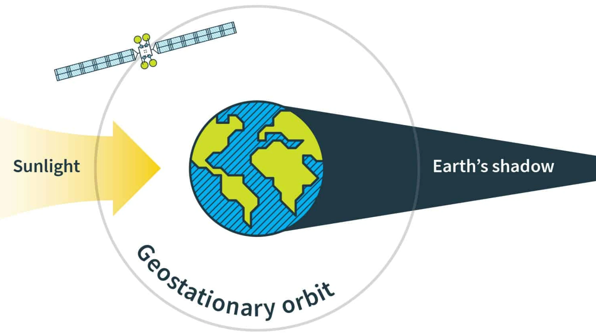

# Loss control regions in optimal control problems

## Introduction

**General context.** *Optimal control theory* studies controlled systems to achieve desired targets with minimal cost. The *Pontryagin maximum principle* (PMP, in short) provides necessary conditions for optimality, ensuring an *adjoint vector* (or *costate*) meets the *Hamiltonian maximization condition*[^1].

Typically, optimal control involves *permanent control*, allowing modification of the control function at each time instant. However, practical constraints can lead to *nonpermanent control*. For instance, digital controls result in *sampled-data control* with discrete changes[^3],[^4]. In aerospace, *eclipse constraints* limit control for solar-powered satellites in a shadow region where the control is reduced to zero[^5]. Hence, it is desirable to keep the system outside these regions.

 


**Objective and approach.** Here, we address optimal control problems with *loss control regions* (we refer to [^2] for further details), where the state space is divided into *control regions* and *loss control regions*. In control regions, control can change at any time, while in loss control regions, control must remain constant, though its value is to be optimized and can vary with each visit.

We extend our previous work by using a permanent control for control regions and a *regionally switching parameter* for loss control regions. This leads to a discontinuous dynamics framework, fitting into *optimal control problems involving spatially heterogenous dynamics*[^2],[^5]. The *hybrid maximum principle* (HMP, in short) extends the PMP to hybrid settings[^2],[^5], with a piecewise absolutely continuous adjoint vector.

**Numerical contribution.** In this note we illustrate a two-step numerical method for optimal control problems with loss control regions. First, a direct numerical approach is applied to a *regularized* problem to manage discontinuities and outline the optimal trajectory's structure. Second, this helps initialize an indirect numerical method for the original problem, using the PMP with loss control regions. The method incorporates the *averaged Hamiltonian gradient condition*[^3],[^4] and adjoint vector discontinuities to define an appropriate shooting function, adding to classical terms for non-hybrid optimal control problems.

!!! note "Contents"
    - Provide a statement of the **PMP with loss control regions**.
    - Provide a **direct method** for solving optimal control problems with loss control regions (based on a **regularization** technique).
    - Provide an **indirect method** (shooting method) for solving optimal control problems with loss control regions using the PMP with loss control regions.


[^1]: L. S. Pontryagin, V. G. Boltyanskii, R. V. Gamkrelidze, E. F. Mishchenko, *The Mathematical Theory of Optimal Processes*, A Pergamon Press Book. The Macmillan Co., New York, 1964.

[^2]: T. Bayen, A. Bouali, L. Bourdin & O. Cots, *Loss control regions in optimal control problems*, Journal of Differential Equations, **405** (2024), 359-397.

[^3]: P. Bettiol, L. Bourdin, *Pontryagin Maximum Principle for State Constrained Optimal Sampled-Data Control Problems on Time Scales*, ESAIM Control Optim. Calc. Var., **27** (2021) 51.

[^4]: L. Bourdin, G. Dhar, *Optimal Sampled-Data Controls with Running Inequality State Constraints: Pontryagin Maximum Principle and Bouncing Trajectory Phenomenon*, Mathematical Programming, **191** (2022) 907–951.

[^5]: T. Haberkorn, E. Trélat, *Convergence Results for Smooth Regularizations of Hybrid Nonlinear Optimal Control Problems*, SIAM Journal on Control and Optimization, **49** (2011) 1498–1522.

## Dependencies

All the numerical simulations to generate this documentation are performed with the following packages.

```@example
using Pkg
Pkg.status()
```
