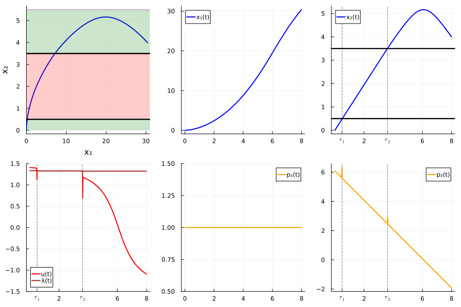
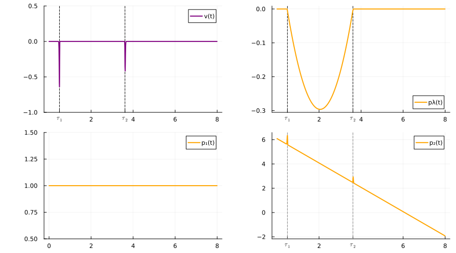
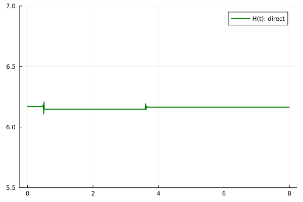
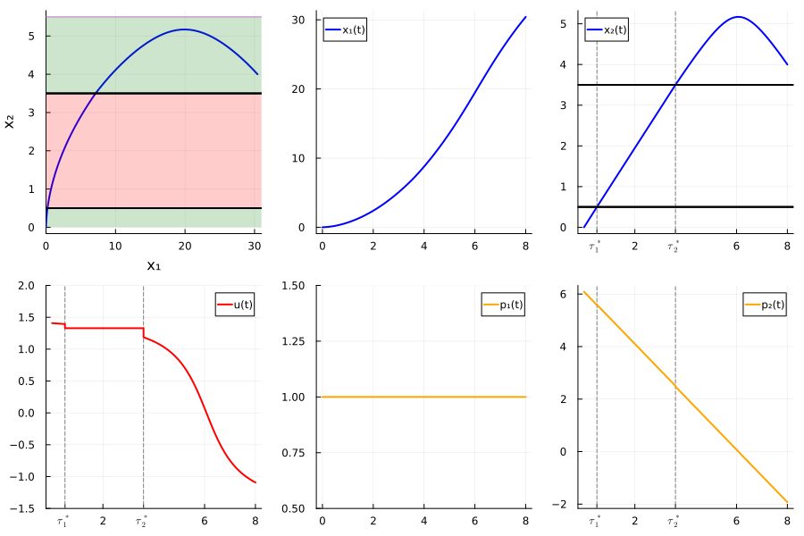
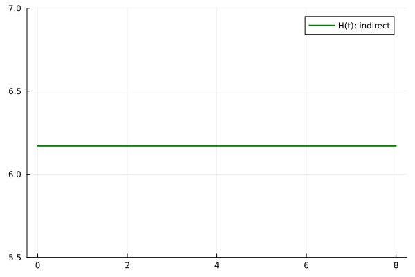

# Zermelo problem, example 1

We consider the Zermelo-type optimal control problem with loss control regions given by

```math
    \begin{equation}
    \begin{array}{lcl}
     \text{minimize}&  &-x_1(8),\\[10pt]
     \text{subject to}& &  (x,u) \in \mathrm{AC}([0,8],\R^2) \times \mathrm{L}^\infty([0,8],\R), \\[6pt]
     & & \dot{x}_1(t) = x_2(t) + \cos(u(t)), \quad \text{a.e.\ } t\in [0,8], \\[6pt]
     & & \dot{x}_2(t) = \sin(u(t)), \quad \text{a.e.\ } t\in [0,8], \\[6pt]
     &  & x(0)=0_{\R^2}, \quad x_2(8)=4,  \\[6pt]
     &  & u(t) \in [-\frac{\pi}{2},\frac{\pi}{2}], \quad \text{a.e.\ } t\in [0,8], \\[6pt]
     &  &u \text{ is constant when } x \text{ is in the loss control region }
     \{x \in \mathbb{R}^2 \mid 0.5 < x_2 < 3.5 \}.
    \end{array}
    \end{equation}
```

## Reformulation for the direct method

```math
    \left\{
    \begin{array}{l}
    \displaystyle \min - x_1(8) + \varepsilon\int_0^8 v^2(t)dt + \int_0^1 f_{NC}(x(t))u^2(t)dt, \\[0.5em]
    \dot{x}_1(t) = f_{C}(x(t))(x_2(t) + \cos(u(t))) + f_{NC}(x_2(t) + \cos(\lambda(t))), \; \text{for a.e. } t\in [0,8],\\[0.5em]
    \dot{x}_2(t) = f_{C}(x(t))\sin(u(t)) + f_{NC}(x(t))\sin(\lambda(t)),  \; \text{for a.e. } t\in [0,8], \\[0.5em]
    \dot{\lambda}(t) = f_{C}(x(t))v^2(t),  \; \text{for a.e. } t\in [0,8], \\[0.5em]

    u(t) \in [-\frac{\pi}{2}, \frac{\pi}{2}], \; \text{for a.e. } t\in [0,8], \\[0.5em]
    x(0) = 0_{\mathbb{R}^2}, \quad x_2(8) = 4,\\[0.5em]
    \{x \in \mathbb{R}^2 \mid 0.5 < x_2 < 3.5 \} \text{ is a loss control region.}
    \end{array}
    \right.
```


```julia
using JuMP 
using Ipopt
using Plots
using Plots.PlotMeasures
using LaTeXStrings
```


```julia
    mutable struct Direct
        t; x1; x2 ; λ ; u ; xu ; xv ; p1 ; p2
    end

    mutable struct DirecttSol
        t; x1; x2 ; λ ; u ; v ; xu ; xv ; p1 ; p2 ; p3 
    end
```


```julia
    distance_squared(x, a, b) = x < a ? (a - x)^2 : x > b ? (x - b)^2 : 0 ;

    # Moreau Yosida regularization
    function MY_reg(x, a, b, k)
        return 1 - exp(-k*distance_squared(x, a, b))
    end

    fC(x) = MY_reg(x, 0.5, 3.5, 2000)
    fNC(x) = 1 - fC(x)

    plot(fNC, 0, 5)
```
    

    


```julia
    function ZERMELO(ε=1e-3; x0=[0, 0], nsteps=1000, tol=1e-10, display=true)
        """
            Solve the Zermelo problem with the given parameters.

            Parameters
            ----------

            x0 : array of floats
                Initial condition
            nsteps : int
                Number of steps in the discretization
            ε : float
                Regularization parameter
            tol : float
                Tolerance for the solver
            display : bool
                If true, display the results

            Returns
            -------
        
            sol : DirecttSol
                The (direct) solution of the problem

        """

        # Create JuMP model, using Ipopt as the solver
        sys = Model(optimizer_with_attributes(Ipopt.Optimizer, "print_level" => display ? 5 : 1))
        set_optimizer_attribute(sys,"tol", tol)
        set_optimizer_attribute(sys,"constr_viol_tol", tol)
        set_optimizer_attribute(sys,"max_iter", 200)
    
        # Constants
        N  = nsteps     # Grid size
    
        # Variables
        @variables(sys, begin
            x1[1:N+1]
            x2[1:N+1]
            -2  ≤  λ[1:N+1]  ≤ 2 # we add box constraints to help the convergence
            -2  ≤  u[1:N+1]  ≤ 2
            v[1:N+1]
            xv[1:N+1]
            xu[1:N+1]
        end)
    
        # Objective
        @NLobjective(sys, Min, -x1[N+1] + ε*xv[N+1] + xu[N+1])
    
        # Boundary constraints
        @constraints(sys, begin
            con_xu0, xu[1]   == 0
            con_xv0, xv[1]   == 0
            con_x10, x1[1]   == x0[1]
            con_x20, x2[1]   == x0[2]
            con_x2f, x2[N+1] == 4
            end)
    
        # Expressions for the dynamics
        @NLexpression(sys, dx1[j = 1:N+1], x2[j] + fNC(x2[j])*cos(λ[j]) + fC(x2[j])*cos(u[j]))
        @NLexpression(sys, dx2[j = 1:N+1],         fNC(x2[j])*sin(λ[j]) + fC(x2[j])*sin(u[j]))
        @NLexpression(sys,  dλ[j = 1:N+1], fC(x2[j])*v[j])
        @NLexpression(sys, dxv[j = 1:N+1], v[j]^2)
        @NLexpression(sys, dxu[j = 1:N+1], fNC(x2[j])*u[j]^2)
    
        # Dynamics with Crank-Nicolson scheme
        Δt = 8/(N+1)
        @NLconstraints(sys, begin
        con_dx1[j=1:N], x1[j+1] == x1[j] + 0.5 * Δt * (dx1[j+1] + dx1[j])
        con_dx2[j=1:N], x2[j+1] == x2[j] + 0.5 * Δt * (dx2[j+1] + dx2[j])
        con_dx3[j=1:N],  λ[j+1] ==  λ[j] + 0.5 * Δt * (dλ[j+1]  + dλ[j])
        con_dxv[j=1:N], xv[j+1] == xv[j] + 0.5 * Δt * (dxv[j+1] + dxv[j])
        con_dxu[j=1:N], xu[j+1] == xu[j] + 0.5 * Δt * (dxu[j+1] + dxu[j])
    end);
    
    if display
        println("Solving...")
    end
    status = optimize!(sys)
    if display
        println()
    end
        
    # Display results
    if display
        if termination_status(sys) == MOI.OPTIMAL
            println("  Solution is optimal")
        elseif  termination_status(sys) == MOI.LOCALLY_SOLVED
            println("  (Local) solution found")
        elseif termination_status(sys) == MOI.TIME_LIMIT && has_values(sys)
            println("  Solution is suboptimal due to a time limit, but a primal solution is available")
        else
            error("  The model was not solved correctly.")
        end
        println("  objective value = ", objective_value(sys))
        println()
    end    
        
    # Retrieves values (including duals)
    x1 = value.(x1)[:]
    x2 = value.(x2)[:]
    λ  = value.(λ)[:]
    u  = value.(u)[:]
    v  = value.(v)[:]
    xu  = value.(xu)[:]
    xv  = value.(xv)[:]
    t  = (0:N) * value.(Δt)
    
    # duals of the boundary constraints
    px10 = -dual(con_x10)
    px20 = -dual(con_x20)
    px30 = 0 # λ(0) is free
    px1f = 1
    px2f = dual(con_x2f) 
    px3f = 0 # λ(4) is free

    # duals of the dynamics
    px1 = -[ dual(con_dx1[i]) for i in 1:N ]
    px2 = -[ dual(con_dx2[i]) for i in 1:N ]
    px3 = -[ dual(con_dx3[i]) for i in 1:N ]

    # adjoint vectors
    p1 = [px10; (px1[1:N-1]+px1[2:N])/2; px1f]
    p2 = [px20; (px2[1:N-1]+px2[2:N])/2; px2f]
    p3 = [px30; (px3[1:N-1]+px3[2:N])/2; px3f]

    return DirecttSol(t, x1, x2, λ, u, v, xu, xv, p1, p2, p3)
        
    end;
```


```julia
    # Resolution
    ε = 1e-3
    sol_direct = ZERMELO(ε);
```

    Solving...
    
    ******************************************************************************
    This program contains Ipopt, a library for large-scale nonlinear optimization.
     Ipopt is released as open source code under the Eclipse Public License (EPL).
             For more information visit https://github.com/coin-or/Ipopt
    ******************************************************************************
    
    This is Ipopt version 3.14.4, running with linear solver MUMPS 5.4.1.
    
    Number of nonzeros in equality constraint Jacobian...:    30005
    Number of nonzeros in inequality constraint Jacobian.:        0
    Number of nonzeros in Lagrangian Hessian.............:    34000
    
    Total number of variables............................:     7007
                         variables with only lower bounds:        0
                    variables with lower and upper bounds:     2002
                         variables with only upper bounds:        0
    Total number of equality constraints.................:     5005
    Total number of inequality constraints...............:        0
            inequality constraints with only lower bounds:        0
       inequality constraints with lower and upper bounds:        0
            inequality constraints with only upper bounds:        0
    
    iter    objective    inf_pr   inf_du lg(mu)  ||d||  lg(rg) alpha_du alpha_pr  ls
       0  0.0000000e+00 4.00e+00 4.60e-03  -1.0 0.00e+00    -  0.00e+00 0.00e+00   0
       1 -2.4329118e+01 4.20e-03 1.01e+01  -1.0 2.43e+01    -  8.14e-01 1.00e+00f  1
       2 -2.3332372e+01 3.20e-02 1.62e+01  -1.0 2.00e+00  -2.0 8.41e-01 1.00e+00h  1
       3 -2.3295187e+01 5.88e-02 2.25e+01  -1.0 1.66e+00  -0.7 8.83e-01 1.00e+00h  1
       4 -2.3298763e+01 1.56e-03 6.06e+00  -1.0 3.55e-01  -0.2 1.00e+00 1.00e+00h  1
       5 -2.3305004e+01 1.35e-04 7.07e-01  -1.0 8.53e-02   0.2 1.00e+00 1.00e+00h  1
       6 -2.3322266e+01 2.99e-05 5.63e-02  -1.7 1.79e-02  -0.3 1.00e+00 1.00e+00h  1
       7 -2.3369092e+01 2.89e-04 2.72e-02  -2.5 2.96e-02  -0.8 1.00e+00 1.00e+00f  1
       8 -2.3505808e+01 1.77e-03 4.28e-02  -3.8 9.10e-02  -1.3 1.00e+00 1.00e+00f  1
       9 -2.3896881e+01 7.56e-03 1.81e-01  -3.8 5.63e-01  -1.7 1.00e+00 1.00e+00f  1
    iter    objective    inf_pr   inf_du lg(mu)  ||d||  lg(rg) alpha_du alpha_pr  ls
      10 -2.4244011e+01 1.33e-02 5.48e-01  -3.8 7.26e+00  -2.2 2.95e-01 2.56e-01f  1
      11 -2.4572251e+01 1.16e-02 7.47e-01  -3.8 1.02e+00  -1.8 1.00e+00 1.00e+00h  1
      12 -2.5407442e+01 2.33e-02 5.92e-01  -3.8 1.64e+00  -2.3 5.90e-01 1.00e+00f  1
      13 -2.6856699e+01 4.21e-02 5.35e-01  -3.8 2.32e+00  -2.7 8.10e-01 1.00e+00f  1
      14 -2.6781113e+01 1.52e-02 3.29e-01  -3.8 8.63e-01  -1.4 1.00e+00 1.00e+00h  1
      15 -2.6777720e+01 2.21e-03 2.43e-01  -3.8 1.40e-01  -1.0 1.00e+00 1.00e+00h  1
      16 -2.6921492e+01 2.36e-02 1.56e+00  -3.8 1.81e+01  -1.5 1.15e-01 1.07e-01f  1
      17 -2.6929526e+01 4.54e-03 1.12e+00  -3.8 7.34e-01  -1.0 1.00e+00 1.00e+00h  1
      18 -2.6941301e+01 1.05e-03 1.99e-01  -3.8 2.48e-02  -0.6 9.98e-01 1.00e+00h  1
      19 -2.6977734e+01 1.32e-04 2.47e-02  -3.8 6.13e-02  -1.1 1.00e+00 1.00e+00h  1
    iter    objective    inf_pr   inf_du lg(mu)  ||d||  lg(rg) alpha_du alpha_pr  ls
      20 -2.7090900e+01 1.69e-03 9.58e-03  -3.8 1.14e-01  -1.6 1.00e+00 1.00e+00f  1
      21 -2.7418408e+01 6.70e-03 8.19e-02  -3.8 3.56e-01  -2.0 1.00e+00 1.00e+00f  1
      22 -2.8032621e+01 2.99e-02 2.75e-01  -3.8 8.69e+01    -  6.90e-03 3.91e-02f  1
      23 -2.8132877e+01 2.11e-02 3.11e-01  -3.8 2.25e+00  -1.6 1.00e+00 1.00e+00h  1
      24 -2.8468256e+01 2.49e-02 8.58e-01  -3.8 2.25e+00  -2.1 6.32e-01 1.00e+00h  1
      25 -2.8563077e+01 7.65e-03 5.04e-01  -3.8 8.18e-01  -1.7 1.00e+00 1.00e+00h  1
      26 -2.8909197e+01 2.72e-02 1.63e+00  -3.8 2.23e+00  -2.1 7.48e-01 1.00e+00h  1
      27 -2.9016378e+01 8.27e-03 2.04e+00  -3.8 7.72e-01  -1.7 1.00e+00 1.00e+00h  1
      28 -2.9037214e+01 5.56e-03 2.66e-01  -3.8 3.59e-01  -1.3 1.00e+00 1.00e+00h  1
      29 -2.9171381e+01 5.56e-03 2.13e-01  -3.8 3.36e-01  -1.8 1.00e+00 1.00e+00h  1
    iter    objective    inf_pr   inf_du lg(mu)  ||d||  lg(rg) alpha_du alpha_pr  ls
      30 -2.9614426e+01 2.09e-02 4.07e-01  -3.8 1.97e+00  -2.2 1.00e+00 9.64e-01f  1
      31 -3.0148015e+01 1.97e-02 4.39e-01  -3.8 3.44e+01    -  5.81e-02 5.81e-02f  1
      32 -3.0275291e+01 1.94e-02 4.33e-01  -3.8 1.35e+02    -  1.61e-02 1.37e-02f  1
      33 -3.0471309e+01 1.63e-02 3.67e-01  -3.8 1.30e+01    -  2.26e-02 1.52e-01h  1
      34 -3.0588444e+01 6.24e-02 3.93e-01  -3.8 1.36e+01    -  1.26e-02 2.10e-01h  1
      35 -3.0816105e+01 6.27e-01 6.04e-01  -3.8 1.15e+02    -  2.34e-02 8.68e-02f  1
      36 -3.1057930e+01 1.94e-01 7.91e-01  -3.8 4.52e+00  -2.7 8.31e-01 8.31e-01h  1
      37 -3.0763980e+01 3.30e-02 4.78e+00  -3.8 2.31e+00  -1.4 4.66e-03 1.00e+00h  1
      38 -3.0499204e+01 6.29e-03 9.04e+00  -3.8 1.47e+00  -1.0 6.33e-01 1.00e+00h  1
      39 -3.0325523e+01 9.77e-04 7.12e-01  -3.8 3.94e-01    -  1.00e+00 1.00e+00h  1
    iter    objective    inf_pr   inf_du lg(mu)  ||d||  lg(rg) alpha_du alpha_pr  ls
      40 -3.0336887e+01 3.56e-04 3.74e-01  -3.8 1.61e-01  -1.4 1.00e+00 1.00e+00h  1
      41 -3.0358753e+01 2.63e-03 4.93e-01  -3.8 6.06e-01    -  1.00e+00 1.00e+00h  1
      42 -3.0345091e+01 6.28e-03 7.35e-02  -3.8 3.17e+00    -  1.00e+00 1.00e+00H  1
      43 -3.0345143e+01 4.34e-03 2.28e-02  -3.8 7.77e-01    -  1.00e+00 1.00e+00h  1
      44 -3.0345057e+01 1.32e-05 6.26e-04  -3.8 4.07e-02  -1.9 1.00e+00 1.00e+00h  1
      45 -3.0345879e+01 3.26e-04 1.98e-02  -5.7 3.05e-01    -  9.65e-01 1.00e+00h  1
      46 -3.0349654e+01 4.06e-02 3.15e-03  -5.7 3.99e+00    -  1.00e+00 1.00e+00h  1
      47 -3.0348262e+01 4.67e-04 1.51e-04  -5.7 1.46e+00    -  1.00e+00 1.00e+00h  1
      48 -3.0348210e+01 1.45e-06 5.96e-07  -5.7 5.12e-02    -  1.00e+00 1.00e+00h  1
      49 -3.0348334e+01 3.25e-04 2.57e-05  -8.6 3.13e-01    -  8.99e-01 1.00e+00h  1
    iter    objective    inf_pr   inf_du lg(mu)  ||d||  lg(rg) alpha_du alpha_pr  ls
      50 -3.0348329e+01 5.68e-05 2.10e-06  -8.6 2.00e-01    -  9.96e-01 1.00e+00h  1
      51 -3.0348318e+01 2.93e-06 1.09e-07  -8.6 5.07e-02    -  1.00e+00 1.00e+00h  1
      52 -3.0348317e+01 9.62e-09 3.56e-10  -8.6 3.25e-03    -  1.00e+00 1.00e+00h  1
      53 -3.0348317e+01 5.03e-09 1.74e-10 -11.0 1.75e-03    -  1.00e+00 1.00e+00h  1
      54 -3.0348317e+01 2.60e-14 5.88e-15 -11.0 4.93e-06    -  1.00e+00 1.00e+00h  1
    
    Number of Iterations....: 54
    
                                       (scaled)                 (unscaled)
    Objective...............:  -3.0348317398267728e+01   -3.0348317398267728e+01
    Dual infeasibility......:   5.8804686380725668e-15    5.8804686380725668e-15
    Constraint violation....:   2.6041668821363828e-14    2.6041668821363828e-14
    Variable bound violation:   0.0000000000000000e+00    0.0000000000000000e+00
    Complementarity.........:   9.0909561694714120e-12    9.0909561694714120e-12
    Overall NLP error.......:   9.0909561694714120e-12    9.0909561694714120e-12
    
    
    Number of objective function evaluations             = 56
    Number of objective gradient evaluations             = 55
    Number of equality constraint evaluations            = 56
    Number of inequality constraint evaluations          = 0
    Number of equality constraint Jacobian evaluations   = 55
    Number of inequality constraint Jacobian evaluations = 0
    Number of Lagrangian Hessian evaluations             = 54
    Total seconds in IPOPT                               = 6.013
    
    EXIT: Optimal Solution Found.
    
      (Local) solution found
      objective value = -30.348317398267728
    
    

    ┌ Warning: Function fNC automatically registered with 1 arguments.
    │ 
    │ Calling the function with a different number of arguments will result in an
    │ error.
    │ 
    │ While you can safely ignore this warning, we recommend that you manually
    │ register the function as follows:
    │ ```Julia
    │ model = Model()
    │ register(model, :fNC, 1, fNC; autodiff = true)
    │ ```
    └ @ MathOptInterface.Nonlinear ~/.julia/packages/MathOptInterface/fTxO0/src/Nonlinear/operators.jl:370
    ┌ Warning: Function fC automatically registered with 1 arguments.
    │ 
    │ Calling the function with a different number of arguments will result in an
    │ error.
    │ 
    │ While you can safely ignore this warning, we recommend that you manually
    │ register the function as follows:
    │ ```Julia
    │ model = Model()
    │ register(model, :fC, 1, fC; autodiff = true)
    │ ```
    └ @ MathOptInterface.Nonlinear ~/.julia/packages/MathOptInterface/fTxO0/src/Nonlinear/operators.jl:370
    


```julia
    # Plots
    t  = sol_direct.t
    x1 = sol_direct.x1
    x2 = sol_direct.x2
    u  = sol_direct.u
    v  = sol_direct.v
    λ  = sol_direct.λ
    xu = sol_direct.xu
    xv = sol_direct.xv
    p1 = sol_direct.p1
    p2 = sol_direct.p2
    p3 = sol_direct.p3

    println("xu = ", xu[end])
    println("xv = ", xv[end])

    u1     = deepcopy(u); 
    index1 = findfirst(abs.(x2.- 0.5) .< 0.01)
    index2 = findfirst(abs.(x2.- 3.5) .< 0.01)
    t1   = t[index1-1]
    t2   = t[index2+2]
    u1[t1  .<= t .<= t2] .= λ[(index1 + index2) ÷ 2]

    # plots
    x1_plot   = plot(t, x1, label="x₁(t)", linecolor=:blue, linewidth=2)

    x2_plot   = plot(t,  x2, label="x₂(t)", linecolor=:blue, linewidth=2)
    xticks!(x2_plot, [t1,2.,t2,6.,8.], [L"$\tau_1$", "2",L"$\tau_2$","6","8"])
    vline!(x2_plot, [t1], linestyle=:dash, linecolor=:gray, label=nothing)
    vline!(x2_plot, [t2], linestyle=:dash, linecolor=:gray, label=nothing)
    hline!([(0., 0.5), (8., 0.5)], linecolor=:black, linewidth=2, label=false)
    hline!([(0., 3.5), (8., 3.5)], linecolor=:black, linewidth=2, label=false)

    p1_plot   = plot(t, p1, label="p₁(t)", linecolor=:orange, linewidth=2, ylims=(0.5, 1.5))

    p2_plot   = plot(t,  p2, label="p₂(t)", linecolor=:orange, linewidth=2)
    xticks!(p2_plot, [t1,2.,t2,6.,8.], [L"$\tau_1$", "2",L"$\tau_2$","6","8"])
    vline!(p2_plot, [t1], linestyle=:dash, linecolor=:gray, label=nothing, z_order=:back)
    vline!(p2_plot, [t2], linestyle=:dash, linecolor=:gray, label=nothing, z_order=:back)

    u_plot = plot(t,  u1, label="u(t)" ,linecolor=:red ,linewidth=2, ylims=(-1.5, 1.5))
    plot!(t, λ, label="λ(t)", linecolor=:brown , linewidth=2)
    xticks!(u_plot, [t1,2.,t2,6.,8.], [L"$\tau_1$", "2",L"$\tau_2$","6","8"])
    vline!(u_plot, [t1], linestyle=:dash, linecolor=:gray, label=nothing, z_order=:back)
    vline!(u_plot, [t2], linestyle=:dash, linecolor=:gray, label=nothing, z_order=:back)

    x1x2_plot = plot(x1, x2, xlabel = "x₁", ylabel = "x₂",   legend=false, linecolor=:blue, linewidth=2)
    plot!(x1x2_plot, [0., 32.], [0.5, 0.5], fillrange = 0.0, fillalpha = 0.2, fillcolor = :green, label=false )
    plot!(x1x2_plot, [0., 32.], [3.5, 3.5], fillrange = 0.5, fillalpha = 0.2, fillcolor = :red,  label=false )
    plot!(x1x2_plot, [0., 32.], [5.5, 5.5], fillrange = 3.5, fillalpha = 0.2, fillcolor = :green, label=false )
    hline!([(0., 0.5), (32., 0.5)], linecolor=:black, linewidth=2, label=false)
    hline!([(0., 3.5), (32., 3.5)], linecolor=:black, linewidth=2, label=false)
    xlims!(0, 31)

    # global plot
    plot(x1x2_plot, x1_plot, x2_plot, u_plot , p1_plot, p2_plot , layout = (2,3), size=(900, 600))
```

    xu = 0.019619164191148557
    xv = 0.010565925235049853
        

    


```julia
    # other plots specific to the direct method

    v_plot   = plot(t,  v, label = "v(t)", linecolor=:purple, linewidth=2, ylims=(-1, 0.5))
    xticks!(v_plot, [t1,2.,t2,4.,6.,8.], [L"$\tau_1$", "2",L"$\tau_2$","4","6","8"])
    vline!(v_plot, [t1], linestyle=:dash, linecolor=:black, label=nothing, z_order=:back)
    vline!(v_plot, [t2], linestyle=:dash, linecolor=:black, label=nothing, z_order=:back)

    p3_plot   = plot(t,  p3, label = "pλ(t)", linecolor=:orange, linewidth=2)
    xticks!(p3_plot, [t1,2.,t2,4.,6.,8.], [L"$\tau_1$", "2",L"$\tau_2$","4","6","8"])
    vline!(p3_plot, [t1], linestyle=:dash, linecolor=:black, label=nothing, z_order=:back)
    vline!(p3_plot, [t2], linestyle=:dash, linecolor=:black, label=nothing, z_order=:back)

    plot(v_plot,p3_plot ,p1_plot,p2_plot, layout = (2,2), size=(900, 500), left_margin=10mm)
```


    

    


```julia
    function H(k)
        return p1[k] * x2[k] + p1[k] * (fNC(x2[k])*cos(λ[k]) + fC(x2[k])*cos(u[k])) +
                            p2[k] * (fNC(x2[k])*sin(λ[k]) + fC(x2[k])*sin(u[k])) +
                            p3[k] * fC(x2[k]) * v[k] -
                            ε * v[k]^2 - fNC(x2[k]) * u[k]^2
    end

H_direct  = [H(k) for k in 1:length(x1)]
ph_plot   = plot(t, H_direct, label = "H(t): direct", linecolor=:green , linewidth=2, ylims=(5.5, 7))
```


    

    


    ```julia
    jmp1 = p2[index1+2]  - p2[index1]
    jmp2 = p2[index2+2]  - p2[index2]

    println(" p2(t1+) - p2(t1-) = ", jmp1)
    println(" p2(t2+) - p2(t2-) = ", jmp2)
```

     p2(t1+) - p2(t1-) = -0.337988685006648
     p2(t2+) - p2(t2-) = 0.3238832176238047
    

## Indirect method


```julia
    using NLsolve
    using Animations
    using Reel
    using Plots
    using Plots.PlotMeasures
    using LinearAlgebra
    include("flow.jl");
```


```julia
    # Dynamics
    function F(x, u)
        return [ x[2] + cos(u), sin(u) ]
    end

    function G(λ)
        return [ sin(λ), - cos(λ) ]
    end

    # Hamiltonian: permanent region
    H1(x, u, p)  = p' * F(x, u)                 # pseudo-Hamiltonian
    u11(x, p)    = atan(p[2]/p[1])              # maximizing control
    Hc(x, p)     = H1(x, u11(x, p) , p )        # Hamiltonian

    # Flow
    fc  = Flow(Hc)

    # Hamiltonian: control loss region
    H2(x, λ, y, p)   = p' * F(x, λ)   + y* p' *G(λ) # pseudo-Hamiltonian
    Hcl(X, P)     = H2(X[1:2], X[3], X[4], P[1:2])  # Hamiltonian

    # Flow
    fcl  = Flow(Hcl);
```


```julia
    # parameters
    t0  = 0
    tf  = 8
    x2f = 4
    x0  = [0, 0]

    # Shooting function
    function shoot(p0, tt1, tt2, λ, jump1, jump2) 
        
        pλ0    = 0
        py0    = 0
        
        x1, p1 = fc(t0, x0, p0, tt1)
        X2, P2 = fcl(tt1, [x1; λ; 0], [p1 - [0, jump1]; pλ0; py0], tt2) # augmented flow
        xf, pf = fc(tt2, X2[1:2], P2[1:2] - [0, jump2], tf)

        s = zeros(eltype(p0), 7)
        s[1]  = xf[2] - x2f # target
        s[2]  = pf[1] - 1.0 # transversality condition
        s[3]  = x1[2] - 0.5 # first crossing 
        s[4]  = X2[2] - 3.5 # second crossing 
        s[5]  = P2[4]       # averaged gradient condition
        s[6]  = jump1 - (p1[1]*(cos(λ) - cos(u11(x1, p1)))           + 
                        p1[2]*(sin(λ) - sin(u11(x1, p1))))/(sin(λ))                                              # jump 1
        s[7]  = jump2 - (P2[1]*(cos(u11(X2[1:2], P2[1:2])) - cos(λ)) + 
                        P2[2]*(sin(u11(X2[1:2], P2[1:2])) - sin(λ)))/(sin(u11(X2[1:2], P2[1:2])))                # jump 2

        return s

    end;
```


```julia
    # Solve

    S(ξ)    = shoot(ξ[1:2], ξ[3], ξ[4], ξ[5], ξ[6], ξ[7])
    ξ_guess = [p1[1], p2[1], t1[1], t2[1], λ[(index1+index2)÷2], jmp1, jmp2] # initial guess
    println("Initial value of shooting:\n", S(ξ_guess), "\n\n")

    indirect_sol = nlsolve(S, ξ_guess; xtol=1e-8, method=:trust_region, show_trace=true)
    println(indirect_sol)

    # Retrieves solution
    if indirect_sol.f_converged || indirect_sol.x_converged
        pp0   = indirect_sol.zero[1:2]
        tt1   = indirect_sol.zero[3]
        tt2   = indirect_sol.zero[4]
        a     = indirect_sol.zero[5]
        jmp11 = indirect_sol.zero[6]
        jmp22 = indirect_sol.zero[7]

    else
        error("Not converged")
    end;
```

    Initial value of shooting:
    [0.05007226071378135, 0.0, -0.011617047560808114, 0.013492751980266338, 0.2568239312461033, -0.3251275640733963, 0.3085873259832842]
    
    
    Iter     f(x) inf-norm    Step 2-norm 
    ------   --------------   --------------
         0     3.251276e-01              NaN
         1     2.901690e-03     4.423209e-01
         2     2.455838e-06     3.474638e-03
         3     3.406229e-13     5.064949e-07
    Results of Nonlinear Solver Algorithm
     * Algorithm: Trust-region with dogleg and autoscaling
     * Starting Point: [1.0, 6.087321019322859, 0.4955044955044955, 3.612387612387612, 1.3275286734022251, -0.337988685006648, 0.3238832176238047]
     * Zero: [1.0, 6.088879620621635, 0.5073023447991126, 3.5974522435428518, 1.3286547556171466, -0.01228198993970171, 0.027541288724319064]
     * Inf-norm of residuals: 0.000000
     * Iterations: 3
     * Convergence: true
       * |x - x'| < 1.0e-08: false
       * |f(x)| < 1.0e-08: true
     * Function Calls (f): 4
     * Jacobian Calls (df/dx): 4
    


```julia
    # jumps from direct solution
    println(" jumps from direct solution")
    println(" p2(t1+) - p2(t1-) = ", jmp1)
    println(" p2(t2+) - p2(t2-) = ", jmp2)
    println("")

    # jumps from indirect solution
    println(" jumps from indirect solution")
    println(" p2(t1+) - p2(t1-) = ", jmp11)
    println(" p2(t2+) - p2(t2-) = ", jmp22)
```

     jumps from direct solution
     p2(t1+) - p2(t1-) = -0.337988685006648
     p2(t2+) - p2(t2-) = 0.3238832176238047
    
     jumps from indirect solution
     p2(t1+) - p2(t1-) = -0.01228198993970171
     p2(t2+) - p2(t2-) = 0.027541288724319064
    


```julia
    ode_sol = fc((t0, tt1), x0, pp0, saveat=0.1) ;
    ttt1 = ode_sol.t ;
    xx1 = [ ode_sol[1:2, j] for j in 1:size(ttt1, 1) ] ;
    pp1 = [ ode_sol[3:4, j] for j in 1:size(ttt1, 1) ] ;
    uu1 = u11.(xx1, pp1)  ;

    pλ0 = 0. 
    py0 = 0.

    ode_sol = fcl((tt1, tt2), [xx1[end] ; a ; 0.0], [pp1[end] - [0. , jmp11]; pλ0 ; py0], saveat=0.1)
    ttt2 = ode_sol.t
    xx2 = [ ode_sol[1:2, j] for j in 1:size(ttt2, 1) ]
    pp2 = [ ode_sol[5:6, j] for j in 1:size(ttt2, 1) ]
    uu2 = a.*ones(length(ttt2)) ;

    ode_sol = fc((tt2, tf), xx2[end], pp2[end] - [0. , jmp22], saveat=0.1)
    ttt3 = ode_sol.t
    xx3 = [ ode_sol[1:2, j] for j in 1:size(ttt3, 1) ]
    pp3 = [ ode_sol[3:4, j] for j in 1:size(ttt3, 1) ] 
    uu3 = u11.(xx3, pp3)  ;

    t = [ ttt1 ; ttt2 ; ttt3 ]
    x = [ xx1 ; xx2 ; xx3 ]
    p = [ pp1 ; pp2 ; pp3 ]
    u = [ uu1 ; uu2 ; uu3 ]

    m = length(t)

    x1 = [ x[i][1] for i=1:m ]
    x2 = [ x[i][2] for i=1:m ]
    p1 = [ p[i][1] for i=1:m ]
    p2 = [ p[i][2] for i=1:m ];

    x1_plot   = plot(t, x1, label="x₁(t)", linecolor=:blue, linewidth=2)

    x2_plot   = plot(t,  x2, label="x₂(t)", linecolor=:blue, linewidth=2)
    xticks!(x2_plot, [ttt1[end],2.,ttt2[end],6.,8.], [L"$\tau_1^*$", "2",L"$\tau_2^*$","6","8"])
    vline!(x2_plot, [ttt1[end]], linestyle=:dash, linecolor=:gray, label=nothing)
    vline!(x2_plot, [ttt2[end]], linestyle=:dash, linecolor=:gray, label=nothing)
    hline!([(0., 0.5), (8., 0.5)], linecolor=:black, linewidth=2, label=false)
    hline!([(0., 3.5), (8., 3.5)], linecolor=:black, linewidth=2, label=false)

    p1_plot   = plot(t, p1, label="p₁(t)", linecolor=:orange, linewidth=2, ylims=(0.5, 1.5))

    p2_plot   = plot(t,  p2, label="p₂(t)", linecolor=:orange, linewidth=2)
    xticks!(p2_plot, [ttt1[end],2.,ttt2[end],6.,8.], [L"$\tau_1^*$", "2",L"$\tau_2^*$","6","8"])
    vline!(p2_plot, [ttt1[end]], linestyle=:dash, linecolor=:gray, label=nothing, z_order=:back)
    vline!(p2_plot, [ttt2[end]], linestyle=:dash, linecolor=:gray, label=nothing, z_order=:back)

    u_plot    = plot(t,   u, label="u(t)" ,linecolor=:red ,linewidth=2, ylims=(-1.5, 2))
    xticks!(u_plot, [ttt1[end],2.,ttt2[end],6.,8.], [L"$\tau_1^*$", "2",L"$\tau_2^*$","6","8"])
    vline!(u_plot, [ttt1[end]], linestyle=:dash, linecolor=:gray, label=nothing, z_order=:back)
    vline!(u_plot, [ttt2[end]], linestyle=:dash, linecolor=:gray, label=nothing, z_order=:back)

    x1x2_plot = plot(x1, x2, xlabel = "x₁", ylabel = "x₂",   legend=false, linecolor=:blue, linewidth=2)
    plot!(x1x2_plot, [0., 31.], [0.5, 0.5], fillrange = 0.0, fillalpha = 0.2, fillcolor = :green, label=false)
    plot!(x1x2_plot, [0., 31.], [3.5, 3.5], fillrange = 0.5, fillalpha = 0.2, fillcolor = :red, label=false)
    plot!(x1x2_plot, [0., 31.], [5.5, 5.5], fillrange = 3.5, fillalpha = 0.2, fillcolor = :green, label=false)
    hline!([(0., 0.5), (31., 0.5)], linecolor=:black, linewidth=2, label=false)
    hline!([(0., 3.5), (31., 3.5)], linecolor=:black, linewidth=2, label=false)
    xlims!(0, 31)

    x = plot(x1x2_plot,x1_plot, x2_plot,u_plot,p1_plot, p2_plot , layout = (2, 3), size=(900, 600))


```


    

    


```julia
    function HH(k)
        return p1[k] * (x2[k] + cos(u[k])) + p2[k] * sin(u[k])
    end

    H_indirect  = [HH(k) for k in 1:length(x2)]
    ph_plot   = plot(t, H_indirect, label = "H(t): indirect", linecolor=:green , linewidth=2, ylims=(5.5, 7))
```


    

    


```julia
    p2_plot = plot(t, p2, xlabel = "t", ylabel = "p2", legend=false, linecolor=:orange, linewidth=2)
    xticks!(p2_plot, [ttt1[end], 2., ttt2[end], 6., 8.], [L"$\tau_1^*$", "2", L"$\tau_2^*$", "6", "8"])

    xlims!(p2_plot, (ttt1[end]-0.05, ttt1[end]+0.05))
    ylims!(p2_plot, (5.50, 5.65))

```


```julia
    p2_plot = plot(t, p2, xlabel = "t", ylabel = "p2", legend=false, linecolor=:orange, linewidth=2)
    xticks!(p2_plot, [ttt1[end], 2., ttt2[end], 6., 8.], [L"$\tau_1^*$", "2", L"$\tau_2^*$", "6", "8"])

    xlims!(p2_plot, (ttt2[end]-0.05, ttt2[end]+0.05))
    ylims!(p2_plot, (2.4250,2.55))
```


```julia
    # create an animation
    animx = @animate for i = 1:length(t)
        plot(x1[1:i], x2[1:i], xlim=(0.,31.), ylim=(-0.,5.5), xlabel="x1", ylabel="x2", label="optimal trajectory \$x\$", linecolor=:blue,  linewidth=2)
        scatter!([x1[i]], [x2[i]], markersize=4, marker=:circle, color=:black, label=false)
        plot!( [0., 31.], [0.5, 0.5], fillrange = 0.0, fillalpha = 0.2, fillcolor = :green, label=false)
        plot!( [0., 31.], [3.5, 3.5], fillrange = 0.5, fillalpha = 0.2, fillcolor = :red, label=false)
        plot!( [0., 31.], [5.5, 5.5], fillrange = 3.5, fillalpha = 0.2, fillcolor = :green, label=false)

    end

    # create an animation
    animu = @animate for i = 1:length(t)
        plot(t[1:i], u[1:i], xlim=(0.,8.), ylim=(-pi/2,pi/2), xlabel="t", ylabel="u", label="opitmal control \$u\$", linecolor=:red,  linewidth=2)
    end ;

    # create an animation
    animp1 = @animate for i = 1:length(t)
        plot(t[1:i], p1[1:i], xlim=(0.,8.), ylim=(0.,2.), xlabel="t", ylabel="p1", label="adjoint vector \$p1\$", linecolor=:orange,  linewidth=2)
    end ;

    # create an animation
    animp2 = @animate for i = 1:length(t)
        plot(t[1:i], p2[1:i], xlim=(0.,8.), ylim=(-2.2,6.), xlabel="t", ylabel="p2", label="adjoint vector \$p2\$", linecolor=:orange,  linewidth=2)
    end ;
```


```julia
    # display the animation
    gif(animx, "zer1_x.gif", fps = 10)
```


```julia
    gif(animu, "zer1_u.gif", fps = 10)
```


```julia
    # display the animation
    gif(animp1, "zer1_p1.gif", fps = 10)
```


```julia
    # display the animation
    gif(animp2, "zer_p2.gif", fps = 10)
```
