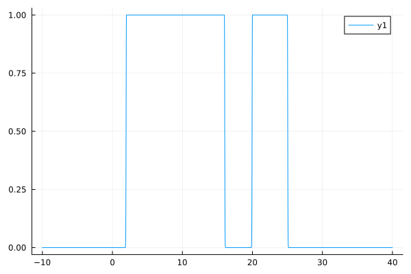
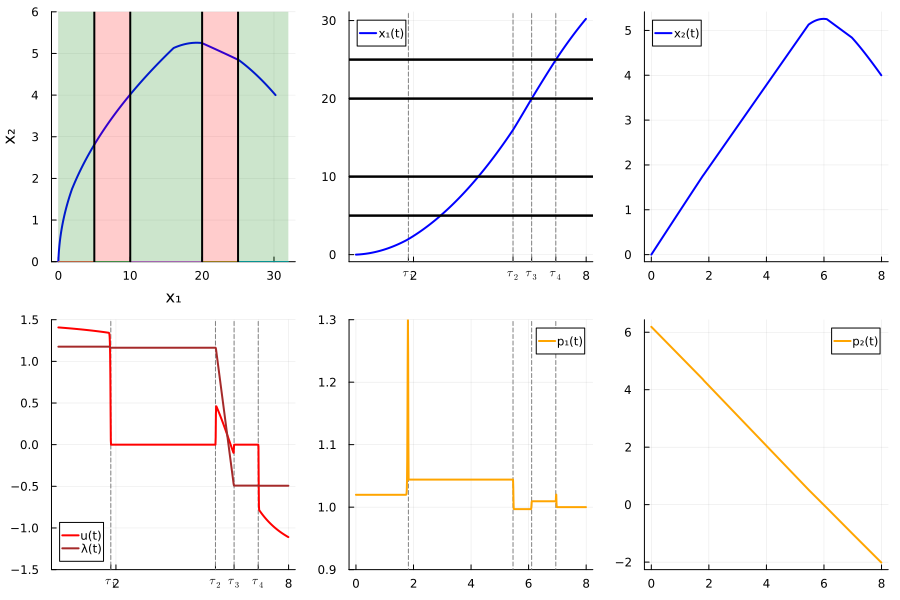
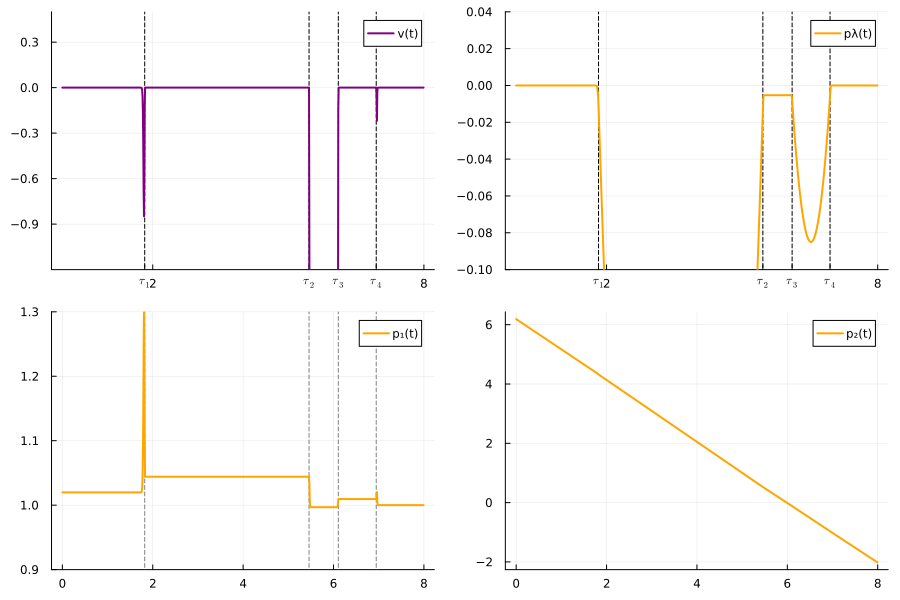
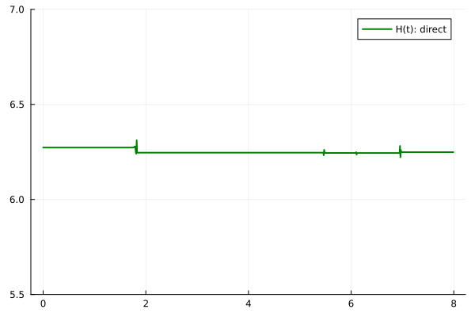
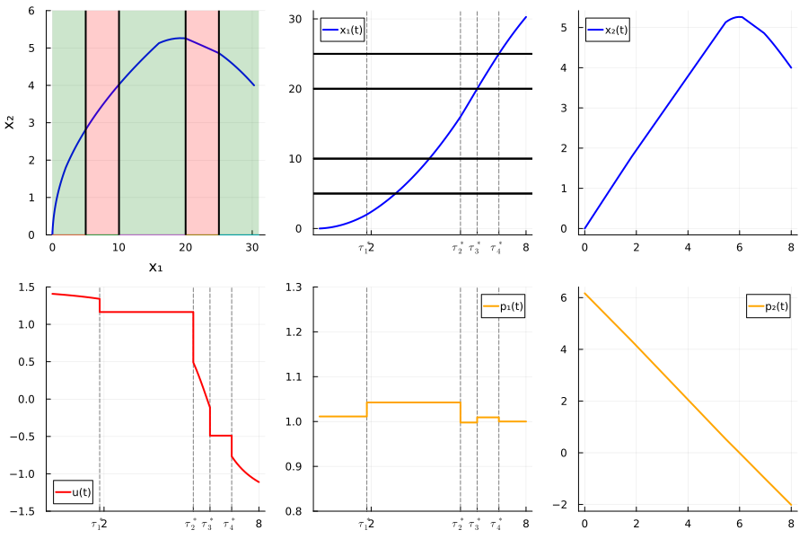
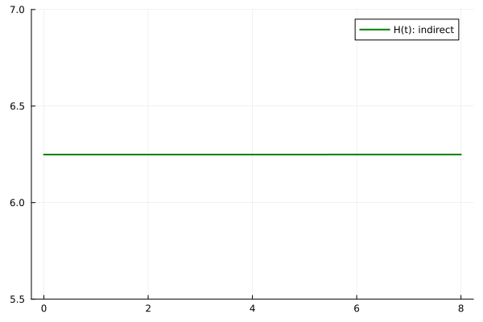

# Zermelo problem, example 2

We consider the Zermelo-type optimal control problem with loss control regions given by

```math
    \begin{equation}
    \begin{array}{lcl}
        \text{minimize}&  &-x_1(8),\\[10pt]
        \text{subject to}& &  (x,u) \in \mathrm{AC}([0,8],\mathbb{R}^2) \times \mathrm{L}^\infty([0,8],\mathbb{R}), \\[6pt]
        & & \dot{x}_1(t) = x_2(t) + \cos(u(t)), \quad \text{a.e. } t\in [0,8], \\[6pt]
        & & \dot{x}_2(t) = \sin(u(t)), \quad \text{a.e. } t\in [0,8], \\[6pt]
        &  & x(0)=0_{\mathbb{R}^2}, \quad x_2(8)=4,  \\[6pt]
        &  & u(t) \in \left[-\frac{\pi}{2},\frac{\pi}{2}\right], \quad \text{a.e. } t\in [0,8], \\[6pt]
        &  & u \text{ is constant when } x \text{ is in the loss control regions } \{x \in \mathbb{R}^2 \mid 5 < x_1 < 10 \} \text{ and } \{x \in \mathbb{R}^2 \mid 20 < x_1 < 25 \}.
    \end{array}
    \end{equation}
```


## Reformulation for the direct method

```math
    \left\{
    \begin{array}{l}
        \displaystyle \min - x_1(8) + \varepsilon\int_0^8 v^2(t)dt + \int_0^1 f_{NC}(x(t))u^2(t)dt, \\[0.5em]
        \dot{x}_1(t) = f_{C}(x(t))(x_2(t) + \cos(u(t))) + f_{NC}(x_2(t) + \cos(\lambda(t))), \; \text{for a.e. } t\in [0,8],\\[0.5em]
        \dot{x}_2(t) = f_{C}(x(t))\sin(u(t)) + f_{NC}(x(t))\sin(\lambda(t)),  \; \text{for a.e. } t\in [0,8], \\[0.5em]
        \dot{\lambda}(t) = f_{C}(x(t))v^2(t),  \; \text{for a.e. } t\in [0,8], \\[0.5em]

        u(t) \in [-\frac{\pi}{2}, \frac{\pi}{2}], \; \text{for a.e. } t\in [0,8], \\[0.5em]
        x(0) = 0_{\mathbb{R}^2}, \quad x_2(8) = 4,\\[0.5em]
        \{x \in \mathbb{R}^2 \mid 5 < x_1 < 10 \} \text{ and } \{x \in \mathbb{R}^2 \mid 20 < x_1 < 25 \}
        \text{ are the loss control regions.}
    \end{array}
    \right.
```


```julia
    using JuMP  
    using Ipopt
    using Plots
    using Plots.PlotMeasures
    using LaTeXStrings
```


```julia
    mutable struct DirecTSS
        t; x1; x2 ; λ ; u ; xu ; xv ; p1 ; p2
    end

    mutable struct DirecttSol
        t; x1; x2 ; λ ; u ; v ; xu ; xv ; p1 ; p2 ; p3
    end
```


```julia
    distance_squared(x, a, b) = x < a ? (a - x)^2 : x > b ? (x - b)^2 : 0 ;

    #Moreau Yosida regularization

    function MY_reg(x, a, b, k)
        return 1 - exp(-k*distance_squared(x, a, b))
    end

    fC(x)  = MY_reg(x, 2, 16, 300) + MY_reg(x, 20, 25, 300) - 1
    fNC(x) = 1- fC(x)
    plot(fNC, -10, 40)
```


    

    


```julia
    function ZERMELO(ε=1e-3; x0=[0, 0], nsteps=1000, tol=1e-10, display=true)
        """
            Solve the Zermelo problem with the given parameters.

            Parameters
            ----------

            x0 : array of floats
                Initial condition
            nsteps : int
                Number of steps in the discretization
            ε : float
                Regularization parameter
            tol : float
                Tolerance for the solver
            display : bool
                If true, display the results

            Returns
            -------
            
            sol : DirecttSol
                The (direct) solution of the problem

        """

        # Create JuMP model, using Ipopt as the solver
        sys = Model(optimizer_with_attributes(Ipopt.Optimizer, "print_level" => display ? 5 : 1))
        set_optimizer_attribute(sys,"tol", tol)
        set_optimizer_attribute(sys,"constr_viol_tol", tol)
        set_optimizer_attribute(sys,"max_iter", 200)
        
        # Constants
        N  = nsteps     # Grid size
        
        # Variables
        @variables(sys, begin
            x1[1:N+1]
            x2[1:N+1]
            -2  ≤  λ[1:N+1]  ≤ 2 # we add box constraints to help the convergence
            -2  ≤  u[1:N+1]  ≤ 2
            v[1:N+1]
            xv[1:N+1]
            xu[1:N+1]
        end)
        
        # Objective
        @NLobjective(sys, Min, -x1[N+1] + ε*xv[N+1] + xu[N+1])
        
        # Boundary constraints
        @constraints(sys, begin
            con_xu0, xu[1]   == 0
            con_xv0, xv[1]   == 0
            con_x10, x1[1]   == x0[1]
            con_x20, x2[1]   == x0[2]
            con_x2f, x2[N+1] == 4
            end)
        
        # Expressions for the dynamics
        @NLexpression(sys, dx1[j = 1:N+1], x2[j] + fNC(x1[j])*cos(λ[j]) + fC(x1[j])*cos(u[j]))
        @NLexpression(sys, dx2[j = 1:N+1],         fNC(x1[j])*sin(λ[j]) + fC(x1[j])*sin(u[j]) )
        @NLexpression(sys,  dλ[j = 1:N+1], fC(x1[j])*v[j])
        @NLexpression(sys, dxv[j = 1:N+1], v[j]^2)
        @NLexpression(sys, dxu[j = 1:N+1], fNC(x1[j])*u[j]^2)
        
        # Dynamics with Crank-Nicolson scheme
        Δt = 8/(N+1)
        @NLconstraints(sys, begin
            con_dx1[j=1:N], x1[j+1] == x1[j] + 0.5 * Δt * (dx1[j+1] + dx1[j])
            con_dx2[j=1:N], x2[j+1] == x2[j] + 0.5 * Δt * (dx2[j+1] + dx2[j])
            con_dx3[j=1:N],  λ[j+1] ==  λ[j] + 0.5 * Δt * (dλ[j+1]  + dλ[j])
            con_dxv[j=1:N], xv[j+1] == xv[j] + 0.5 * Δt * (dxv[j+1] + dxv[j])
            con_dxu[j=1:N], xu[j+1] == xu[j] + 0.5 * Δt * (dxu[j+1] + dxu[j])
        end);
        
        if display
            println("Solving...")
        end
        status = optimize!(sys)
        if display
            println()
        end
            
        # Display results
        if display
            if termination_status(sys) == MOI.OPTIMAL
                println("  Solution is optimal")
            elseif  termination_status(sys) == MOI.LOCALLY_SOLVED
                println("  (Local) solution found")
            elseif termination_status(sys) == MOI.TIME_LIMIT && has_values(sys)
                println("  Solution is suboptimal due to a time limit, but a primal solution is available")
            else
                error("  The model was not solved correctly.")
            end
            println("  objective value = ", objective_value(sys))
            println()
        end    
            
        # Retrieves values (including duals)
        x1 = value.(x1)[:]
        x2 = value.(x2)[:]
        λ  = value.(λ)[:]
        u  = value.(u)[:]
        v  = value.(v)[:]
        xu  = value.(xu)[:]
        xv  = value.(xv)[:]
        t  = (0:N) * value.(Δt)
        
        # duals of the boundary constraints
        px10 = -dual(con_x10)
        px20 = -dual(con_x20)
        px30 = 0 # λ(0) is free
        px1f = 1
        px2f = dual(con_x2f) 
        px3f = 0 # λ(4) is free

        # duals of the dynamics
        px1 = -[ dual(con_dx1[i]) for i in 1:N ]
        px2 = -[ dual(con_dx2[i]) for i in 1:N ]
        px3 = -[ dual(con_dx3[i]) for i in 1:N ]

        # adjoint vectors
        p1 = [px10; (px1[1:N-1]+px1[2:N])/2; px1f]
        p2 = [px20; (px2[1:N-1]+px2[2:N])/2; px2f]
        p3 = [px30; (px3[1:N-1]+px3[2:N])/2; px3f]

        return DirecttSol(t, x1, x2, λ, u, v, xu, xv, p1, p2, p3)
            
    end;
```


```julia
    # Resolution
    ε   = 1e-3
    sol_direct = ZERMELO(ε);
```

    Solving...
    This is Ipopt version 3.14.4, running with linear solver MUMPS 5.4.1.
    
    Number of nonzeros in equality constraint Jacobian...:    32005
    Number of nonzeros in inequality constraint Jacobian.:        0
    Number of nonzeros in Lagrangian Hessian.............:    34000
    
    Total number of variables............................:     7007
                         variables with only lower bounds:        0
                    variables with lower and upper bounds:     2002
                         variables with only upper bounds:        0
    Total number of equality constraints.................:     5005
    Total number of inequality constraints...............:        0
            inequality constraints with only lower bounds:        0
       inequality constraints with lower and upper bounds:        0
            inequality constraints with only upper bounds:        0
    
    iter    objective    inf_pr   inf_du lg(mu)  ||d||  lg(rg) alpha_du alpha_pr  ls
       0  0.0000000e+00 4.00e+00 4.60e-03  -1.0 0.00e+00    -  0.00e+00 0.00e+00   0
       1 -2.4329118e+01 4.17e-03 3.87e+00  -1.0 2.43e+01    -  8.14e-01 1.00e+00f  1
       2 -2.4025216e+01 1.41e-02 4.00e+01  -1.0 1.27e+00   0.0 9.74e-01 1.00e+00h  1
       3 -2.3924818e+01 9.15e-04 2.56e+00  -1.0 2.73e-01   0.4 1.00e+00 1.00e+00h  1
       4 -2.3935056e+01 6.30e-04 3.46e+00  -1.0 2.43e-01  -0.1 1.00e+00 1.00e+00h  1
       5 -2.4002144e+01 1.25e-04 9.15e-02  -1.0 1.79e-01  -0.5 1.00e+00 1.00e+00f  1
       6 -2.4071347e+01 1.82e-04 3.06e-02  -2.5 1.02e-01  -1.0 9.64e-01 1.00e+00h  1
       7 -2.4273503e+01 2.21e-03 2.95e-02  -2.5 1.52e-01  -1.5 1.00e+00 1.00e+00f  1
       8 -2.4777365e+01 1.75e-02 4.21e-01  -2.5 2.07e+00  -2.0 6.23e-01 1.00e+00f  1
       9 -2.5228259e+01 2.89e-02 4.26e-01  -2.5 1.38e+04  -2.4 1.12e-04 1.78e-04f  1
    iter    objective    inf_pr   inf_du lg(mu)  ||d||  lg(rg) alpha_du alpha_pr  ls
      10 -2.5741199e+01 1.25e-02 3.49e-01  -2.5 1.50e+00  -2.0 1.00e+00 1.00e+00f  1
      11 -2.5826478e+01 2.99e-03 8.09e-02  -2.5 5.19e-01  -1.6 1.00e+00 1.00e+00h  1
      12 -2.6302368e+01 1.93e-02 3.59e-01  -2.5 1.48e+00  -2.1 1.00e+00 1.00e+00f  1
      13 -2.6428105e+01 5.03e-03 8.31e-02  -2.5 3.65e-01  -1.6 1.00e+00 1.00e+00h  1
      14 -2.6949724e+01 2.90e-02 3.54e-01  -2.5 1.89e+00  -2.1 1.00e+00 1.00e+00f  1
      15 -2.7394409e+01 8.14e-02 3.26e-01  -2.5 5.40e+01  -2.6 7.41e-02 7.42e-02f  1
      16 -2.7823259e+01 3.05e-02 2.95e-01  -2.5 2.22e+00  -2.2 1.00e+00 1.00e+00h  1
      17 -2.7938174e+01 8.01e-03 1.52e-01  -2.5 5.60e-01  -1.7 1.00e+00 1.00e+00h  1
      18 -2.8420953e+01 3.85e-02 5.91e-01  -2.5 2.29e+00  -2.2 8.69e-01 8.70e-01f  1
      19 -2.8535470e+01 6.49e-03 1.43e-01  -2.5 9.79e-01  -1.8 1.00e+00 1.00e+00h  1
    iter    objective    inf_pr   inf_du lg(mu)  ||d||  lg(rg) alpha_du alpha_pr  ls
      20 -2.8907751e+01 3.00e-02 6.33e-01  -2.5 3.67e+00  -2.3 5.44e-01 5.44e-01f  1
      21 -2.9003583e+01 4.40e-03 1.36e-01  -2.5 9.82e-01  -1.8 1.00e+00 1.00e+00h  1
      22 -2.9354664e+01 2.79e-02 7.40e-01  -2.5 5.25e+00  -2.3 4.55e-01 4.55e-01f  1
      23 -2.9324332e+01 1.42e-03 1.18e-01  -2.5 8.46e-01  -1.0 1.00e+00 1.00e+00h  1
      24 -2.9355055e+01 5.18e-04 8.24e-02  -2.5 1.96e-01  -1.5 9.94e-01 1.00e+00h  1
      25 -2.9441218e+01 2.89e-03 8.50e-02  -2.5 4.87e-01  -1.9 1.00e+00 1.00e+00h  1
      26 -2.9673534e+01 2.13e-02 3.08e-01  -2.5 1.93e+00  -2.4 1.00e+00 1.00e+00h  1
      27 -2.9700502e+01 1.29e-03 2.69e-02  -2.5 6.18e-01  -2.0 1.00e+00 1.00e+00h  1
      28 -2.9871018e+01 1.44e-02 5.17e-01  -3.8 2.82e+00  -2.5 4.51e-01 6.32e-01f  1
      29 -3.0002807e+01 2.37e-02 4.07e-01  -3.8 1.04e+01  -2.9 1.16e-01 2.13e-01h  1
    iter    objective    inf_pr   inf_du lg(mu)  ||d||  lg(rg) alpha_du alpha_pr  ls
      30 -2.9951087e+01 8.69e-04 1.92e-01  -3.8 6.66e-01  -1.6 1.19e-01 1.00e+00h  1
      31 -2.9987506e+01 1.03e-03 1.43e-01  -3.8 7.08e-01  -2.1 8.87e-01 1.00e+00h  1
      32 -3.0111684e+01 2.73e-02 3.13e-01  -3.8 8.47e+00    -  2.81e-01 2.44e-01f  1
      33 -3.0248718e+01 3.90e-02 2.81e-01  -3.8 4.22e+00    -  3.89e-02 6.86e-01h  1
      34 -3.0227281e+01 8.62e-03 1.56e-01  -3.8 1.38e+00    -  3.41e-02 1.00e+00h  1
      35 -3.0199526e+01 5.77e-04 4.96e-02  -3.8 2.02e+00    -  1.00e+00 1.00e+00H  1
      36 -3.0200543e+01 2.96e-04 1.58e-01  -3.8 2.91e-01  -2.6 1.00e+00 1.00e+00h  1
      37 -3.0200315e+01 5.57e-05 6.98e-03  -3.8 1.01e-01  -3.1 1.00e+00 1.00e+00h  1
      38 -3.0199571e+01 3.92e-03 3.93e-04  -3.8 9.20e-01    -  1.00e+00 1.00e+00h  1
      39 -3.0199312e+01 1.00e-03 2.01e-05  -3.8 4.68e-01    -  1.00e+00 1.00e+00h  1
    iter    objective    inf_pr   inf_du lg(mu)  ||d||  lg(rg) alpha_du alpha_pr  ls
      40 -3.0200970e+01 1.06e-02 4.63e-03  -5.7 1.16e+00    -  9.29e-01 1.00e+00h  1
      41 -3.0201731e+01 6.44e-03 4.12e-04  -5.7 1.01e+00    -  9.97e-01 1.00e+00h  1
      42 -3.0201508e+01 7.33e-04 2.68e-05  -5.7 3.03e-01    -  1.00e+00 1.00e+00h  1
      43 -3.0201462e+01 1.39e-05 2.12e-07  -5.7 4.64e-02    -  1.00e+00 1.00e+00h  1
      44 -3.0201487e+01 1.47e-04 3.94e-06  -8.6 1.36e-01    -  9.64e-01 1.00e+00h  1
      45 -3.0201477e+01 3.23e-06 4.57e-08  -8.6 2.20e-02    -  1.00e+00 1.00e+00h  1
      46 -3.0201476e+01 1.99e-09 2.83e-11  -8.6 5.96e-04    -  1.00e+00 1.00e+00h  1
      47 -3.0201476e+01 4.86e-10 9.30e-12 -11.0 2.47e-04    -  1.00e+00 1.00e+00h  1
      48 -3.0201476e+01 3.55e-15 2.57e-15 -11.0 7.56e-08    -  1.00e+00 1.00e+00h  1
    
    Number of Iterations....: 48
    
                                       (scaled)                 (unscaled)
    Objective...............:  -3.0201476324150104e+01   -3.0201476324150104e+01
    Dual infeasibility......:   2.5684783347499490e-15    2.5684783347499490e-15
    Constraint violation....:   3.5527136788005009e-15    3.5527136788005009e-15
    Variable bound violation:   0.0000000000000000e+00    0.0000000000000000e+00
    Complementarity.........:   9.0909091543481225e-12    9.0909091543481225e-12
    Overall NLP error.......:   9.0909091543481225e-12    9.0909091543481225e-12
    
    
    Number of objective function evaluations             = 50
    Number of objective gradient evaluations             = 49
    Number of equality constraint evaluations            = 50
    Number of inequality constraint evaluations          = 0
    Number of equality constraint Jacobian evaluations   = 49
    Number of inequality constraint Jacobian evaluations = 0
    Number of Lagrangian Hessian evaluations             = 48
    Total seconds in IPOPT                               = 3.698
    
    EXIT: Optimal Solution Found.
    
      (Local) solution found
      objective value = -30.201476324150104
    
    

    ┌ Warning: Function fNC automatically registered with 1 arguments.
    │ 
    │ Calling the function with a different number of arguments will result in an
    │ error.
    │ 
    │ While you can safely ignore this warning, we recommend that you manually
    │ register the function as follows:
    │ ```Julia
    │ model = Model()
    │ register(model, :fNC, 1, fNC; autodiff = true)
    │ ```
    └ @ MathOptInterface.Nonlinear ~/.julia/packages/MathOptInterface/fTxO0/src/Nonlinear/operators.jl:370
    ┌ Warning: Function fC automatically registered with 1 arguments.
    │ 
    │ Calling the function with a different number of arguments will result in an
    │ error.
    │ 
    │ While you can safely ignore this warning, we recommend that you manually
    │ register the function as follows:
    │ ```Julia
    │ model = Model()
    │ register(model, :fC, 1, fC; autodiff = true)
    │ ```
    └ @ MathOptInterface.Nonlinear ~/.julia/packages/MathOptInterface/fTxO0/src/Nonlinear/operators.jl:370
    


```julia
    # Plots

    t  = sol_direct.t
    x1 = sol_direct.x1
    x2 = sol_direct.x2
    u  = sol_direct.u
    v  = sol_direct.v
    xu = sol_direct.xu
    xv = sol_direct.xv
    λ  = sol_direct.λ
    p1  = sol_direct.p1
    p2  = sol_direct.p2
    p3  = sol_direct.p3

    println("xu = ", xu[end])
    println("xv = ", xv[end])

    index1 = findfirst(abs.(x1.-  2.)  .<= 0.02)
    index2 = findfirst(abs.(x1.- 16.)  .<= 0.04)
    index3 = findfirst(abs.(x1.- 20.)  .<= 0.05)
    index4 = findfirst(abs.(x1.- 25.)  .<= 0.06)

    t1 = t[index1]
    t2 = t[index2]
    t3 = t[index3]
    t4 = t[index4]

    u1   = deepcopy(u)
    u1[t1  .<= t .<= t2] .= λ[div(index1 + index2, 2)]
    u1[t3  .<= t .<= t4] .= λ[div(index3 + index4, 2)]

    # plots
    x1_plot   = plot(t, x1, label="x₁(t)", linecolor=:blue, linewidth=2)
    xticks!(x1_plot, [2.,t1,t2,t3,t4,8.], ["2",L"$\tau_1$",L"$\tau_2$",L"$\tau_3$",L"$\tau_4$","8"])
    vline!(x1_plot, [t1], linestyle=:dash, linecolor=:gray, label=nothing, z_order=:back)
    vline!(x1_plot, [t2], linestyle=:dash, linecolor=:gray, label=nothing, z_order=:back)
    vline!(x1_plot, [t3], linestyle=:dash, linecolor=:gray, label=nothing, z_order=:back)
    vline!(x1_plot, [t4], linestyle=:dash, linecolor=:gray, label=nothing, z_order=:back)
    hline!([(0., 5), (31., 5)], linecolor=:black, linewidth=2, label=false)
    hline!([(0., 10), (31., 10)], linecolor=:black, linewidth=2, label=false)
    hline!([(0., 20), (31., 20)], linecolor=:black, linewidth=2, label=false)
    hline!([(0., 25), (31., 25)], linecolor=:black, linewidth=2, label=false)

    x2_plot   = plot(t,  x2, label="x₂(t)", linecolor=:blue, linewidth=2)

    p1_plot   = plot(t, p1, label="p₁(t)", linecolor=:orange, linewidth=2, ylims=(0.9, 1.3))
    vline!(p1_plot, [t1], linestyle=:dash, linecolor=:gray, label=nothing, z_order=:back)
    vline!(p1_plot, [t2], linestyle=:dash, linecolor=:gray, label=nothing, z_order=:back)
    vline!(p1_plot, [t3], linestyle=:dash, linecolor=:gray, label=nothing, z_order=:back)
    vline!(p1_plot, [t4], linestyle=:dash, linecolor=:gray, label=nothing, z_order=:back)

    p2_plot   = plot(t,  p2, label="p₂(t)", linecolor=:orange, linewidth=2)

    u_plot = plot(t,  u, label="u(t)" ,linecolor=:red ,linewidth=2, ylims=(-1.5, 1.5))
    plot!(t, λ, label="λ(t)", linecolor=:brown , linewidth=2)
    xticks!(u_plot, [2.,t1,t2,t3,t4,8.], ["2",L"$\tau_1$",L"$\tau_2$",L"$\tau_3$",L"$\tau_4$","8"])
    vline!(u_plot, [t1], linestyle=:dash, linecolor=:gray, label=nothing, z_order=:back)
    vline!(u_plot, [t2], linestyle=:dash, linecolor=:gray, label=nothing, z_order=:back)
    vline!(u_plot, [t3], linestyle=:dash, linecolor=:gray, label=nothing, z_order=:back)
    vline!(u_plot, [t4], linestyle=:dash, linecolor=:gray, label=nothing, z_order=:back)

    x1x2_plot = plot(x1, x2, xlabel = "x₁", ylabel = "x₂",   legend=false, linecolor=:blue, linewidth=2)
    plot!(x1x2_plot, [0.0, 5.],  [0.0, 0.0], fillrange = 6, fillalpha = 0.2, fillcolor = :green, label=false)
    plot!(x1x2_plot, [5., 10.],  [0.0, 0.0], fillrange = 6, fillalpha = 0.2, fillcolor = :red, label=false)
    plot!(x1x2_plot, [10., 20.], [0.0, 0.0], fillrange = 6, fillalpha = 0.2, fillcolor = :green, label=false)
    plot!(x1x2_plot, [20., 25.], [0.0, 0.0], fillrange = 6, fillalpha = 0.2, fillcolor = :red, label=false)
    plot!(x1x2_plot, [25., 32.], [0.0, 0.0], fillrange = 6, fillalpha = 0.2, fillcolor = :green, label=false)
    vline!([5., 10., 20., 25.], linecolor=:black, linewidth=2, label=false)
    ylims!(0, 6)

    plot(x1x2_plot, x1_plot, x2_plot, u_plot, p1_plot, p2_plot , layout = (2,3), size=(900, 600))
```

        xu = 0.01085770813357839
        xv = 4.401267604621215
        
        

        


```julia
    v_plot   = plot(t,  v, label = "v(t)", linecolor=:purple, linewidth=2, ylims=(-1.2, 0.5))
    xticks!(v_plot, [2.,t1,t2,t3,t4,8.], ["2",L"$\tau_1$",L"$\tau_2$",L"$\tau_3$",L"$\tau_4$","8"])
    vline!(v_plot, [t1], linestyle=:dash, linecolor=:black, label=nothing, z_order=:back)
    vline!(v_plot, [t2], linestyle=:dash, linecolor=:black, label=nothing, z_order=:back)
    vline!(v_plot, [t3], linestyle=:dash, linecolor=:black, label=nothing, z_order=:back)
    vline!(v_plot, [t4], linestyle=:dash, linecolor=:black, label=nothing, z_order=:back)

    p3_plot   = plot(t,  p3, label = "pλ(t)", linecolor=:orange, linewidth=2, ylims=(-0.1, 0.04))
    xticks!(p3_plot, [2.,t1,t2,t3,t4,8.], ["2",L"$\tau_1$",L"$\tau_2$",L"$\tau_3$",L"$\tau_4$","8"])
    vline!(p3_plot, [t1], linestyle=:dash, linecolor=:black, label=nothing, z_order=:back)
    vline!(p3_plot, [t2], linestyle=:dash, linecolor=:black, label=nothing, z_order=:back)
    vline!(p3_plot, [t3], linestyle=:dash, linecolor=:black, label=nothing, z_order=:back)
    vline!(p3_plot, [t4], linestyle=:dash, linecolor=:black, label=nothing, z_order=:back)

    plot(v_plot, p3_plot, p1_plot, p2_plot, layout = (2,2), size=(900, 600)) #, left_margin=10mm)
```


    

    


```julia
    function H(k)
        return p1[k] * x2[k] + p1[k] * (fNC(x1[k])*cos(λ[k]) + fC(x1[k])*cos(u[k])) +
                            p2[k] * (fNC(x1[k])*sin(λ[k]) + fC(x1[k])*sin(u[k])) +
                            p3[k] * fC(x1[k]) * v[k] -
                            ε * v[k]^2 - fNC(x1[k]) * u[k]^2
    end

    H_direct  = [H(k) for k in 1:length(x1)]
    ph_plot   = plot(t, H_direct, label = "H(t): direct", linecolor=:green , linewidth=2, ylims=(5.5, 7))
```


    

    


```julia
    jmp1 = -(p1[div(index1 + index2, 2)] - p1[div(index1 + 1, 2)])
    jmp2 = -(p1[div(index2 + index3, 2)] - p1[div(index1 + index2, 2)])
    jmp3 = -(p1[div(index3 + index4, 2)] - p1[div(index2 + index3, 2)])
    jmp4 = -(p1[div(index4 + length(t), 2)] - p1[div(index3 + index4, 2)])

    println(" p1(t1+) - p1(t1-) = ", jmp1)
    println(" p1(t2+) - p1(t2-) = ", jmp2)
    println(" p1(t3+) - p1(t3-) = ", jmp3)
    println(" p1(t4+) - p1(t4-) = ", jmp4)
```

     p1(t1+) - p1(t1-) = -0.02432108825537127
     p1(t2+) - p1(t2-) = 0.047288220458145735
     p1(t3+) - p1(t3-) = -0.01262338370173488
     p1(t4+) - p1(t4-) = 0.009455063072500547
    

# Indirect method


```julia
    using NLsolve
    using Animations
    using Reel
    using Plots
    using Plots.PlotMeasures
    using LinearAlgebra
    include("flow.jl");
```


```julia
    # Dynamics
    function F(x, u)
        return [ x[2] + cos(u), sin(u) ]
    end

    function G(λ)
        return [  sin(λ), -cos(λ) ]
    end

    # Hamiltonian: permanent region
    H1(x, u, p)  = p' * F(x, u)                               # pseudo-Hamiltonian
    u11(x, p)    = atan(p[2]/p[1])                            # maximizing control
    Hc(x, p)     = H1(x, u11(x, p) , p )                      # Hamiltonian

    # Flow
    fc  = Flow(Hc)

    # Hamiltonian: control loss region
    H2(x, λ, y, p)   = p' * F(x, λ)   + y* p' *G(λ) # pseudo-Hamiltonian
    Hcl(X, P)     = H2(X[1:2], X[3], X[4], P[1:2])  # Hamiltonian

    # Flow
    fcl  = Flow(Hcl);
```


```julia
    # parameters
    t0  = 0
    tf  = 8
    x2f = 4
    x0  = [0, 0]

    # Shooting function
    function shoot(p0, tt1, tt2, tt3, tt4, λ1, λ3, j1, j2, j3, j4) 
        
        pλ0    = 0
        py0    = 0
        
        x1, p1 =  fc(t0, x0, p0, tt1)
        X2, P2 = fcl(tt1, [x1; λ1; 0], [p1 - [j1 , 0]; pλ0 ; py0], tt2) 
        x3, p3 =  fc(tt2, X2[1:2], P2[1:2] - [j2 , 0], tt3)
        X4, P4 = fcl(tt3, [x3; λ3; 0], [p3 - [j3 , 0]; pλ0 ; py0], tt4)
        xf, pf =  fc(tt4, X4[1:2], P4[1:2] - [j4 , 0], tf)

        s = zeros(eltype(p0), 12)
        s[1]  = xf[2] - x2f   # target
        s[2]  = pf[1] - 1     # transversality condition
        s[3]  = x1[1] - 2     # first crossing 
        s[4]  = X2[1] - 16    # second crossing 
        s[5]  = x3[1] - 20    # first crossing 
        s[6]  = X4[1] - 25    # second crossing 
        s[7]  = P2[4]         # averaged gradient condition1
        s[8]  = P4[4]         # averaged gradient condition2

        u_temp = u11(x1, p1)
        s[9]  = j1 - (p1[1]*(cos(λ1) - cos(u_temp)) + 
                    p1[2]*(sin(λ1) - sin(u_temp)))/(x1[2] + cos(λ1))    # jump 1

        u_temp = u11(X2[1:2], P2[1:2])
        s[10] = j2 - (P2[1]*(cos(u_temp) - cos(λ1)) + 
                    P2[2]*(sin(u_temp) - sin(λ1)))/(X2[2]+cos(u_temp))  # jump 2

        u_temp = u11(x3, p3)
        s[11] = j3 - (p3[1]*(cos(λ3) - cos(u_temp)) + 
                    p3[2]*(sin(λ3) - sin(u_temp)))/(x3[2] + cos(λ3))    # jump 3
                    
        u_temp = u11(X4[1:2], P4[1:2])
        s[12] = j4 - (P4[1]*(cos(u_temp) - cos(λ3)) + 
                    P4[2]*(sin(u_temp) - sin(λ3)))/(X4[2]+cos(u_temp))  # jump 4

        return s

    end;

```


```julia
    # Solve

    S(ξ)    = shoot(ξ[1:2], ξ[3], ξ[4], ξ[5], ξ[6], ξ[7], ξ[8], ξ[9], ξ[10], ξ[11], ξ[12]) ;
    ξ_guess = [p1[1], p2[1], t1, t2,t3,t4, λ[div(index1+index2, 2)], λ[div(index3 + index4, 2)], jmp1, jmp2, jmp3, jmp4]; # initial guess
    println("Initial value of shooting:\n", S(ξ_guess), "\n\n") ;

    indirect_sol = nlsolve(S, ξ_guess; xtol=1e-8, method=:trust_region, show_trace=true)
    println(indirect_sol)

    # Retrieves solution
    if indirect_sol.f_converged || indirect_sol.x_converged
        pp0 = indirect_sol.zero[1:2]
        tt1 = indirect_sol.zero[3]
        tt2 = indirect_sol.zero[4]
        tt3 = indirect_sol.zero[5]
        tt4 = indirect_sol.zero[6]
        a1  = indirect_sol.zero[7]
        b1  = indirect_sol.zero[8]
        j11 = indirect_sol.zero[9]
        j22 = indirect_sol.zero[10]
        j33 = indirect_sol.zero[11]
        j44 = indirect_sol.zero[12]
        
    else
        error("Not converged")
    end;
```

    Initial value of shooting:
    [-0.0030603188532318804, 0.0, -0.017350592822976685, -0.005140082023801895, 0.0006248671940944917, -0.015256195622630031, 0.014008033191363628, 0.004393427264007859, 0.007024378500931461, 0.0025898436876357622, -0.0009230531585132078, 0.0005774517548917599]
    
    
    Iter     f(x) inf-norm    Step 2-norm 
    ------   --------------   --------------
         0     1.735059e-02              NaN
         1     1.574661e-04     2.736572e-02
         2     2.861110e-09     7.222442e-05
    Results of Nonlinear Solver Algorithm
     * Algorithm: Trust-region with dogleg and autoscaling
     * Starting Point: [1.0197988115735401, 6.189426909118297, 1.8221778221778222, 5.4585414585414584, 6.105894105894106, 6.945054945054945, 1.1639275354231233, -0.4915287705628049, -0.02432108825537127, 0.047288220458145735, -0.01262338370173488, 0.009455063072500547]
     * Zero: [1.0112722919499118, 6.16654218773788, 1.8315586754159638, 5.459536646381439, 6.105719912512274, 6.947171979616726, 1.1645203848740207, -0.4891213971550329, -0.031233366806228707, 0.04478696385887632, -0.0114710409471598, 0.009189735844423754]
     * Inf-norm of residuals: 0.000000
     * Iterations: 2
     * Convergence: true
       * |x - x'| < 1.0e-08: false
       * |f(x)| < 1.0e-08: true
     * Function Calls (f): 3
     * Jacobian Calls (df/dx): 3
    


```julia
    # jumps from direct solution
    println(" jumps from direct solution")
    println(" p1(t1+) - p1(t1-) = ", jmp1)
    println(" p1(t2+) - p1(t2-) = ", jmp2)
    println(" p1(t3+) - p1(t3-) = ", jmp3)
    println(" p1(t4+) - p1(t4-) = ", jmp4)

    println("")

    # jumps from indirect solution
    println(" jumps from indirect solution")
    println(" p1(t1+) - p1(t1-) = ", j11)
    println(" p1(t2+) - p1(t2-) = ", j22)
    println(" p1(t3+) - p1(t3-) = ", j33)
    println(" p1(t4+) - p1(t4-) = ", j44)
```

     jumps from direct solution
     p1(t1+) - p1(t1-) = -0.02432108825537127
     p1(t2+) - p1(t2-) = 0.047288220458145735
     p1(t3+) - p1(t3-) = -0.01262338370173488
     p1(t4+) - p1(t4-) = 0.009455063072500547
    
     jumps from indirect solution
     p1(t1+) - p1(t1-) = -0.031233366806228707
     p1(t2+) - p1(t2-) = 0.04478696385887632
     p1(t3+) - p1(t3-) = -0.0114710409471598
     p1(t4+) - p1(t4-) = 0.009189735844423754
    


```julia
    #Plots

    pa0 = 0 
    pb0 = 0
    py0 = 0
    pz0 = 0

    ode_sol = fc((t0, tt1), x0, pp0, saveat=0.1) ;
    ttt1    = ode_sol.t ;
    xx1     = [ ode_sol[1:2, j] for j in 1:size(ttt1, 1) ] ;
    pp1     = [ ode_sol[3:4, j] for j in 1:size(ttt1, 1) ] ;
    uu1     = u11.(xx1, pp1)  ;


    ode_sol = fcl((tt1, tt2), [xx1[end] ; a1 ; 0.0], [pp1[end] - [ j11, 0.]; pa0 ; py0], saveat=0.1)
    ttt2    = ode_sol.t
    xx2     = [ ode_sol[1:2, j] for j in 1:size(ttt2, 1) ]
    pp2     = [ ode_sol[5:6, j] for j in 1:size(ttt2, 1) ]
    uu2     = a1.*ones(length(ttt2)) ;


    ode_sol = fc((tt2, tt3), xx2[end],  pp2[end] - [j22, 0.], saveat=0.1)
    ttt3    = ode_sol.t
    xx3     = [ ode_sol[1:2, j] for j in 1:size(ttt3, 1) ]
    pp3     = [ ode_sol[3:4, j] for j in 1:size(ttt3, 1) ] 
    uu3     = u11.(xx3, pp3)  ;

    ode_sol = fcl((tt3, tt4), [xx3[end] ; b1 ; 0.0], [pp3[end] - [j33, 0.]; pb0 ; pz0], saveat=0.1)
    ttt4    = ode_sol.t
    xx4     = [ ode_sol[1:2, j] for j in 1:size(ttt4, 1) ]
    pp4     = [ ode_sol[5:6, j] for j in 1:size(ttt4, 1) ] 
    uu4     = b1.*ones(length(ttt4)) ;

    ode_sol = fc((tt4, tf), xx4[end], pp4[end]- [j44, 0.], saveat=0.1)
    ttt5 = ode_sol.t
    xx5 = [ ode_sol[1:2, j] for j in 1:size(ttt5, 1) ]
    pp5 = [ ode_sol[3:4, j] for j in 1:size(ttt5, 1) ] 
    uu5 = u11.(xx5, pp5)  ;


    t = [ ttt1 ; ttt2 ; ttt3 ; ttt4 ; ttt5]
    x = [ xx1 ; xx2 ; xx3 ; xx4 ; xx5 ]
    p = [ pp1 ; pp2 ; pp3 ; pp4 ; pp5 ]
    u = [ uu1 ; uu2 ; uu3 ; uu4 ; uu5 ]

    m = length(t)

    x1 = [ x[i][1] for i=1:m ]
    x2 = [ x[i][2] for i=1:m ]
    p1 = [ p[i][1] for i=1:m ]
    p2 = [ p[i][2] for i=1:m ];

    x1_plot   = plot(t, x1, label="x₁(t)", linecolor=:blue, linewidth=2)
    xticks!(x1_plot, [2.,ttt1[end],ttt2[end],ttt3[end],ttt4[end],8.], ["2", L"$\tau^*_1$",L"$\tau^*_2$",L"$\tau^*_3$",L"$\tau^*_4$","8"])
    vline!(x1_plot, [ttt1[end]], linestyle=:dash, linecolor=:gray, label=nothing, z_order=:back)
    vline!(x1_plot, [ttt2[end]], linestyle=:dash, linecolor=:gray, label=nothing, z_order=:back)
    vline!(x1_plot, [ttt3[end]], linestyle=:dash, linecolor=:gray, label=nothing, z_order=:back)
    vline!(x1_plot, [ttt4[end]], linestyle=:dash, linecolor=:gray, label=nothing, z_order=:back)
    hline!([(0., 5), (31., 5)], linecolor=:black, linewidth=2, label=false)
    hline!([(0., 10), (31., 10)], linecolor=:black, linewidth=2, label=false)
    hline!([(0., 20), (31., 20)], linecolor=:black, linewidth=2, label=false)
    hline!([(0., 25), (31., 25)], linecolor=:black, linewidth=2, label=false)

    x2_plot   = plot(t,  x2, label="x₂(t)", linecolor=:blue, linewidth=2)

    p1_plot   = plot(t, p1, label="p₁(t)", linecolor=:orange, linewidth=2, ylims=(0.8, 1.3))
    xticks!(p1_plot, [2.,ttt1[end],ttt2[end],ttt3[end],ttt4[end],8.], ["2",L"$\tau^*_1$",L"$\tau^*_2$",L"$\tau^*_3$",L"$\tau^*_4$","8"])
    vline!(p1_plot, [ttt1[end]], linestyle=:dash, linecolor=:gray, label=nothing, z_order=:back)
    vline!(p1_plot, [ttt2[end]], linestyle=:dash, linecolor=:gray, label=nothing, z_order=:back)
    vline!(p1_plot, [ttt3[end]], linestyle=:dash, linecolor=:gray, label=nothing, z_order=:back)
    vline!(p1_plot, [ttt4[end]], linestyle=:dash, linecolor=:gray, label=nothing, z_order=:back)

    p2_plot   = plot(t,  p2, label="p₂(t)", linecolor=:orange, linewidth=2)

    u_plot = plot(t,  u, label="u(t)" ,linecolor=:red ,linewidth=2, ylims=(-1.5, 1.5))
    xticks!(u_plot, [2.,ttt1[end],ttt2[end],ttt3[end],ttt4[end],8.], ["2",L"$\tau^*_1$",L"$\tau^*_2$",L"$\tau^*_3$",L"$\tau^*_4$","8"])
    vline!(u_plot, [ttt1[end]], linestyle=:dash, linecolor=:gray, label=nothing, z_order=:back)
    vline!(u_plot, [ttt2[end]], linestyle=:dash, linecolor=:gray, label=nothing, z_order=:back)
    vline!(u_plot, [ttt3[end]], linestyle=:dash, linecolor=:gray, label=nothing, z_order=:back)
    vline!(u_plot, [ttt4[end]], linestyle=:dash, linecolor=:gray, label=nothing, z_order=:back)

    x1x2_plot = plot(x1, x2, xlabel = "x₁", ylabel = "x₂",   legend=false, linecolor=:blue, linewidth=2)
    plot!(x1x2_plot, [0.0, 5.],  [0.0, 0.0], fillrange = 6, fillalpha = 0.2, fillcolor = :green, label=false)
    plot!(x1x2_plot, [5., 10.],  [0.0, 0.0], fillrange = 6, fillalpha = 0.2, fillcolor = :red, label=false)
    plot!(x1x2_plot, [10., 20.], [0.0, 0.0], fillrange = 6, fillalpha = 0.2, fillcolor = :green, label=false)
    plot!(x1x2_plot, [20., 25.], [0.0, 0.0], fillrange = 6, fillalpha = 0.2, fillcolor = :red, label=false)
    plot!(x1x2_plot, [25., 31.], [0.0, 0.0], fillrange = 6, fillalpha = 0.2, fillcolor = :green, label=false)
    vline!([5., 10., 20., 25.], linecolor=:black, linewidth=2, label=false)
    ylims!(0, 6)

    plot(x1x2_plot, x1_plot, x2_plot, u_plot, p1_plot, p2_plot , layout = (2,3), size=(900, 600))
```


    

    


```julia
    function HH(k)
        return p1[k] * (x2[k] + cos(u[k])) + p2[k] * sin(u[k])
    end

    H_indirect  = [HH(k) for k in 1:length(x2)]
    ph_plot   = plot(t, H_indirect, label = "H(t): indirect", linecolor=:green , linewidth=2, ylims=(5.5, 7))
```


    

    


```julia
    p1_plot = plot(t, p1, xlabel = "t", ylabel = "p1", legend=false, linecolor=:orange, linewidth=2)
    xticks!(p1_plot, [2.,ttt1[end],ttt2[end],ttt3[end],ttt4[end],8.], ["2",L"$\tau^*_1$",L"$\tau^*_2$",L"$\tau^*_3$",L"$\tau^*_4$","8"])
    xlims!(p1_plot, (ttt1[end]-0.01, ttt1[end]+0.01))
    ylims!(p1_plot, (0.63,0.65))
```


```julia
    # create an animation
    animx = @animate for i = 1:length(t)
        plot(x1[1:i], x2[1:i], xlim=(0.,31.), ylim=(-0.,5.5), xlabel="x1", ylabel="x2", label="optimal trajectory \$x\$", linecolor=:blue,  linewidth=2)
        scatter!([x1[i]], [x2[i]], markersize=4, marker=:circle, color=:black, label=false)
        vline!([5., 10., 20., 25.], linecolor=:black, linewidth=2, label=false)
        plot!( [0.0, 5.],  [0.0, 0.0], fillrange = 6, fillalpha = 0.2, fillcolor = :green, label=false)
        plot!( [5., 10.],  [0.0, 0.0], fillrange = 6, fillalpha = 0.2, fillcolor = :red, label=false)
        plot!( [10., 20.], [0.0, 0.0], fillrange = 6, fillalpha = 0.2, fillcolor = :green, label=false)
        plot!( [20., 25.], [0.0, 0.0], fillrange = 6, fillalpha = 0.2, fillcolor = :red, label=false)
        plot!( [25., 31.], [0.0, 0.0], fillrange = 6, fillalpha = 0.2, fillcolor = :green, label=false)
    end

    # create an animation
    animu = @animate for i = 1:length(t)
        plot(t[1:i], u[1:i], xlim=(0.,8.), ylim=(-pi/2,pi/2), xlabel="t", ylabel="u", label="opitmal control \$u\$", linecolor=:red,  linewidth=2)
    end ;

    # create an animation
    animp1 = @animate for i = 1:length(t)
        plot(t[1:i], p1[1:i], xlim=(0.,8.), ylim=(-1.5, 1.5), xlabel="t", ylabel="p1", label="adjoint vector \$p1\$", linecolor=:orange,  linewidth=2)
    end ;

    # create an animation
    animp2 = @animate for i = 1:length(t)
        plot(t[1:i], p2[1:i], xlim=(0.,8.), ylim=(-5.,0.5), xlabel="t", ylabel="p2", label="adjoint vector \$p2\$", linecolor=:orange,  linewidth=2)
    end ;
```


```julia
    # display the animation
    gif(animx, "zer2_x.gif", fps = 10)
```

   
```julia    
    gif(animu, "zer2_u.gif", fps = 10)
```

    


```julia
    # display the animation
    gif(animp1, "zer2_p1.gif", fps = 10)
```

  


```julia
    # display the animation
    gif(animp2, "zer2_p2.gif", fps = 10)
```
